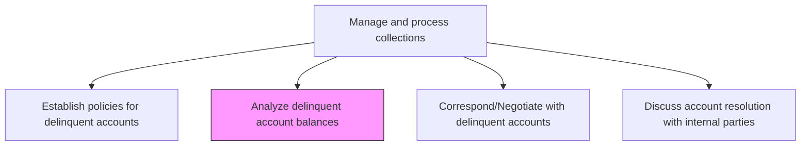
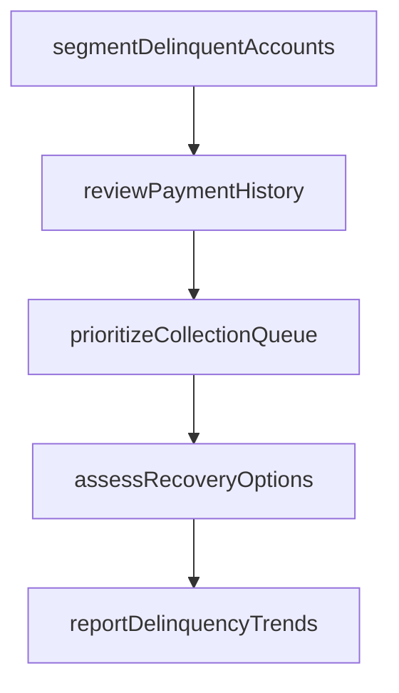

# Analyze delinquent account balances

> Business-as-Code definition for delinquent account balance analysis. Models the review and segmentation of past-due accounts by aging, balance, risk, and payment history to prioritize collection efforts.

## Overview

Analyzing delinquent account balances segments and prioritizes past-due accounts to focus collection resources on the highest-value recovery opportunities. This process involves classifying delinquent accounts by aging bucket, outstanding balance, and risk tier, reviewing historical payment patterns to assess recovery likelihood, ranking accounts in a prioritized collection queue, and evaluating the appropriate collection strategy for each segment. Effective delinquency analysis ensures that limited collection resources are deployed where they will have the greatest impact on cash recovery. The resulting trend reports provide management with early warning signals about portfolio deterioration and inform reserve adequacy assessments.

## Process Hierarchy



## GraphDL

```yaml
analyze:
  object: Delinquent Account Balances
  actor: CollectionsSpecialist
  result: DelinquencyAnalysisReport
```

## Actions

| Action | Description |
|--------|-------------|
| segmentDelinquentAccounts | Classify past-due accounts by aging bucket, balance, and risk tier |
| reviewPaymentHistory | Examine historical payment patterns to assess likelihood of recovery |
| prioritizeCollectionQueue | Rank delinquent accounts by recovery probability and dollar amount |
| assessRecoveryOptions | Evaluate available collection strategies for each account segment |
| reportDelinquencyTrends | Summarize delinquency patterns and trends for management |

## Events

| Event | Description |
|-------|-------------|
| delinquentAccountsSegmented | Past-due accounts classified by aging and risk |
| paymentHistoryReviewed | Historical payment patterns analyzed |
| collectionQueuePrioritized | Delinquent accounts ranked for collection effort |
| recoveryOptionsAssessed | Available collection strategies evaluated per segment |
| delinquencyTrendsReported | Delinquency summary published to management |

## Searches

| Search | Description |
|--------|-------------|
| getDelinquentAccounts | Retrieve past-due accounts by aging bucket or balance range |
| getCollectionPriority | Query the prioritized collection queue |
| getDelinquencyTrends | List delinquency rates and balances over multiple periods |

## Process Flow



## RACI Matrix

| Activity | Responsible | Accountable | Consulted | Informed |
|----------|-------------|-------------|-----------|----------|
| segmentDelinquentAccounts | Collections Specialist | Collections Manager | AR Manager | Credit Manager |
| reviewPaymentHistory | Collections Specialist | Collections Manager | AR Specialist | Sales |
| prioritizeCollectionQueue | Collections Specialist | Collections Manager | Sales | Controller |
| assessRecoveryOptions | Collections Specialist | Collections Manager | Credit Manager | Legal |
| reportDelinquencyTrends | Collections Specialist | Collections Manager | FP&A | CFO |

## Related Processes

| Process | Relationship |
|---------|-------------|
| 9.2.4.1 Establish policies for delinquent accounts | Upstream - policies define segmentation and prioritization criteria |
| 9.2.4.3 Correspond/Negotiate with delinquent accounts | Downstream - analysis drives collection outreach |
| 9.2.4.4 Discuss account resolution with internal parties | Downstream - analysis results inform internal resolution discussions |
| 9.2.3.4 Prepare AR reports | Parallel - AR aging data feeds delinquency analysis |

## Related Departments

| Department | Role |
|-----------|------|
| Collections | Analyzes and segments delinquent accounts |
| Credit | Provides risk classification and credit history |
| Sales | Supplies customer relationship context |
| Finance | Reviews delinquency exposure and reserve requirements |

## Related Occupations

| Occupation | Involvement |
|-----------|-------------|
| Collections Specialist | Segments and prioritizes delinquent accounts |
| Credit Analyst | Provides risk data for recovery assessment |
| Financial Analyst | Analyzes delinquency trends and reserve impact |

## KPIs

| KPI | Description | Unit |
|-----|-------------|------|
| Delinquency Rate | Percentage of receivables past due by more than 30 days | % |
| Average Days Delinquent | Mean aging of past-due accounts | Days |
| Collection Queue Coverage | Percentage of delinquent accounts actively being worked | % |
| Delinquent Balance Concentration | Percentage of total delinquent balance in the top 10 accounts | % |

## Usage

```typescript
import { analyzeDelinquentAccountBalances } from '@headlessly/analyze-delinquent-account-balances'

const analysis = analyzeDelinquentAccountBalances()

// Get delinquent accounts by aging bucket
const delinquent = await analysis.getDelinquentAccounts({
  agingBucket: '61-90',
  minBalance: 5000
})

// Get prioritized collection queue
const queue = await analysis.getCollectionPriority({
  maxAccounts: 50,
  sortBy: 'recovery-probability'
})
```
