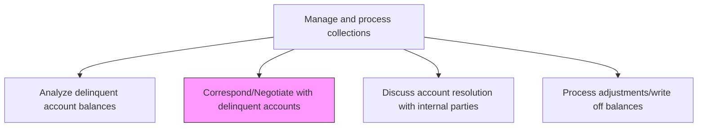
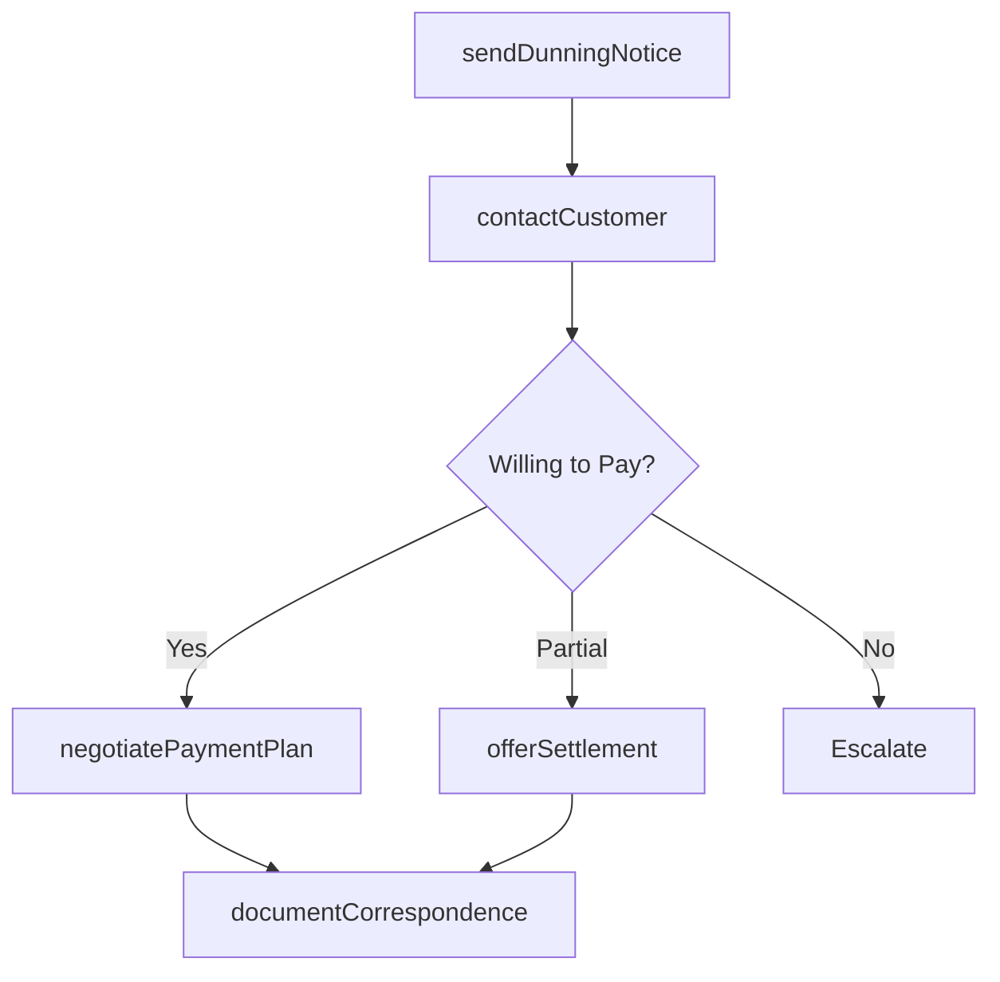

# Correspond/Negotiate with delinquent accounts

> Business-as-Code definition for delinquent account correspondence and negotiation. Models the outreach to past-due customers through dunning notices, calls, and payment plan negotiations to recover outstanding balances.

## Overview

Corresponding and negotiating with delinquent accounts is the active outreach phase of the collections process, where collectors contact past-due customers to recover outstanding balances through dunning notices, direct calls, and structured payment negotiations. This process involves issuing collection letters per the dunning schedule, making direct contact to understand the customer's situation, negotiating payment plans or reduced settlements when full payment is not feasible, and documenting all communications for compliance and audit purposes. Effective negotiation maximizes cash recovery while preserving customer relationships where the business case supports continued engagement. Settlement authority levels and compliance with debt collection regulations such as the Fair Debt Collection Practices Act are critical governance considerations throughout this process.

## Process Hierarchy



## GraphDL

```yaml
correspond/negotiate:
  object: With Delinquent Accounts
  actor: CollectionsSpecialist
  result: PaymentArrangement
```

## Actions

| Action | Description |
|--------|-------------|
| sendDunningNotice | Issue collection letters or emails per the dunning schedule |
| contactCustomer | Make direct phone or email contact with the delinquent account holder |
| negotiatePaymentPlan | Propose and agree on a structured repayment arrangement |
| offerSettlement | Present a reduced settlement amount for immediate payment |
| documentCorrespondence | Record all collection communications and negotiation outcomes |

## Events

| Event | Description |
|-------|-------------|
| dunningNoticeSent | Collection notice issued to the delinquent account |
| customerContacted | Direct contact made with the account holder |
| paymentPlanNegotiated | Structured repayment arrangement agreed |
| settlementOffered | Reduced settlement proposed to the customer |
| correspondenceDocumented | Collection communications and outcomes recorded |

## Searches

| Search | Description |
|--------|-------------|
| getCollectionActivity | Retrieve correspondence history for a delinquent account |
| getPaymentPlans | List active payment arrangements by customer or status |
| getSettlementOffers | Query outstanding settlement proposals |

## Process Flow



## RACI Matrix

| Activity | Responsible | Accountable | Consulted | Informed |
|----------|-------------|-------------|-----------|----------|
| sendDunningNotice | Collections Specialist | Collections Manager | AR Manager | Sales Rep |
| contactCustomer | Collections Specialist | Collections Manager | Sales Rep | AR Manager |
| negotiatePaymentPlan | Collections Specialist | Collections Manager | Credit Manager | Controller |
| offerSettlement | Collections Manager | Controller | Legal | CFO |
| documentCorrespondence | Collections Specialist | Collections Manager | Legal | Internal Audit |

## Related Processes

| Process | Relationship |
|---------|-------------|
| 9.2.4.2 Analyze delinquent account balances | Upstream - analysis prioritizes which accounts to contact |
| 9.2.4.4 Discuss account resolution with internal parties | Parallel - internal alignment may be needed before negotiation |
| 9.2.4.5 Process adjustments/write off balances | Downstream - negotiated settlements may require adjustments |
| 9.2.4.6 Perform recovery workout | Downstream - failed negotiations may escalate to formal workout |

## Related Departments

| Department | Role |
|-----------|------|
| Collections | Conducts outreach and negotiation with delinquent accounts |
| Sales | Provides customer relationship context and may assist with outreach |
| Legal | Advises on settlement terms and regulatory compliance |
| Credit | Updates credit status based on negotiation outcomes |

## Related Occupations

| Occupation | Involvement |
|-----------|-------------|
| Collections Specialist | Contacts customers and negotiates payment arrangements |
| Collections Manager | Approves settlements and escalated negotiations |
| Legal Counsel | Reviews settlement terms for compliance |

## KPIs

| KPI | Description | Unit |
|-----|-------------|------|
| Contact Rate | Percentage of delinquent accounts contacted per cycle | % |
| Promise-to-Pay Rate | Percentage of contacted accounts that commit to payment | % |
| Recovery Rate | Percentage of delinquent balances recovered through negotiation | % |
| Average Settlement Discount | Mean percentage discount accepted in settlement agreements | % |

## Usage

```typescript
import { correspondNegotiateWithDelinquentAccounts } from '@headlessly/correspond-negotiate-with-delinquent-accounts'

const collections = correspondNegotiateWithDelinquentAccounts()

// Get collection activity for an account
const activity = await collections.getCollectionActivity({
  accountId: 'ACCT-8200',
  lookbackDays: 90
})

// Get active payment plans
const plans = await collections.getPaymentPlans({
  status: 'active',
  pastDue: true
})
```
