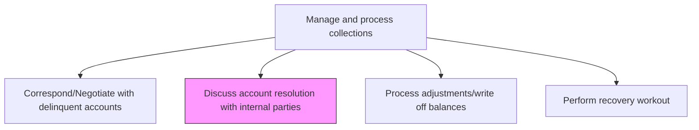
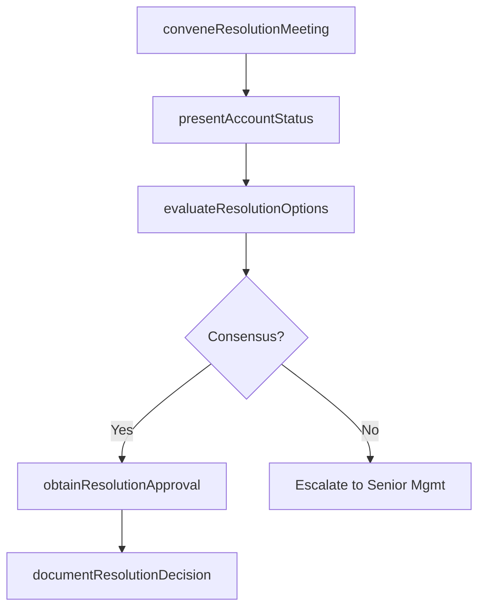

# Discuss account resolution with internal parties

> Business-as-Code definition for internal account resolution discussion. Models the coordination between collections, sales, credit, and management to determine the best resolution path for delinquent accounts.

## Overview

Discussing account resolution with internal parties coordinates cross-functional decision-making for delinquent accounts that require alignment between collections, sales, credit, and finance before a resolution path can be pursued. This process involves convening resolution meetings, presenting the collection history and outstanding balances, evaluating options ranging from structured payment plans to settlements and write-offs, and securing management authorization for the recommended approach. Internal alignment is essential for high-value or strategically important accounts where the resolution decision has significant financial impact or customer relationship implications. The documented resolution decision provides the authorization and audit trail for downstream execution of adjustments, workouts, or write-offs.

## Process Hierarchy



## GraphDL

```yaml
discuss:
  object: Account Resolution With Internal Parties
  actor: CollectionsManager
  result: ResolutionDecision
```

## Actions

| Action | Description |
|--------|-------------|
| conveneResolutionMeeting | Organize cross-functional discussion to review delinquent accounts |
| presentAccountStatus | Share collection history, customer context, and outstanding balances |
| evaluateResolutionOptions | Assess available options including payment plans, settlements, and write-offs |
| obtainResolutionApproval | Secure management authorization for the recommended resolution |
| documentResolutionDecision | Record the agreed-upon resolution path and responsible parties |

## Events

| Event | Description |
|-------|-------------|
| resolutionMeetingConvened | Cross-functional account review meeting held |
| accountStatusPresented | Collection history and balances shared with stakeholders |
| resolutionOptionsEvaluated | Available resolution paths assessed |
| resolutionApprovalObtained | Management authorization for resolution secured |
| resolutionDecisionDocumented | Resolution path and action items recorded |

## Searches

| Search | Description |
|--------|-------------|
| getAccountsForReview | Retrieve delinquent accounts requiring internal resolution discussion |
| getResolutionHistory | Query past resolution decisions for an account |
| getPendingResolutions | List accounts with approved but unexecuted resolution plans |

## Process Flow



## RACI Matrix

| Activity | Responsible | Accountable | Consulted | Informed |
|----------|-------------|-------------|-----------|----------|
| conveneResolutionMeeting | Collections Manager | Controller | Sales Director | AR Manager |
| presentAccountStatus | Collections Specialist | Collections Manager | AR Specialist | Sales Rep |
| evaluateResolutionOptions | Collections Manager | Controller | Credit Manager | Legal |
| obtainResolutionApproval | Collections Manager | CFO | Controller | Internal Audit |
| documentResolutionDecision | Collections Manager | Controller | Legal | AR Manager |

## Related Processes

| Process | Relationship |
|---------|-------------|
| 9.2.4.3 Correspond/Negotiate with delinquent accounts | Upstream - negotiation outcomes inform resolution discussions |
| 9.2.4.5 Process adjustments/write off balances | Downstream - resolution decisions trigger adjustments or write-offs |
| 9.2.4.6 Perform recovery workout | Downstream - approved workouts are executed after resolution |

## Related Departments

| Department | Role |
|-----------|------|
| Collections | Presents account status and leads resolution discussions |
| Sales | Provides customer relationship context and retention perspective |
| Credit | Advises on risk implications of resolution options |
| Legal | Reviews legal exposure and settlement terms |

## Related Occupations

| Occupation | Involvement |
|-----------|-------------|
| Collections Manager | Facilitates resolution meetings and presents recommendations |
| Sales Manager | Represents customer relationship and retention interests |
| Controller | Approves resolution decisions with financial impact |

## KPIs

| KPI | Description | Unit |
|-----|-------------|------|
| Resolution Cycle Time | Average days from escalation to resolution decision | Days |
| Resolution Adoption Rate | Percentage of resolution decisions successfully executed | % |
| Internal Alignment Score | Percentage of resolutions agreed without escalation | % |
| Financial Impact of Resolutions | Total dollar value of concessions approved through resolution | USD |

## Usage

```typescript
import { discussAccountResolutionWithInternalParties } from '@headlessly/discuss-account-resolution-with-internal-parties'

const resolution = discussAccountResolutionWithInternalParties()

// Get accounts needing resolution discussion
const accounts = await resolution.getAccountsForReview({
  minBalance: 10000,
  agingDays: 90
})

// Get pending resolution plans
const pending = await resolution.getPendingResolutions({
  status: 'approved',
  assignee: 'collections-team'
})
```
