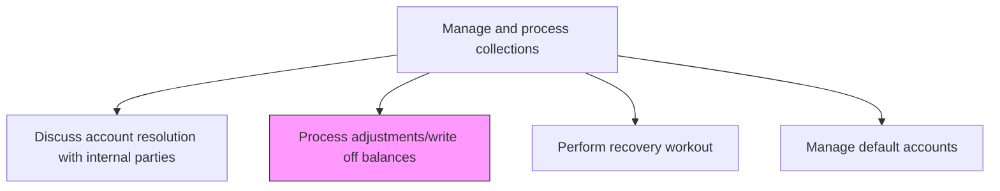
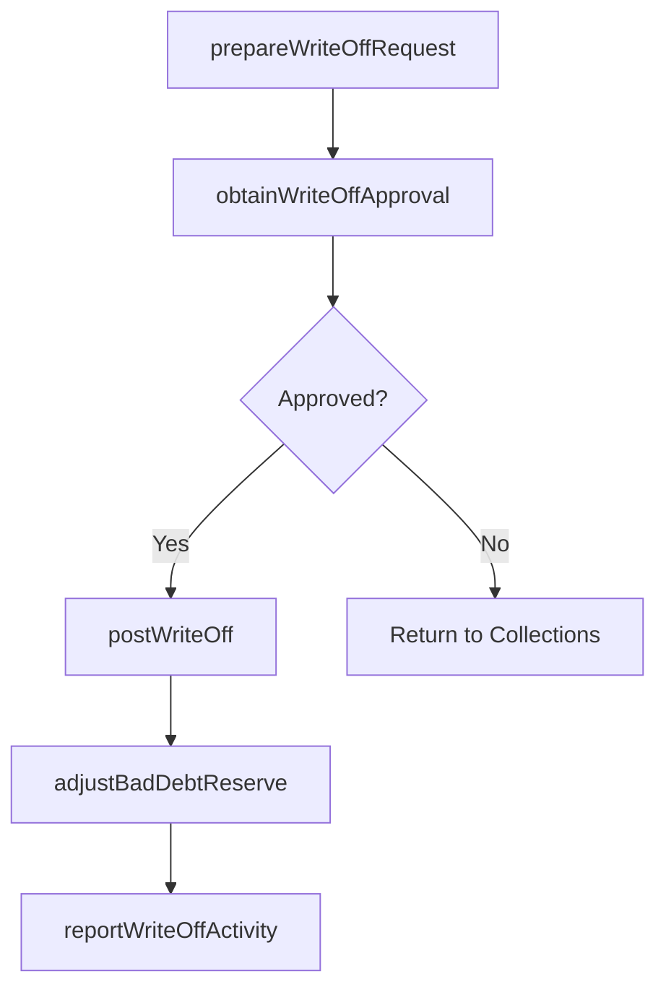

# Process adjustments/write off balances

> Business-as-Code definition for adjustment and write-off processing. Models the authorization, recording, and GL posting of bad debt write-offs, credit memos, and account balance adjustments for uncollectible receivables.

## Overview

Processing adjustments and writing off balances formally removes uncollectible receivables from the books through authorized write-off entries against the bad debt allowance reserve. This process involves preparing write-off documentation with supporting evidence of uncollectibility, securing approval at the appropriate authorization level based on dollar amount, posting the write-off against the allowance for doubtful accounts, and adjusting the reserve balance to reflect current write-off activity. Controlled write-off processing ensures that receivable balances accurately reflect realistically collectible amounts while maintaining the internal controls required for SOX compliance and audit readiness. Management reporting on write-off trends also provides feedback for credit policy calibration and reserve adequacy assessment.

## Process Hierarchy



## GraphDL

```yaml
process:
  object: Adjustments/write Off Balances
  actor: ARSpecialist
  result: WriteOffRecord
```

## Actions

| Action | Description |
|--------|-------------|
| prepareWriteOffRequest | Document the uncollectible balance and supporting evidence for write-off |
| obtainWriteOffApproval | Secure authorization from the appropriate approval level |
| postWriteOff | Record the bad debt write-off against the allowance reserve |
| adjustBadDebtReserve | Update the allowance for doubtful accounts to reflect write-off activity |
| reportWriteOffActivity | Summarize write-off and adjustment activity for management |

## Events

| Event | Description |
|-------|-------------|
| writeOffRequestPrepared | Write-off documentation and supporting evidence assembled |
| writeOffApprovalObtained | Management authorization for write-off secured |
| writeOffPosted | Bad debt write-off recorded in the accounting system |
| badDebtReserveAdjusted | Allowance for doubtful accounts updated |
| writeOffActivityReported | Write-off summary published to management |

## Searches

| Search | Description |
|--------|-------------|
| getPendingWriteOffs | Retrieve write-off requests awaiting approval |
| getWriteOffHistory | Query write-off activity by period or customer |
| getBadDebtReserveBalance | Retrieve current allowance for doubtful accounts balance |

## Process Flow



## RACI Matrix

| Activity | Responsible | Accountable | Consulted | Informed |
|----------|-------------|-------------|-----------|----------|
| prepareWriteOffRequest | AR Specialist | Collections Manager | Credit Manager | Controller |
| obtainWriteOffApproval | Collections Manager | Controller | CFO | Internal Audit |
| postWriteOff | AR Specialist | Controller | GL Accountant | CFO |
| adjustBadDebtReserve | AR Specialist | Controller | Internal Audit | CFO |
| reportWriteOffActivity | AR Specialist | Collections Manager | FP&A | CFO |

## Related Processes

| Process | Relationship |
|---------|-------------|
| 9.2.4.4 Discuss account resolution with internal parties | Upstream - resolution decisions authorize write-offs |
| 9.2.3.5 Post AR activity to the general ledger | Downstream - write-offs are posted to the GL |
| 9.2.4.6 Perform recovery workout | Alternative - recovery may prevent need for write-off |
| 9.2.1.1 Establish credit policies | Feedback - write-off patterns inform credit policy adjustments |

## Related Departments

| Department | Role |
|-----------|------|
| Collections | Prepares and submits write-off requests |
| Accounts Receivable | Posts write-offs and adjusts reserves |
| Finance | Approves write-offs and monitors reserve adequacy |
| Internal Audit | Reviews write-off authorization compliance |

## Related Occupations

| Occupation | Involvement |
|-----------|-------------|
| AR Specialist | Prepares write-off documentation and posts entries |
| Collections Manager | Authorizes write-off requests within delegation |
| Controller | Approves write-offs exceeding manager authority |

## KPIs

| KPI | Description | Unit |
|-----|-------------|------|
| Write-Off Amount | Total bad debt written off during the period | USD |
| Write-Off Processing Time | Average days from request to posted write-off | Days |
| Reserve Adequacy | Allowance balance as a percentage of total receivables | % |
| Write-Off Approval Compliance | Percentage of write-offs processed within authorized delegation levels | % |

## Usage

```typescript
import { processAdjustmentsWriteOffBalances } from '@headlessly/process-adjustments-write-off-balances'

const writeOffs = processAdjustmentsWriteOffBalances()

// Get pending write-off requests
const pending = await writeOffs.getPendingWriteOffs({
  minAmount: 1000,
  agingDays: 180
})

// Check bad debt reserve balance
const reserve = await writeOffs.getBadDebtReserveBalance({
  asOfDate: '2025-12-31'
})
```
