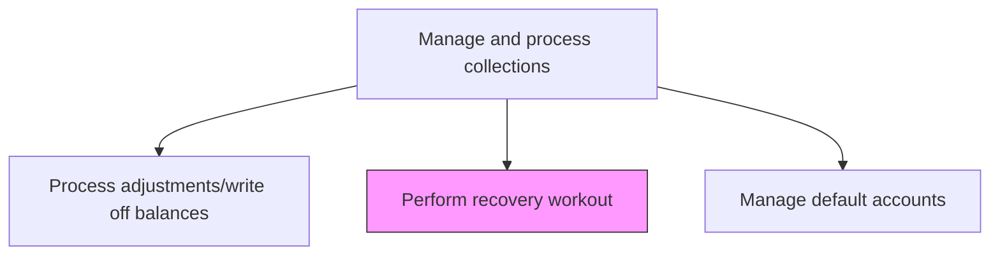
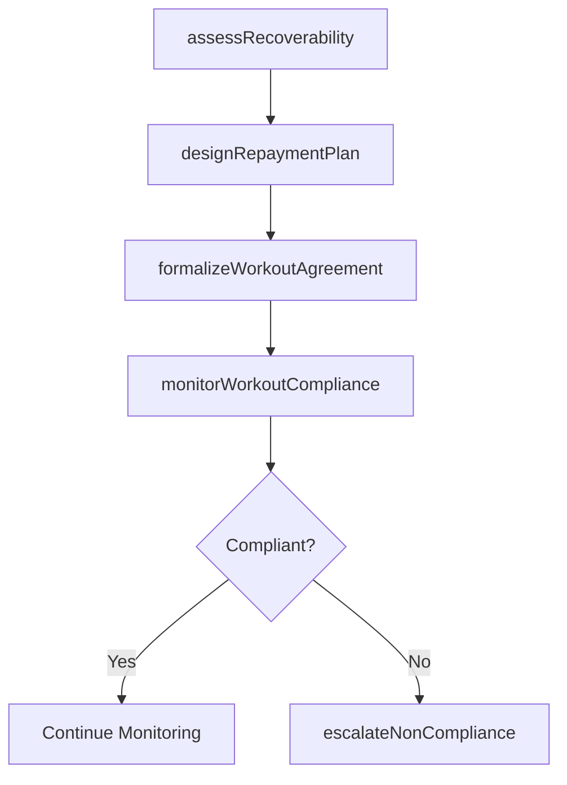

# Perform recovery workout

> Business-as-Code definition for recovery workout execution. Models the restructuring of payment terms for defaulted accounts including repayment plan design, compliance monitoring, and partial recovery tracking.

## Overview

Performing a recovery workout restructures payment terms for defaulted accounts to maximize the organization's cash recovery while providing the debtor a viable path to satisfy their obligation. This process involves assessing realistic recovery potential based on the debtor's current financial capacity, designing a modified repayment schedule with achievable milestones, formalizing the workout agreement with documented terms and debtor commitment, and monitoring compliance against the agreed schedule. Recovery workouts are typically pursued when the expected recovery exceeds what would be obtained through immediate write-off or external agency referral. Ongoing compliance monitoring is essential, as non-performance triggers escalation to legal action or final write-off disposition.

## Process Hierarchy



## GraphDL

```yaml
perform:
  object: Recovery Workout
  actor: CollectionsSpecialist
  result: RecoveryPlan
```

## Actions

| Action | Description |
|--------|-------------|
| assessRecoverability | Evaluate the defaulted account to determine realistic recovery potential |
| designRepaymentPlan | Structure a modified payment schedule based on the debtor's capacity |
| formalizeWorkoutAgreement | Document the restructured terms and obtain debtor commitment |
| monitorWorkoutCompliance | Track payments against the agreed workout schedule |
| escalateNonCompliance | Initiate further action if the debtor fails to meet workout terms |

## Events

| Event | Description |
|-------|-------------|
| recoverabilityAssessed | Defaulted account recovery potential evaluated |
| repaymentPlanDesigned | Modified payment schedule structured |
| workoutAgreementFormalized | Restructured terms documented and signed |
| workoutComplianceMonitored | Payments tracked against the workout schedule |
| nonComplianceEscalated | Workout breach escalated for further action |

## Searches

| Search | Description |
|--------|-------------|
| getActiveWorkouts | Retrieve accounts with active recovery workout plans |
| getWorkoutCompliance | Query payment compliance for a specific workout agreement |
| getRecoveryForecast | Project expected recovery amounts from active workouts |

## Process Flow



## RACI Matrix

| Activity | Responsible | Accountable | Consulted | Informed |
|----------|-------------|-------------|-----------|----------|
| assessRecoverability | Collections Specialist | Collections Manager | Credit Manager | Controller |
| designRepaymentPlan | Collections Specialist | Collections Manager | Legal | CFO |
| formalizeWorkoutAgreement | Collections Manager | Controller | Legal | AR Specialist |
| monitorWorkoutCompliance | Collections Specialist | Collections Manager | AR Specialist | Sales |
| escalateNonCompliance | Collections Manager | Controller | Legal | CFO |

## Related Processes

| Process | Relationship |
|---------|-------------|
| 9.2.4.5 Process adjustments/write off balances | Alternative - unrecoverable workouts may require write-off |
| 9.2.4.7 Manage default accounts | Parallel - default accounts may be candidates for workout |
| 9.2.4.3 Correspond/Negotiate with delinquent accounts | Upstream - negotiations may escalate to formal workout |

## Related Departments

| Department | Role |
|-----------|------|
| Collections | Designs and monitors recovery workout plans |
| Legal | Reviews workout agreements for enforceability |
| Credit | Adjusts credit status based on workout compliance |
| Finance | Tracks recovery cash flow and reserve impact |

## Related Occupations

| Occupation | Involvement |
|-----------|-------------|
| Collections Specialist | Manages recovery workout cases |
| Legal Counsel | Drafts and reviews workout agreements |
| Credit Analyst | Reassesses creditworthiness during workout |

## KPIs

| KPI | Description | Unit |
|-----|-------------|------|
| Workout Recovery Rate | Percentage of defaulted balance recovered through workouts | % |
| Workout Compliance Rate | Percentage of workout accounts making scheduled payments | % |
| Average Workout Duration | Mean number of months for workout plan completion | Months |
| Workout Portfolio Value | Total outstanding balance under active workout agreements | USD |

## Usage

```typescript
import { performRecoveryWorkout } from '@headlessly/perform-recovery-workout'

const workout = performRecoveryWorkout()

// Get active workout plans
const active = await workout.getActiveWorkouts({
  assignee: 'collections-team',
  status: 'in-progress'
})

// Check compliance for a workout
const compliance = await workout.getWorkoutCompliance({
  accountId: 'ACCT-8200',
  agreementId: 'WO-2025-042'
})
```
