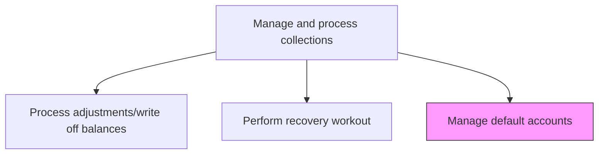
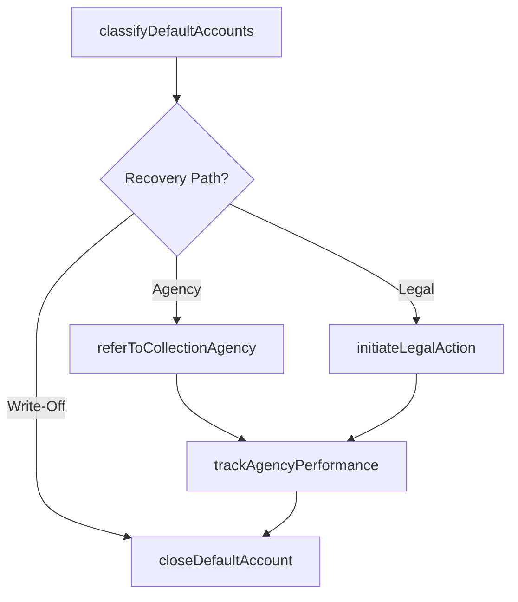

# Manage default accounts

> Business-as-Code definition for default account management. Models the tracking, classification, and disposition of accounts that have breached their credit agreements, including referral to agencies or legal action.

## Overview

Managing default accounts handles the end-stage disposition of receivables where customers have breached their credit agreements and standard collection efforts have been exhausted. This process involves classifying defaulted accounts by severity, outstanding amount, and remaining recovery potential, then routing them to the appropriate disposition path including external collection agency referral, legal action, or final write-off. For accounts referred to agencies, ongoing monitoring of agency recovery performance ensures compliance with contractual terms and regulatory requirements. Effective default account management minimizes total bad debt losses while maintaining proper documentation for tax deductions on written-off balances and potential future recoveries.

## Process Hierarchy



## GraphDL

```yaml
manage:
  object: Default Accounts
  actor: CollectionsManager
  result: DefaultAccountDisposition
```

## Actions

| Action | Description |
|--------|-------------|
| classifyDefaultAccounts | Categorize defaulted accounts by severity, amount, and recovery potential |
| referToCollectionAgency | Transfer accounts to external collection agencies for recovery |
| initiateLegalAction | Engage legal counsel to pursue judicial recovery of outstanding amounts |
| trackAgencyPerformance | Monitor external agency recovery rates and compliance |
| closeDefaultAccount | Finalize default account disposition through recovery or write-off |

## Events

| Event | Description |
|-------|-------------|
| defaultAccountsClassified | Defaulted accounts categorized by severity and recovery potential |
| referredToCollectionAgency | Account transferred to external collection agency |
| legalActionInitiated | Legal proceedings commenced for debt recovery |
| agencyPerformanceTracked | External agency recovery metrics reviewed |
| defaultAccountClosed | Default account finalized through recovery or write-off |

## Searches

| Search | Description |
|--------|-------------|
| getDefaultAccounts | Retrieve accounts in default by category or aging |
| getAgencyReferrals | List accounts referred to external collection agencies |
| getLegalActions | Query accounts with active legal proceedings |

## Process Flow



## RACI Matrix

| Activity | Responsible | Accountable | Consulted | Informed |
|----------|-------------|-------------|-----------|----------|
| classifyDefaultAccounts | Collections Manager | Controller | Credit Manager | CFO |
| referToCollectionAgency | Collections Manager | Controller | Legal | AR Manager |
| initiateLegalAction | Collections Manager | CFO | Legal Counsel | Controller |
| trackAgencyPerformance | Collections Specialist | Collections Manager | Legal | Finance |
| closeDefaultAccount | Collections Manager | Controller | AR Specialist | Internal Audit |

## Related Processes

| Process | Relationship |
|---------|-------------|
| 9.2.4.6 Perform recovery workout | Alternative - workout may precede default management |
| 9.2.4.5 Process adjustments/write off balances | Downstream - unrecoverable defaults are written off |
| 9.2.1.7 Reinstate or suspend accounts based on credit policies | Parallel - default status triggers account suspension |

## Related Departments

| Department | Role |
|-----------|------|
| Collections | Manages default account portfolio and agency relationships |
| Legal | Handles legal proceedings for debt recovery |
| Credit | Updates credit records based on default dispositions |
| Finance | Monitors default exposure and reserve impact |

## Related Occupations

| Occupation | Involvement |
|-----------|-------------|
| Collections Manager | Oversees default account portfolio and dispositions |
| Legal Counsel | Manages litigation for debt recovery |
| Credit Manager | Updates credit records and blacklists |

## KPIs

| KPI | Description | Unit |
|-----|-------------|------|
| Default Account Volume | Total number of accounts in default status | Count |
| Agency Recovery Rate | Percentage of referred balances recovered by external agencies | % |
| Default Disposition Cycle | Average days from default classification to final disposition | Days |
| Legal Recovery Rate | Percentage of balances recovered through legal proceedings | % |

## Usage

```typescript
import { manageDefaultAccounts } from '@headlessly/manage-default-accounts'

const defaults = manageDefaultAccounts()

// Get default accounts by category
const defaultAccounts = await defaults.getDefaultAccounts({
  category: 'high-value',
  minBalance: 25000
})

// Track agency performance
const agencyMetrics = await defaults.trackAgencyPerformance({
  agencyId: 'AGY-001',
  period: 'Q4-2025'
})
```
