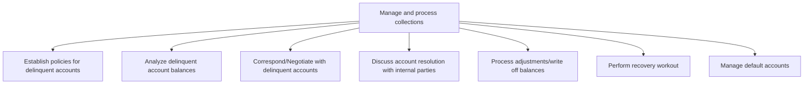
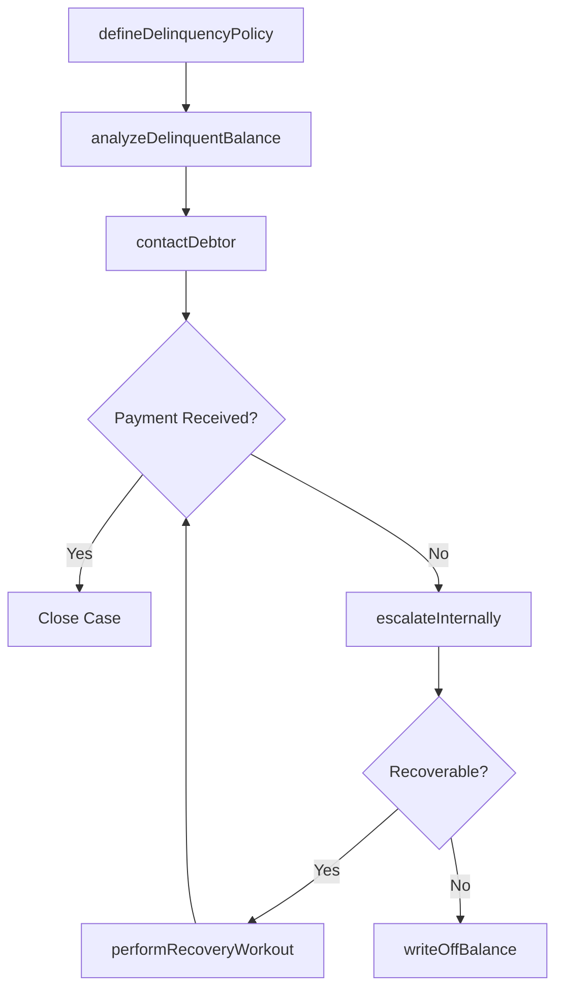

# Manage and process collections

> Business-as-Code definition for collections management. Models delinquency policy, account analysis, customer negotiation, write-off processing, recovery workouts, and default account management as programmable APIs.

## Overview

Posting entries to respective accounts, and preparing accounts for receivables. Manage the cash collected by the business from its debtors. Record it in the books of accounts to provide clear information about the availability of the cash.

## Process Hierarchy



## GraphDL

```yaml
manage:
  object: And Process Collections
  actor: CollectionsSpecialist
  result: CollectionResolution
```

## Actions

| Action | Description |
|--------|-------------|
| defineDelinquencyPolicy | Establish escalation tiers, timelines, and actions for overdue accounts |
| analyzeDelinquentBalance | Review overdue account details, payment history, and risk factors |
| contactDebtor | Send collection notices and negotiate repayment terms |
| escalateInternally | Engage sales, legal, or management for resolution strategies |
| writeOffBalance | Process bad debt write-offs for unrecoverable balances |
| performRecoveryWorkout | Restructure payment terms to recoup funds from defaulted accounts |
| manageDefault | Track and administer accounts that have entered default |

## Events

| Event | Description |
|-------|-------------|
| delinquencyPolicyDefined | Collection policies and escalation procedures established |
| delinquentBalanceAnalyzed | Overdue account assessed for collection priority |
| debtorContacted | Collection communication sent to delinquent customer |
| escalatedInternally | Internal parties engaged for account resolution |
| balanceWrittenOff | Uncollectible balance recorded as bad debt expense |
| recoveryWorkoutPerformed | Payment restructuring agreement reached with debtor |
| defaultManaged | Default account status updated and monitored |

## Searches

| Search | Description |
|--------|-------------|
| getDelinquentAccounts | List overdue accounts by aging bucket, balance, or priority |
| getCollectionActivity | Retrieve collection actions taken on a specific account |
| getWriteOffHistory | Query bad debt write-offs by period, customer, or amount |
| getRecoveryPipeline | List accounts in active recovery workout with projected amounts |

## Process Flow



## RACI Matrix

| Activity | Responsible | Accountable | Consulted | Informed |
|----------|-------------|-------------|-----------|----------|
| analyzeDelinquentBalance | Collections Specialist | Collections Manager | Credit Analyst | AR Manager |
| contactDebtor | Collections Specialist | Collections Manager | Sales | Legal |
| writeOffBalance | Collections Manager | Controller | CFO | Internal Audit |
| performRecoveryWorkout | Collections Manager | CFO | Legal | Credit Manager |

## Sub-Processes

| ID | Name | Description |
|----|------|-------------|
| 9.2.4.1 | Establish policies for delinquent accounts | Creating a process to follow in case of a failed payment by account holders. Create rules and regula |
| 9.2.4.2 | Analyze delinquent account balances | Examining balance statements of accountholders who failed to make required payments. Study or review |
| 9.2.4.3 | Correspond/Negotiate with delinquent accounts | Determine ways for customers in default to repay debts (e.g., allowing more time or discounts). |
| 9.2.4.4 | Discuss account resolution with internal parties | Determining rules for handling accounts. Discuss and plan with internal parties (department heads, m |
| 9.2.4.5 | Process adjustments/write off balances | Maintaining reserves for write-offs and adjustments. Adjust or write off certain expenses and losses |
| 9.2.4.6 | Perform recovery workout | Renegotiating the terms of a loan agreement in order to recoup money from a default account. |
| 9.2.4.7 | Manage default accounts | Managing accounts that have not met the requirements agreed upon to pay off outstanding debts. |

## Related Processes

| Process | Relationship |
|---------|-------------|
| 9.2.3 Process accounts receivable (AR) | Upstream - overdue receivables feed the collection queue |
| 9.2.1 Process customer credit | Parallel - delinquency data informs credit decisions |
| 9.2.5 Manage and process adjustments/deductions | Downstream - write-offs require adjustment entries |

## Related Departments

| Department | Role |
|-----------|------|
| Collections | Primary owner of delinquent account management and recovery |
| Credit | Adjusts credit limits based on collection outcomes |
| Legal | Supports escalated collection actions and debt recovery |
| Sales | Provides customer relationship context for negotiations |
| Finance | Records bad debt expense and monitors reserve adequacy |

## Related Occupations

| Occupation | Involvement |
|-----------|-------------|
| Collections Specialist | Contacts debtors and negotiates payment arrangements |
| Collections Manager | Oversees collection strategy and write-off approvals |
| Recovery Analyst | Structures workout arrangements for defaulted accounts |

## KPIs

| KPI | Description | Unit |
|-----|-------------|------|
| Collection Effectiveness Index | Percentage of overdue balances collected within the period | % |
| Average Days Delinquent | Mean number of days accounts remain past due | Days |
| Write-Off Rate | Bad debt write-offs as a percentage of total receivables | % |
| Recovery Rate | Percentage of written-off amounts subsequently recovered | % |

## Usage

```typescript
import { manageAndProcessCollections } from '@headlessly/manage-and-process-collections'

const collections = manageAndProcessCollections()

// Get prioritized delinquent account queue
const queue = await collections.getDelinquentAccounts({
  minDaysPastDue: 30,
  sortBy: 'balance-descending',
  limit: 50
})

// Initiate contact with a delinquent customer
await collections.contactDebtor({
  accountId: queue[0].accountId,
  method: 'email',
  template: 'first-notice'
})
```
