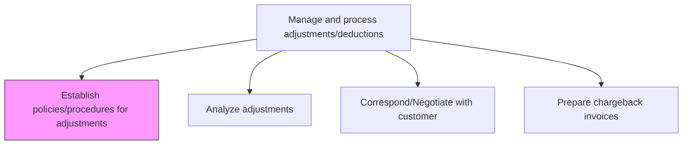
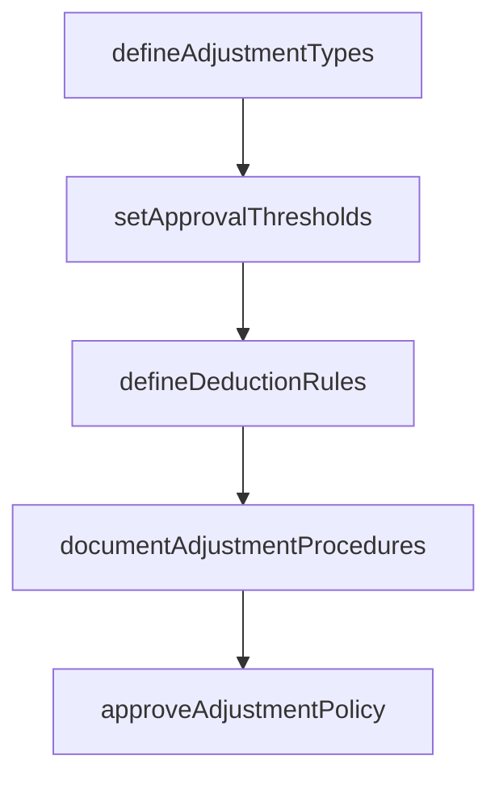

# Establish policies/procedures for adjustments

> Business-as-Code definition for adjustment policy and procedure establishment. Models the creation and governance of rules for processing credit memos, debit memos, pricing adjustments, and customer deductions.

## Overview

Establishing policies and procedures for adjustments creates the governance framework that controls how credit memos, debit memos, pricing corrections, and customer deductions are authorized and processed. This process involves categorizing valid adjustment types, setting dollar-based approval thresholds by role, defining rules for handling customer-initiated short-pays and deductions, and compiling these into documented procedures. Strong adjustment controls are critical for preventing revenue leakage and fraud, as adjustments directly reduce recognized revenue and receivable balances. The policy framework also ensures consistent treatment across the organization and provides the internal control structure required for financial audit compliance.

## Process Hierarchy



## GraphDL

```yaml
establish:
  object: Policies/procedures For Adjustments
  actor: ARManager
  result: AdjustmentPolicyDocument
```

## Actions

| Action | Description |
|--------|-------------|
| defineAdjustmentTypes | Categorize valid adjustment types including credits, debits, and deductions |
| setApprovalThresholds | Establish dollar-based authorization levels for adjustment processing |
| documentAdjustmentProcedures | Compile step-by-step procedures for each adjustment type |
| defineDeductionRules | Set rules for handling customer-initiated deductions and short-pays |
| approveAdjustmentPolicy | Obtain management sign-off on adjustment policy changes |

## Events

| Event | Description |
|-------|-------------|
| adjustmentTypesDefined | Valid adjustment categories established |
| approvalThresholdsSet | Dollar-based authorization levels documented |
| adjustmentProceduresDocumented | Step-by-step adjustment procedures compiled |
| deductionRulesDefined | Customer deduction handling rules established |
| adjustmentPolicyApproved | Adjustment policies signed off by management |

## Searches

| Search | Description |
|--------|-------------|
| getCurrentAdjustmentPolicy | Retrieve the active adjustment policy and procedures |
| getApprovalMatrix | Query adjustment approval thresholds by role |
| getAdjustmentTypes | List valid adjustment categories and their processing rules |

## Process Flow



## RACI Matrix

| Activity | Responsible | Accountable | Consulted | Informed |
|----------|-------------|-------------|-----------|----------|
| defineAdjustmentTypes | AR Manager | Controller | Sales Director | Billing |
| setApprovalThresholds | AR Manager | CFO | Internal Audit | Collections |
| defineDeductionRules | AR Manager | Controller | Sales | Customer Service |
| documentAdjustmentProcedures | AR Manager | Controller | Internal Audit | IT |
| approveAdjustmentPolicy | AR Manager | CFO | Legal | Credit Manager |

## Related Processes

| Process | Relationship |
|---------|-------------|
| 9.2.5.2 Analyze adjustments | Downstream - policies govern how adjustments are analyzed |
| 9.2.5.3 Correspond/Negotiate with customer | Downstream - deduction rules guide customer negotiations |
| 9.2.5.5 Prepare chargeback invoices | Downstream - chargeback rules defined in policy |
| 9.2.3.1 Establish AR policies | Parallel - AR policies complement adjustment policies |

## Related Departments

| Department | Role |
|-----------|------|
| Accounts Receivable | Develops and maintains adjustment policies |
| Internal Audit | Reviews adjustment controls for fraud prevention |
| Sales | Provides input on customer-facing deduction policies |
| Legal | Ensures adjustment policies comply with regulations |

## Related Occupations

| Occupation | Involvement |
|-----------|-------------|
| AR Manager | Authors adjustment policies and approval thresholds |
| Controller | Approves adjustment policy framework |
| Internal Auditor | Reviews adjustment controls and authorization levels |

## KPIs

| KPI | Description | Unit |
|-----|-------------|------|
| Policy Compliance Rate | Percentage of adjustments processed per policy | % |
| Unauthorized Adjustment Rate | Percentage of adjustments exceeding approval thresholds | % |
| Policy Review Frequency | How often adjustment policies are formally reviewed | Per Year |
| Adjustment-to-Revenue Ratio | Total adjustments as a percentage of gross revenue | % |

## Usage

```typescript
import { establishPoliciesProceduresForAdjustments } from '@headlessly/establish-policies-procedures-for-adjustments'

const adjPolicy = establishPoliciesProceduresForAdjustments()

// Get current adjustment policy
const policy = await adjPolicy.getCurrentAdjustmentPolicy({
  effectiveDate: '2025-12-01'
})

// Get approval thresholds by role
const matrix = await adjPolicy.getApprovalMatrix({
  adjustmentType: 'credit-memo'
})
```
