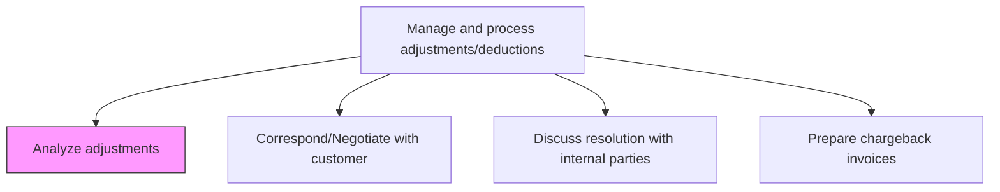
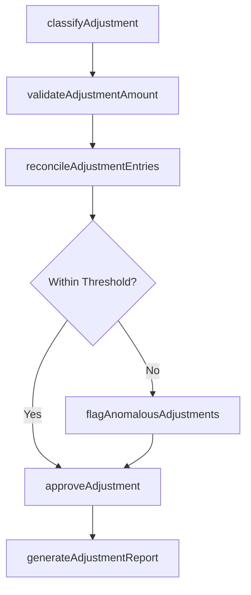

# Analyze adjustments

> Business-as-Code definition for revenue adjustment analysis. Models the process of reviewing, categorizing, and validating account adjustments to ensure accuracy in financial reporting.

## Overview

Analyzing adjustments reviews, categorizes, and validates all account modifications to ensure they are accurately classified, properly supported by documentation, and within authorized thresholds before posting to the ledger. This process involves classifying each adjustment by type such as credit memo, rebate, or write-off, verifying amounts against contracts and source transactions, reconciling entries to the general ledger, and flagging anomalous adjustments that exceed normal patterns for additional review. Rigorous adjustment analysis prevents revenue leakage, detects potential fraud, and ensures financial reporting accuracy. The resulting reports provide management with visibility into adjustment trends, root causes, and the effectiveness of pricing and billing processes.

## Process Hierarchy



## GraphDL

```yaml
analyze:
  object: Adjustments
  actor: RevenueAccountant
  result: AdjustmentAnalysisReport
```

## Actions

| Action | Description |
|--------|-------------|
| classifyAdjustment | Categorize the adjustment by type such as credit memo, rebate, or write-off |
| validateAdjustmentAmount | Verify the adjustment amount against supporting documentation and contracts |
| reconcileAdjustmentEntries | Compare adjustment entries to source transactions in the general ledger |
| flagAnomalousAdjustments | Identify adjustments that fall outside normal thresholds or patterns |
| approveAdjustment | Review and authorize the adjustment for posting to the ledger |
| generateAdjustmentReport | Produce summary reporting of all adjustments by category and period |

## Events

| Event | Description |
|-------|-------------|
| adjustmentClassified | An adjustment has been categorized and assigned a type code |
| adjustmentValidated | The adjustment amount and documentation have been verified |
| entriesReconciled | Adjustment entries have been matched to source transactions |
| anomalyFlagged | An adjustment outside normal parameters has been identified for review |
| adjustmentApproved | The adjustment has been authorized for posting |
| adjustmentReportGenerated | A summary report of adjustments has been produced |

## Searches

| Search | Description |
|--------|-------------|
| findAdjustmentsByPeriod | List all adjustments filtered by accounting period and type |
| getAdjustmentDetails | Retrieve full details for a specific adjustment including supporting documents |
| getAnomalousAdjustments | Return adjustments flagged as outside normal thresholds |
| getAdjustmentTrends | Retrieve adjustment volume and value trends over multiple periods |

## Process Flow



## RACI Matrix

| Activity | Responsible | Accountable | Consulted | Informed |
|----------|-------------|-------------|-----------|----------|
| classifyAdjustment | RevenueAccountant | RevenueManager | SalesOperations | Controller |
| validateAdjustmentAmount | RevenueAccountant | RevenueManager | BillingTeam | InternalAudit |
| reconcileAdjustmentEntries | GeneralLedgerAccountant | Controller | RevenueAccountant | CFO |
| approveAdjustment | RevenueManager | Controller | InternalAudit | FinanceDirector |

## Related Processes

| Process | Relationship |
|---------|-------------|
| 9.2.5.3 Correspond/Negotiate with customer | Downstream - customer disputes may trigger adjustments |
| 9.2.5.4 Discuss resolution with internal parties | Parallel - internal alignment on adjustment resolution |
| 9.2.5.6 Process related entries | Downstream - approved adjustments are posted as journal entries |
| 9.3.2.4 Process period end adjustments | Consumer - period-end close incorporates revenue adjustments |

## Related Departments

| Department | Role |
|-----------|------|
| Revenue Accounting | Primary owner responsible for adjustment analysis |
| Sales Operations | Provides context on customer agreements and pricing terms |
| Internal Audit | Reviews adjustment patterns for control compliance |
| Billing | Supplies source invoices and transaction data |

## Related Occupations

| Occupation | Involvement |
|-----------|-------------|
| Revenue Accountant | Primary executor of adjustment analysis |
| Financial Analyst | Trend analysis and reporting |
| Internal Auditor | Compliance review and threshold monitoring |

## KPIs

| KPI | Description | Unit |
|-----|-------------|------|
| Adjustment Rate | Ratio of adjustments to total revenue transactions | % |
| Average Resolution Time | Mean time from adjustment identification to approval | Days |
| Anomaly Detection Rate | Percentage of adjustments flagged as anomalous | % |
| Adjustment Accuracy | Percentage of adjustments posted without subsequent correction | % |

## Usage

```typescript
import { analyzeAdjustments } from '@headlessly/analyze-adjustments'

const client = analyzeAdjustments()

// Classify and validate an adjustment
const classified = await client.classifyAdjustment({
  transactionId: 'TXN-2024-00451',
  adjustmentType: 'creditMemo',
  amount: 2500.00,
  currency: 'USD'
})

// Retrieve anomalous adjustments for the quarter
const anomalies = await client.findAdjustmentsByPeriod({
  period: '2024-Q3',
  status: 'flagged',
  minAmount: 10000
})
```
