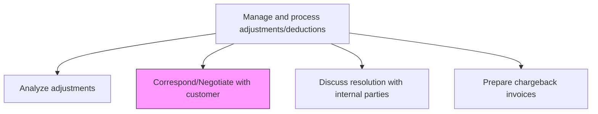
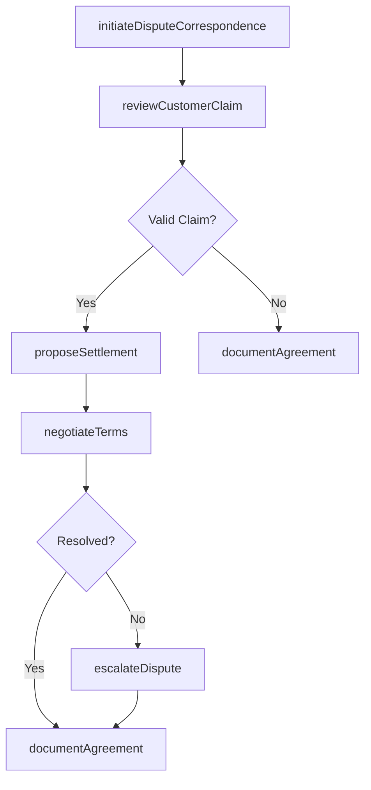

# Correspond/Negotiate with customer

> Business-as-Code definition for customer correspondence and negotiation on revenue adjustments. Models the process of resolving billing disputes, negotiating settlement terms, and formalizing agreed-upon adjustments.

## Overview

Corresponding and negotiating with customers on revenue adjustments involves direct communication to resolve billing disputes, pricing discrepancies, and unauthorized deductions that affect the organization's receivable balances. This process includes initiating formal dispute correspondence, reviewing the validity of customer claims against contracts and pricing agreements, proposing settlement terms such as partial credits or payment plans, and negotiating to reach mutually acceptable resolution. Efficient dispute resolution protects revenue, accelerates cash collection, and preserves customer relationships that might otherwise deteriorate over prolonged billing conflicts. Patterns in customer disputes also provide valuable feedback for improving upstream billing accuracy and contract clarity.

## Process Hierarchy



## GraphDL

```yaml
correspond:
  object: With Customer
  actor: AccountsReceivableSpecialist
  result: NegotiationOutcome
```

## Actions

| Action | Description |
|--------|-------------|
| initiateDisputeCorrespondence | Send formal communication to the customer regarding the billing discrepancy |
| reviewCustomerClaim | Assess the customer's stated reason for the deduction or dispute |
| proposeSettlement | Present a resolution offer including partial credit, discount, or payment plan |
| negotiateTerms | Engage in back-and-forth negotiation to reach mutually acceptable terms |
| documentAgreement | Record the final agreed-upon resolution and supporting rationale |
| escalateDispute | Route unresolved disputes to senior management or legal for further action |

## Events

| Event | Description |
|-------|-------------|
| correspondenceInitiated | A formal dispute communication has been sent to the customer |
| claimReviewed | The customer's dispute claim has been assessed and categorized |
| settlementProposed | A resolution offer has been presented to the customer |
| termsNegotiated | Negotiation has concluded with agreed terms |
| agreementDocumented | The final resolution has been formally recorded |
| disputeEscalated | The dispute has been routed to senior management for resolution |

## Searches

| Search | Description |
|--------|-------------|
| findOpenDisputes | List all active customer disputes filtered by age, amount, or customer |
| getDisputeHistory | Retrieve the full correspondence trail for a specific dispute |
| getCustomerDisputePattern | Analyze dispute frequency and types for a given customer |
| getSettlementOffers | List proposed and accepted settlement offers by period |

## Process Flow



## RACI Matrix

| Activity | Responsible | Accountable | Consulted | Informed |
|----------|-------------|-------------|-----------|----------|
| initiateDisputeCorrespondence | ARSpecialist | ARManager | SalesRepresentative | Controller |
| reviewCustomerClaim | ARSpecialist | ARManager | BillingTeam | RevenueAccountant |
| proposeSettlement | ARManager | Controller | Legal | CFO |
| negotiateTerms | ARManager | Controller | SalesManager | FinanceDirector |

## Related Processes

| Process | Relationship |
|---------|-------------|
| 9.2.5.2 Analyze adjustments | Upstream - adjustment analysis identifies disputes requiring customer contact |
| 9.2.5.4 Discuss resolution with internal parties | Parallel - internal alignment needed before customer negotiation |
| 9.2.5.5 Prepare chargeback invoices | Downstream - agreed chargebacks are invoiced after negotiation |
| 9.2.3 Manage collections | Related - overdue amounts may involve dispute resolution |

## Related Departments

| Department | Role |
|-----------|------|
| Accounts Receivable | Primary owner of customer dispute negotiation |
| Sales | Provides customer relationship context and pricing agreements |
| Legal | Advises on contractual obligations and escalated disputes |
| Finance | Oversees financial impact of negotiated settlements |

## Related Occupations

| Occupation | Involvement |
|-----------|-------------|
| Accounts Receivable Specialist | Primary executor of correspondence and negotiation |
| Collections Analyst | Escalation support for overdue disputed amounts |
| Contract Administrator | Validates terms against existing agreements |

## KPIs

| KPI | Description | Unit |
|-----|-------------|------|
| Dispute Resolution Rate | Percentage of disputes resolved without escalation | % |
| Average Negotiation Cycle Time | Mean time from initial correspondence to resolution | Days |
| Settlement Recovery Rate | Percentage of disputed amount recovered through negotiation | % |
| Customer Dispute Recurrence | Rate of repeat disputes from the same customer | % |

## Usage

```typescript
import { correspondNegotiateWithCustomer } from '@headlessly/correspond-negotiate-with-customer'

const client = correspondNegotiateWithCustomer()

// Initiate dispute correspondence
const dispute = await client.initiateDisputeCorrespondence({
  customerId: 'CUST-9021',
  invoiceId: 'INV-2024-03421',
  disputedAmount: 15000.00,
  reason: 'pricingDiscrepancy'
})

// Propose a settlement offer
const offer = await client.proposeSettlement({
  disputeId: dispute.id,
  creditAmount: 7500.00,
  terms: 'partialCredit',
  validUntil: '2024-12-15'
})
```
