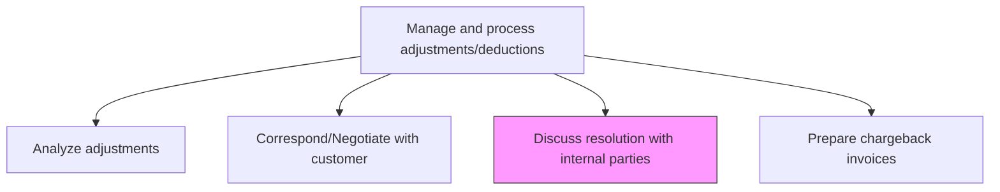
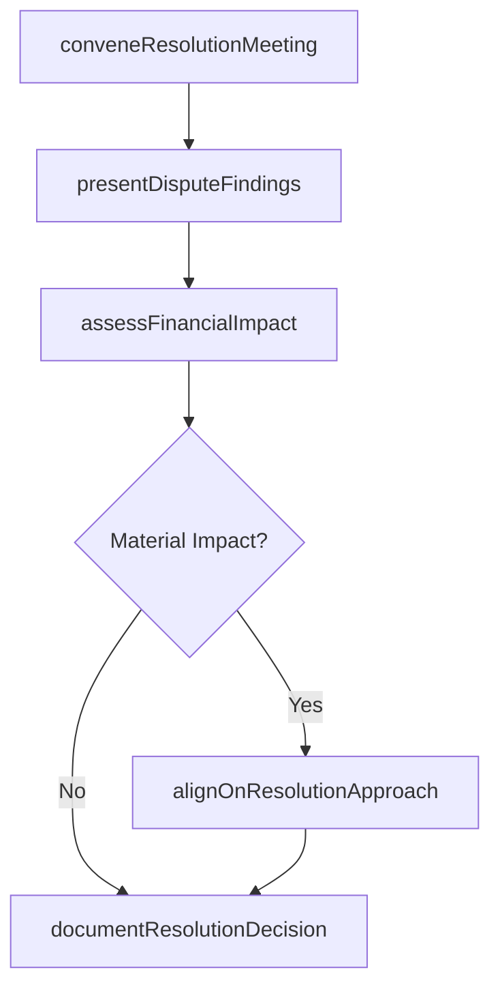

# Discuss resolution with internal parties

> Business-as-Code definition for internal resolution discussion on revenue adjustments. Models the process of coordinating across departments to align on adjustment policies, dispute outcomes, and corrective actions.

## Overview

Discussing resolution with internal parties coordinates cross-departmental alignment on revenue adjustments that require input from multiple stakeholders before a final decision can be reached. This process involves convening resolution meetings with revenue accounting, sales, finance, and legal representatives, presenting dispute analysis and customer correspondence history, assessing the financial impact of proposed resolutions, and reaching consensus on the recommended course of action. Internal alignment is particularly critical for material adjustments that affect revenue recognition, margin reporting, or customer contract terms. The documented resolution decision provides authorization for downstream chargeback invoicing, journal entry processing, and any required policy updates.

## Process Hierarchy



## GraphDL

```yaml
discuss:
  object: Resolution With Internal Parties
  actor: RevenueManager
  result: InternalResolutionDecision
```

## Actions

| Action | Description |
|--------|-------------|
| conveneResolutionMeeting | Schedule and conduct a cross-functional meeting to discuss the adjustment |
| presentDisputeFindings | Share the analysis and customer correspondence history with stakeholders |
| assessFinancialImpact | Calculate the revenue and margin impact of the proposed resolution |
| alignOnResolutionApproach | Reach consensus among departments on the recommended course of action |
| documentResolutionDecision | Record the agreed-upon resolution, rationale, and any policy updates |

## Events

| Event | Description |
|-------|-------------|
| resolutionMeetingConvened | A cross-functional resolution meeting has been held |
| findingsPresented | Dispute analysis and history have been shared with internal stakeholders |
| financialImpactAssessed | The revenue impact of the proposed resolution has been calculated |
| resolutionAligned | Internal departments have reached consensus on the resolution approach |
| resolutionDecisionDocumented | The agreed-upon resolution has been formally recorded |

## Searches

| Search | Description |
|--------|-------------|
| findPendingResolutions | List adjustment disputes awaiting internal resolution discussion |
| getResolutionHistory | Retrieve past internal resolution decisions for similar disputes |
| getImpactAnalysis | Return the financial impact assessment for a specific adjustment |
| getStakeholderFeedback | Retrieve feedback and positions from involved departments |

## Process Flow



## RACI Matrix

| Activity | Responsible | Accountable | Consulted | Informed |
|----------|-------------|-------------|-----------|----------|
| conveneResolutionMeeting | RevenueManager | Controller | SalesManager | CFO |
| presentDisputeFindings | RevenueAccountant | RevenueManager | ARSpecialist | InternalAudit |
| assessFinancialImpact | FinancialAnalyst | Controller | FPAManager | CFO |
| alignOnResolutionApproach | RevenueManager | Controller | Legal | SalesDirector |

## Related Processes

| Process | Relationship |
|---------|-------------|
| 9.2.5.2 Analyze adjustments | Upstream - analysis results feed internal discussion |
| 9.2.5.3 Correspond/Negotiate with customer | Parallel - customer negotiation informed by internal consensus |
| 9.2.5.5 Prepare chargeback invoices | Downstream - resolution decision determines chargeback actions |
| 9.8.3 Manage and monitor compliance function | Related - ensures resolution decisions comply with policies |

## Related Departments

| Department | Role |
|-----------|------|
| Revenue Accounting | Leads the internal resolution discussion |
| Sales | Provides customer relationship context and commercial justification |
| Finance | Assesses financial impact and budgetary implications |
| Legal | Advises on contractual and regulatory considerations |

## Related Occupations

| Occupation | Involvement |
|-----------|-------------|
| Revenue Manager | Facilitates cross-functional resolution discussions |
| Financial Analyst | Performs impact analysis and scenario modeling |
| Sales Operations Manager | Represents commercial interests in resolution decisions |

## KPIs

| KPI | Description | Unit |
|-----|-------------|------|
| Internal Resolution Cycle Time | Average time from meeting request to documented decision | Days |
| Cross-Functional Alignment Rate | Percentage of resolutions agreed upon in first meeting | % |
| Policy Compliance Rate | Percentage of resolutions conforming to established adjustment policies | % |
| Resolution Escalation Rate | Percentage of disputes requiring executive intervention | % |

## Usage

```typescript
import { discussResolutionWithInternalParties } from '@headlessly/discuss-resolution-with-internal-parties'

const client = discussResolutionWithInternalParties()

// Convene a resolution meeting for a disputed adjustment
const meeting = await client.conveneResolutionMeeting({
  adjustmentId: 'ADJ-2024-01122',
  stakeholders: ['revenueAccounting', 'sales', 'legal'],
  scheduledDate: '2024-11-20'
})

// Assess the financial impact of the proposed resolution
const impact = await client.assessFinancialImpact({
  adjustmentId: 'ADJ-2024-01122',
  proposedCredit: 45000.00,
  affectedPeriods: ['2024-Q3', '2024-Q4']
})
```
