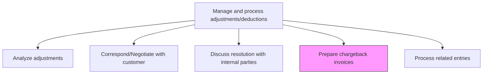
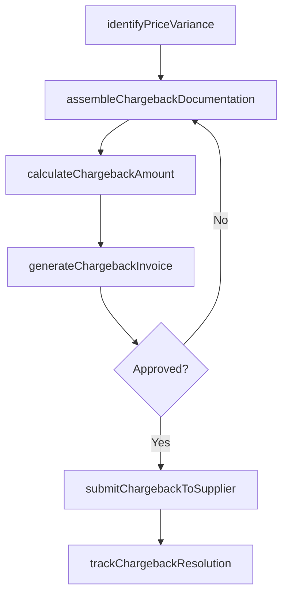

# Prepare chargeback invoices

> Business-as-Code definition for chargeback invoice preparation. Models the process of identifying pricing discrepancies, assembling supporting documentation, and generating chargeback invoices for cost recovery.

## Overview

Preparing chargeback invoices recovers costs when pricing discrepancies exist between contracted rates and amounts actually invoiced, typically when a supplier charges more than the agreed-upon price. This process involves identifying price variances by comparing invoiced amounts against contract terms, assembling supporting documentation such as purchase orders and price schedules, calculating the recoverable amount, and generating formal chargeback invoices for submission to the supplier. Timely chargeback processing directly protects margin and ensures that negotiated pricing agreements are effectively enforced. Tracking supplier response times and resolution rates provides visibility into vendor compliance and informs future contract negotiations.

## Process Hierarchy



## GraphDL

```yaml
prepare:
  object: Chargeback Invoices
  actor: BillingSpecialist
  result: ChargebackInvoice
```

## Actions

| Action | Description |
|--------|-------------|
| identifyPriceVariance | Compare the invoiced price against contracted or agreed-upon pricing |
| assembleChargebackDocumentation | Gather purchase orders, contracts, and price schedules supporting the claim |
| calculateChargebackAmount | Compute the recoverable amount based on the pricing discrepancy |
| generateChargebackInvoice | Create the formal chargeback invoice with line-item detail |
| submitChargebackToSupplier | Transmit the chargeback invoice to the supplier for processing |
| trackChargebackResolution | Monitor the supplier response and payment status of the chargeback |

## Events

| Event | Description |
|-------|-------------|
| priceVarianceIdentified | A pricing discrepancy has been detected between invoiced and contracted amounts |
| documentationAssembled | Supporting documentation for the chargeback claim has been compiled |
| chargebackCalculated | The recoverable chargeback amount has been computed |
| chargebackInvoiceGenerated | A formal chargeback invoice has been created |
| chargebackSubmitted | The chargeback invoice has been sent to the supplier |
| chargebackResolved | The supplier has processed and settled the chargeback claim |

## Searches

| Search | Description |
|--------|-------------|
| findPriceVariances | List transactions with pricing discrepancies above a specified threshold |
| getChargebacksBySupplier | Retrieve all chargebacks for a specific supplier filtered by status |
| getChargebackStatus | Return the current resolution status of a specific chargeback invoice |
| getChargebackSummary | Aggregate chargeback amounts by supplier, period, or product category |

## Process Flow



## RACI Matrix

| Activity | Responsible | Accountable | Consulted | Informed |
|----------|-------------|-------------|-----------|----------|
| identifyPriceVariance | BillingSpecialist | ARManager | Procurement | Controller |
| calculateChargebackAmount | BillingSpecialist | ARManager | ContractAdministrator | FinanceDirector |
| generateChargebackInvoice | BillingSpecialist | ARManager | Legal | RevenueAccountant |
| trackChargebackResolution | ARSpecialist | ARManager | Procurement | CFO |

## Related Processes

| Process | Relationship |
|---------|-------------|
| 9.2.5.2 Analyze adjustments | Upstream - adjustment analysis identifies chargeback candidates |
| 9.2.5.3 Correspond/Negotiate with customer | Parallel - negotiation outcomes may affect chargeback amounts |
| 9.2.5.6 Process related entries | Downstream - chargeback invoices generate journal entries |
| 9.6.1 Process accounts payable (AP) | Related - supplier-side processing of chargeback claims |

## Related Departments

| Department | Role |
|-----------|------|
| Billing | Primary owner responsible for chargeback invoice creation |
| Accounts Receivable | Tracks chargeback collections and supplier responses |
| Procurement | Validates contracted pricing and supplier agreements |
| Legal | Provides guidance on contractual enforcement for disputed chargebacks |

## Related Occupations

| Occupation | Involvement |
|-----------|-------------|
| Billing Specialist | Prepares and issues chargeback invoices |
| Contract Administrator | Validates pricing agreements supporting the chargeback |
| Accounts Receivable Analyst | Monitors chargeback collections and aging |

## KPIs

| KPI | Description | Unit |
|-----|-------------|------|
| Chargeback Recovery Rate | Percentage of submitted chargeback amounts collected | % |
| Average Chargeback Processing Time | Mean time from variance identification to invoice submission | Days |
| Chargeback Volume | Total number of chargeback invoices issued per period | Count |
| Supplier Response Time | Average time for suppliers to acknowledge chargeback claims | Days |

## Usage

```typescript
import { prepareChargebackInvoices } from '@headlessly/prepare-chargeback-invoices'

const client = prepareChargebackInvoices()

// Identify price variances for a product line
const variances = await client.findPriceVariances({
  supplierId: 'SUP-4401',
  threshold: 500.00,
  period: '2024-Q3'
})

// Generate and submit a chargeback invoice
const invoice = await client.generateChargebackInvoice({
  varianceIds: variances.map(v => v.id),
  supplierId: 'SUP-4401',
  chargebackAmount: 12350.00,
  supportingDocs: ['PO-2024-0891', 'CONTRACT-2023-0044']
})
```
