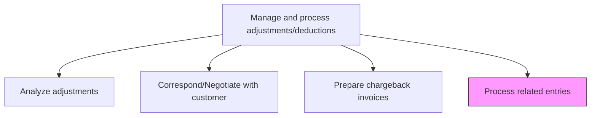
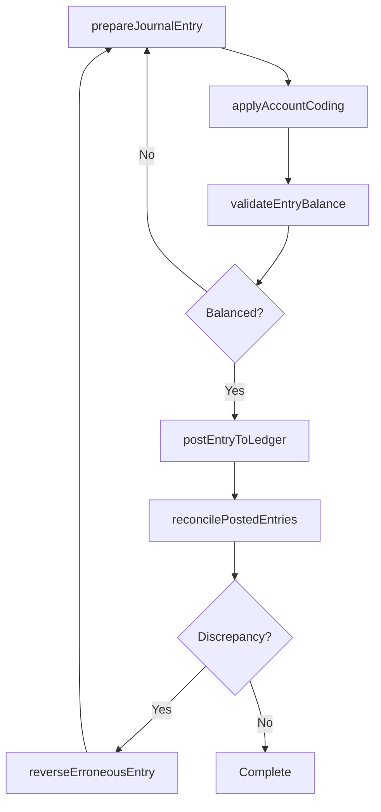

# Process related entries

> Business-as-Code definition for processing related journal entries from revenue adjustments. Models the recording, validation, and posting of debit and credit entries to maintain balanced accounts.

## Overview

Processing related entries records the debit and credit journal entries that arise from revenue adjustments, ensuring that the general ledger accurately reflects all approved modifications to customer accounts. This process involves drafting balanced journal entries, assigning correct GL account codes, validating that debits equal credits, posting entries to the ledger, and reconciling posted entries against source adjustment documents. Accurate and timely entry processing is essential for maintaining balanced books, meeting period-end close deadlines, and providing auditors with a clear trail from adjustment approval to ledger posting. Erroneous entries are corrected through reversing entries and re-posting, with each correction documented for the audit trail.

## Process Hierarchy



## GraphDL

```yaml
process:
  object: Related Entries
  actor: GeneralLedgerAccountant
  result: PostedJournalEntry
```

## Actions

| Action | Description |
|--------|-------------|
| prepareJournalEntry | Draft the debit and credit lines for the adjustment-related transaction |
| validateEntryBalance | Verify that total debits equal total credits before posting |
| applyAccountCoding | Assign the correct general ledger account codes to each line item |
| postEntryToLedger | Record the validated journal entry in the general ledger |
| reconcilePostedEntries | Match posted entries against source adjustment documents |
| reverseErroneousEntry | Create a reversing entry to correct a previously posted error |

## Events

| Event | Description |
|-------|-------------|
| journalEntryPrepared | A draft journal entry has been created for the adjustment |
| entryBalanceValidated | The journal entry has been confirmed as balanced |
| accountCodingApplied | General ledger account codes have been assigned to the entry |
| entryPostedToLedger | The journal entry has been recorded in the general ledger |
| entriesReconciled | Posted entries have been matched to source adjustment documents |
| entryReversed | An erroneous journal entry has been reversed with a correcting entry |

## Searches

| Search | Description |
|--------|-------------|
| findEntriesByAdjustment | List all journal entries related to a specific adjustment |
| getUnpostedEntries | Retrieve draft entries awaiting validation and posting |
| getEntryAuditTrail | Return the full audit trail for a specific journal entry |
| findUnreconciledEntries | List posted entries that have not yet been matched to source documents |

## Process Flow



## RACI Matrix

| Activity | Responsible | Accountable | Consulted | Informed |
|----------|-------------|-------------|-----------|----------|
| prepareJournalEntry | GeneralLedgerAccountant | Controller | RevenueAccountant | FinanceDirector |
| validateEntryBalance | GeneralLedgerAccountant | Controller | InternalAudit | RevenueManager |
| postEntryToLedger | GeneralLedgerAccountant | Controller | ITSystems | CFO |
| reconcilePostedEntries | GeneralLedgerAccountant | Controller | ARSpecialist | InternalAudit |

## Related Processes

| Process | Relationship |
|---------|-------------|
| 9.2.5.2 Analyze adjustments | Upstream - approved adjustments generate related entries |
| 9.2.5.5 Prepare chargeback invoices | Upstream - chargeback invoices create corresponding journal entries |
| 9.3.2.2 Process journal entries | Related - general ledger journal entry processing |
| 9.3.2.6 Reconcile general ledger accounts | Downstream - posted entries feed GL reconciliation |

## Related Departments

| Department | Role |
|-----------|------|
| General Accounting | Primary owner responsible for posting and reconciling entries |
| Revenue Accounting | Provides source adjustment data and approval |
| Internal Audit | Reviews entry accuracy and control compliance |
| IT Finance Systems | Maintains the ledger system and posting controls |

## Related Occupations

| Occupation | Involvement |
|-----------|-------------|
| General Ledger Accountant | Primary executor of entry preparation and posting |
| Revenue Accountant | Provides adjustment details and validates coding |
| Internal Auditor | Reviews posted entries for accuracy and compliance |

## KPIs

| KPI | Description | Unit |
|-----|-------------|------|
| Entry Posting Accuracy | Percentage of entries posted without subsequent correction | % |
| Average Posting Cycle Time | Mean time from entry preparation to ledger posting | Hours |
| Unreconciled Entry Rate | Percentage of posted entries not yet matched to source documents | % |
| Entry Reversal Rate | Ratio of reversing entries to total posted entries | % |

## Usage

```typescript
import { processRelatedEntries } from '@headlessly/process-related-entries'

const client = processRelatedEntries()

// Prepare and post a journal entry for an adjustment
const entry = await client.prepareJournalEntry({
  adjustmentId: 'ADJ-2024-01122',
  debitAccount: '4100-Revenue',
  creditAccount: '1200-AccountsReceivable',
  amount: 2500.00,
  description: 'Credit memo for pricing adjustment'
})

// Reconcile posted entries for the period
const unreconciled = await client.findUnreconciledEntries({
  period: '2024-11',
  accountRange: '4000-4999'
})
```
