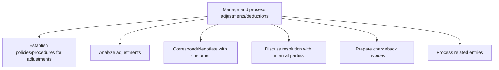
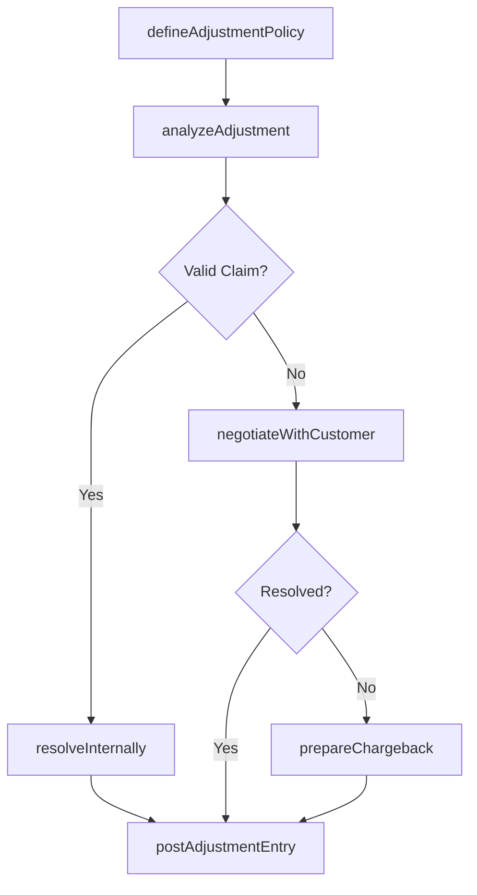

# Manage and process adjustments/deductions

> Business-as-Code definition for revenue adjustments and deductions management. Models adjustment policy creation, deduction analysis, customer negotiation, chargeback processing, and journal entry posting as programmable APIs.

## Overview

Creating and providing funds for necessary adjustments and deductions, including all expenses that were required for the business at certain point in time.

## Process Hierarchy



## GraphDL

```yaml
manage:
  object: And Process Adjustments/deductions
  actor: ARAdjustmentSpecialist
  result: AdjustmentResolution
```

## Actions

| Action | Description |
|--------|-------------|
| defineAdjustmentPolicy | Establish rules for credit memos, deductions, and chargeback processing |
| analyzeAdjustment | Review deduction claims and determine root cause and validity |
| negotiateWithCustomer | Communicate with customers to resolve disputed amounts |
| resolveInternally | Coordinate with sales, logistics, or quality teams on adjustment claims |
| prepareChargeback | Create chargeback invoices for invalid customer deductions |
| postAdjustmentEntry | Record approved adjustments and deductions in the AR subledger |

## Events

| Event | Description |
|-------|-------------|
| adjustmentPolicyDefined | Adjustment and deduction policies published |
| adjustmentAnalyzed | Deduction claim reviewed and root cause determined |
| customerNegotiated | Resolution discussed and agreed upon with the customer |
| resolvedInternally | Internal departments aligned on adjustment resolution |
| chargebackPrepared | Chargeback invoice created for invalid deduction |
| adjustmentEntryPosted | Adjustment journal entry recorded in the AR subledger |

## Searches

| Search | Description |
|--------|-------------|
| getOpenDeductions | List unresolved deductions by customer, amount, or age |
| getAdjustmentHistory | Retrieve adjustment records for a customer or invoice |
| getChargebacks | Query chargeback invoices by status, customer, or date |
| getDeductionAnalytics | Get deduction trends by reason code, customer, or product |

## Process Flow



## RACI Matrix

| Activity | Responsible | Accountable | Consulted | Informed |
|----------|-------------|-------------|-----------|----------|
| analyzeAdjustment | AR Adjustment Specialist | AR Manager | Sales | Controller |
| negotiateWithCustomer | AR Adjustment Specialist | AR Manager | Sales Representative | Credit Manager |
| prepareChargeback | AR Adjustment Specialist | AR Manager | Legal | Controller |
| postAdjustmentEntry | AR Accountant | Controller | AR Manager | Internal Audit |

## Sub-Processes

| ID | Name | Description |
|----|------|-------------|
| 9.2.5.1 | Establish policies/procedures for adjustments | Creating guidelines to follow in case of adjustments to business processes. |
| 9.2.5.2 | Analyze adjustments | Checking changes made in accounts during the year. Examine the alterations made in final accounts to |
| 9.2.5.3 | Correspond/Negotiate with customer | Providing suitable offers to customers. Present different offers (e.g., discounts) available for cus |
| 9.2.5.4 | Discuss resolution with internal parties | Discussing and planning with internal parties (department heads, managers, and senior management) ab |
| 9.2.5.5 | Prepare chargeback invoices | Creating a mechanism for consumer protection in case of a higher price charged. When a supplier sell |
| 9.2.5.6 | Process related entries | Recording business transactions as they occur in order to provide a balanced accounts for financial  |

## Related Processes

| Process | Relationship |
|---------|-------------|
| 9.2.3 Process accounts receivable (AR) | Upstream - adjustments modify AR balances |
| 9.2.4 Manage and process collections | Parallel - collection disputes may result in adjustments |
| 9.3.2 Perform general accounting | Downstream - adjustment entries post to general ledger |

## Related Departments

| Department | Role |
|-----------|------|
| Accounts Receivable | Primary owner of deduction analysis and adjustment processing |
| Sales | Provides context on customer claims and trade promotions |
| Supply Chain | Investigates shipping and delivery-related deductions |
| Legal | Advises on contractual disputes and chargeback authority |

## Related Occupations

| Occupation | Involvement |
|-----------|-------------|
| AR Adjustment Specialist | Investigates deductions and processes credit memos |
| Deductions Analyst | Analyzes deduction trends and root causes |
| AR Manager | Approves high-value adjustments and chargebacks |

## KPIs

| KPI | Description | Unit |
|-----|-------------|------|
| Deduction Resolution Time | Average days to resolve an open deduction | Days |
| Invalid Deduction Rate | Percentage of deductions determined to be invalid | % |
| Chargeback Recovery Rate | Percentage of chargebacks successfully collected | % |
| Deduction-to-Revenue Ratio | Total deductions as a percentage of gross revenue | % |

## Usage

```typescript
import { manageAndProcessAdjustmentsDeductions } from '@headlessly/manage-and-process-adjustments-deductions'

const adjustments = manageAndProcessAdjustmentsDeductions()

// Analyze an open deduction
const analysis = await adjustments.analyzeAdjustment({
  deductionId: 'DED-2025-0445',
  invoiceId: 'INV-2025-7001',
  reasonCode: 'pricing-discrepancy'
})

// Prepare chargeback for invalid deduction
await adjustments.prepareChargeback({
  deductionId: 'DED-2025-0445',
  amount: 2500,
  supportingDocuments: ['contract-v2.pdf', 'po-confirmation.pdf']
})
```
