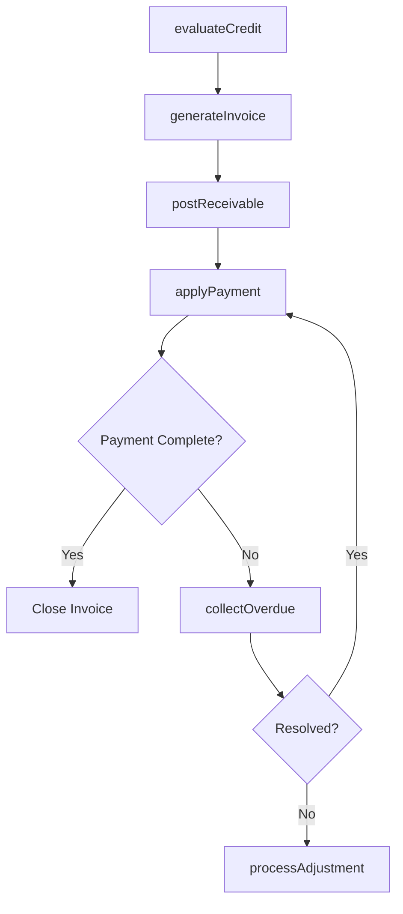

# Perform revenue accounting

> Business-as-Code definition for revenue accounting operations. Models the order-to-cash cycle including credit management, invoicing, accounts receivable, collections, and adjustments as programmable APIs.

## Overview

Comparing revenue targets to reality. Review all transactions and entries passed in final accounts in a year in order to examine profits.

## Process Hierarchy

```mermaid
graph TD
    A[Perform revenue accounting]
    A --> B[Process customer credit]
    A --> C[Invoice customer]
    A --> D[Process accounts receivable (AR)]
    A --> E[Manage and process collections]
    A --> F[Manage and process adjustments/deductions]
```

## GraphDL

```yaml
perform:
  object: Revenue Accounting
  actor: RevenueAccountant
  result: RevenueRecognitionReport
```

## Actions

| Action | Description |
|--------|-------------|
| evaluateCredit | Assess customer creditworthiness and set credit limits |
| generateInvoice | Create and transmit customer invoices for goods or services delivered |
| postReceivable | Record accounts receivable entries in the subledger |
| applyPayment | Match incoming payments to open invoices and post cash receipts |
| collectOverdue | Initiate collection activities on past-due accounts |
| processAdjustment | Record credit memos, write-offs, and deduction resolutions |

## Events

| Event | Description |
|-------|-------------|
| creditEvaluated | Customer credit assessment completed and limits established |
| invoiceGenerated | Customer invoice created and transmitted |
| receivablePosted | Accounts receivable entry recorded in the subledger |
| paymentApplied | Customer payment matched to invoice and cash posted |
| overdueCollected | Collection action completed on delinquent account |
| adjustmentProcessed | Credit memo or write-off recorded and reflected in AR balance |

## Searches

| Search | Description |
|--------|-------------|
| getOpenInvoices | Retrieve unpaid invoices filtered by customer, date, or amount |
| getAgingReport | Get accounts receivable aging summary by bucket |
| findPayments | Search payment records by customer, date range, or reference |
| getCollectionQueue | List overdue accounts prioritized by balance and aging |

## Process Flow



## RACI Matrix

| Activity | Responsible | Accountable | Consulted | Informed |
|----------|-------------|-------------|-----------|----------|
| evaluateCredit | Credit Analyst | Credit Manager | Sales Manager | Controller |
| generateInvoice | Billing Specialist | AR Manager | Sales Operations | Customer |
| applyPayment | Cash Applications Clerk | AR Manager | Treasury | Controller |
| collectOverdue | Collections Specialist | Credit Manager | Legal | CFO |

## Sub-Processes

| ID | Name | Description |
|----|------|-------------|
| 9.2.1 | Process customer credit | Evaluating and processing requests for advances. Evaluate credit requests by customers requiring loa |
| 9.2.2 | Invoice customer | Preparing detailed reports of customer purchases. Prepare a commercial document between the seller a |
| 9.2.3 | Process accounts receivable (AR) | Processing payments due from customers. This includes all processing of funds received, whether by c |
| 9.2.4 | Manage and process collections | Posting entries to respective accounts, and preparing accounts for receivables. Manage the cash coll |
| 9.2.5 | Manage and process adjustments/deductions | Creating and providing funds for necessary adjustments and deductions, including all expenses that w |

## Related Processes

| Process | Relationship |
|---------|-------------|
| 9.1 Perform planning and management accounting | Upstream - revenue actuals feed budget variance analysis |
| 9.3 Perform general accounting and reporting | Downstream - AR balances post to the general ledger |
| 3.5 Invoice and service customers | Upstream - order fulfillment triggers invoicing |

## Related Departments

| Department | Role |
|-----------|------|
| Accounts Receivable | Primary owner of invoicing, cash application, and collections |
| Credit | Manages customer credit evaluation and limit setting |
| Sales | Provides order and contract data triggering invoices |
| Treasury | Manages cash receipts and bank reconciliation |
| Legal | Supports escalated collections and contractual disputes |

## Related Occupations

| Occupation | Involvement |
|-----------|-------------|
| Revenue Accountant | Revenue recognition and AR subledger management |
| Credit Analyst | Customer creditworthiness assessment and limit management |
| Collections Specialist | Overdue account follow-up and payment negotiation |

## KPIs

| KPI | Description | Unit |
|-----|-------------|------|
| Days Sales Outstanding | Average number of days to collect receivables | Days |
| Invoice Accuracy Rate | Percentage of invoices issued without errors | % |
| Collection Effectiveness Index | Ratio of cash collected to total receivables available | % |
| Bad Debt Ratio | Write-offs as a percentage of total revenue | % |

## Usage

```typescript
import { performRevenueAccounting } from '@headlessly/perform-revenue-accounting'

const revenue = performRevenueAccounting()

// Generate invoice for a completed order
const invoice = await revenue.generateInvoice({
  orderId: 'ORD-2025-4891',
  paymentTerms: 'Net30',
  currency: 'USD'
})

// Get aging report for overdue accounts
const aging = await revenue.getAgingReport({
  asOfDate: '2025-12-31',
  buckets: ['current', '1-30', '31-60', '61-90', '90+']
})
```
