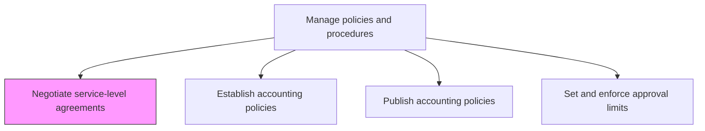
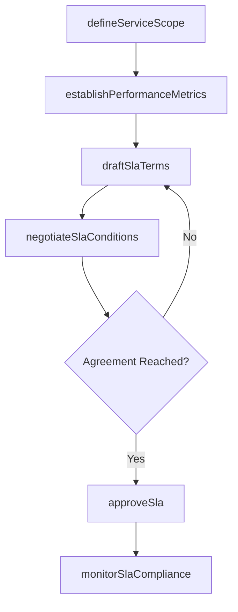

# Negotiate service-level agreements

> Business-as-Code definition for negotiating financial service-level agreements. Models the process of defining, negotiating, and formalizing SLAs between the finance function and internal or external service providers.

## Overview

Agreeing upon terms and conditions. Negotiate an agreement between two or more parties, the customer and service providers. Specify scope, quality, and responsibilities.

## Process Hierarchy



## GraphDL

```yaml
negotiate:
  object: Service-level Agreements
  actor: FinanceOperationsManager
  result: ServiceLevelAgreement
```

## Actions

| Action | Description |
|--------|-------------|
| defineServiceScope | Specify the financial services covered including transaction processing, reporting, and close timelines |
| establishPerformanceMetrics | Set measurable targets for accuracy, timeliness, and throughput |
| draftSlaTerms | Prepare the formal SLA document with obligations, penalties, and escalation procedures |
| negotiateSlaConditions | Engage with service providers to finalize mutually acceptable terms |
| approveSla | Obtain sign-off from authorized stakeholders on the finalized agreement |
| monitorSlaCompliance | Track actual performance against agreed-upon service levels |

## Events

| Event | Description |
|-------|-------------|
| serviceScopeDefined | The scope of covered financial services has been documented |
| performanceMetricsEstablished | Measurable SLA targets have been set |
| slaTermsDrafted | A draft SLA document has been prepared for review |
| slaConditionsNegotiated | Terms have been finalized through provider negotiation |
| slaApproved | The SLA has been formally signed by all parties |
| slaBreachDetected | Actual performance has fallen below agreed-upon thresholds |

## Searches

| Search | Description |
|--------|-------------|
| findActiveSlas | List all current SLAs filtered by provider, service type, or status |
| getSlaPerformance | Retrieve actual vs. target metrics for a specific SLA |
| getSlaBreaches | Return instances where SLA thresholds were not met |
| getSlaRenewalSchedule | List SLAs approaching renewal or expiration dates |

## Process Flow



## RACI Matrix

| Activity | Responsible | Accountable | Consulted | Informed |
|----------|-------------|-------------|-----------|----------|
| defineServiceScope | FinanceOperationsManager | Controller | BusinessUnitLeads | CFO |
| draftSlaTerms | FinanceOperationsManager | Controller | Legal | Procurement |
| negotiateSlaConditions | FinanceOperationsManager | CFO | Procurement | InternalAudit |
| monitorSlaCompliance | FinanceAnalyst | Controller | ServiceProvider | BusinessUnitLeads |

## Related Processes

| Process | Relationship |
|---------|-------------|
| 9.3.1.2 Establish accounting policies | Parallel - SLAs must align with accounting policies |
| 9.3.1.5 Establish common financial systems | Related - system capabilities constrain achievable SLAs |
| 9.3.2 Perform general accounting | Consumer - accounting operations are governed by negotiated SLA targets |
| 9.8.3 Manage and monitor compliance function | Downstream - SLA monitoring feeds compliance reporting |

## Related Departments

| Department | Role |
|-----------|------|
| Finance Operations | Primary owner of SLA negotiation and monitoring |
| Procurement | Supports vendor negotiations and contract terms |
| Legal | Reviews SLA terms for enforceability |
| IT | Provides system capability assessments |

## Related Occupations

| Occupation | Involvement |
|-----------|-------------|
| Finance Operations Manager | Leads SLA negotiation and defines service scope |
| Procurement Specialist | Supports commercial negotiations |
| Financial Analyst | Monitors SLA performance metrics |

## KPIs

| KPI | Description | Unit |
|-----|-------------|------|
| SLA Compliance Rate | Percentage of SLA targets met during the period | % |
| Average Negotiation Duration | Mean time from initiation to signed SLA | Days |
| SLA Breach Frequency | Number of SLA breaches per reporting period | Count |
| Service Satisfaction Score | Internal stakeholder satisfaction with SLA-covered services | Score (1-5) |

## Usage

```typescript
import { negotiateServiceLevelAgreements } from '@headlessly/negotiate-service-level-agreements'

const client = negotiateServiceLevelAgreements()

// Define service scope for a new SLA
const scope = await client.defineServiceScope({
  providerId: 'PROV-SSC-001',
  services: ['transactionProcessing', 'monthEndClose', 'reporting'],
  effectiveDate: '2025-01-01'
})

// Monitor compliance for active SLAs
const performance = await client.getSlaPerformance({
  slaId: 'SLA-2024-0012',
  period: '2024-Q4'
})
```
