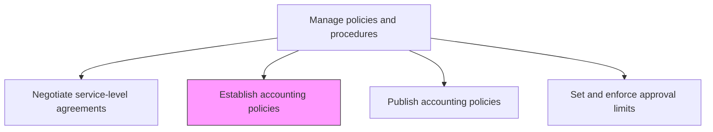
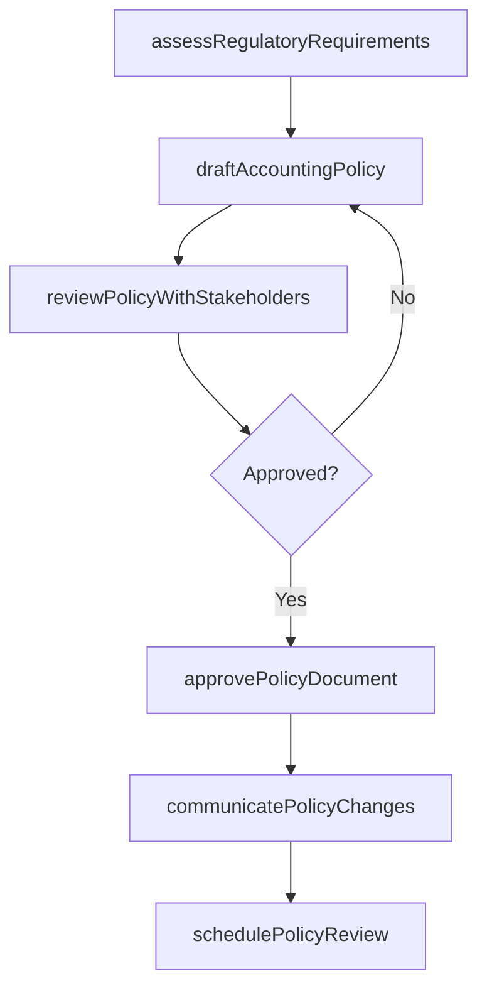

# Establish accounting policies

> Business-as-Code definition for establishing accounting policies. Models the process of defining, documenting, and implementing accounting standards, methods, and measurement systems for financial statement preparation.

## Overview

Establishing policies and procedures to prepare financial statements, including methods, measurement systems, and procedures for providing disclosures. Accounting policies define the recognition, measurement, and presentation rules that the organization applies when recording transactions and preparing financial reports. These policies must comply with applicable GAAP, IFRS, or local statutory frameworks and be periodically reviewed to reflect new standards, regulatory changes, and evolving business practices.

## Process Hierarchy



## GraphDL

```yaml
establish:
  object: Accounting Policies
  actor: ChiefAccountingOfficer
  result: AccountingPolicyDocument
```

## Actions

| Action | Description |
|--------|-------------|
| assessRegulatoryRequirements | Review applicable GAAP, IFRS, or local statutory requirements for policy alignment |
| draftAccountingPolicy | Author the detailed policy specifying recognition, measurement, and disclosure methods |
| reviewPolicyWithStakeholders | Circulate the draft policy for input from audit, legal, and business unit leaders |
| approvePolicyDocument | Obtain formal sign-off from the controller and CFO |
| communicatePolicyChanges | Distribute approved policy changes to all affected finance personnel |
| schedulePolicyReview | Set periodic review dates to ensure policies remain current with regulatory changes |

## Events

| Event | Description |
|-------|-------------|
| regulatoryRequirementsAssessed | Applicable accounting standards have been reviewed for policy impact |
| policyDrafted | A new or updated accounting policy document has been authored |
| policyReviewCompleted | Stakeholder feedback on the draft policy has been collected |
| policyApproved | The accounting policy has been formally authorized |
| policyChangeCommunicated | Updated policies have been distributed to finance personnel |
| policyReviewScheduled | A future review date has been set for the policy |

## Searches

| Search | Description |
|--------|-------------|
| findPoliciesByStandard | List accounting policies filtered by applicable standard (GAAP, IFRS) |
| getPolicyDocument | Retrieve the full text of a specific accounting policy |
| getPoliciesRequiringReview | Return policies approaching their scheduled review date |
| getPolicyChangeHistory | Retrieve the revision history for a specific policy |

## Process Flow



## RACI Matrix

| Activity | Responsible | Accountable | Consulted | Informed |
|----------|-------------|-------------|-----------|----------|
| assessRegulatoryRequirements | TechnicalAccountingManager | Controller | ExternalAuditor | CFO |
| draftAccountingPolicy | TechnicalAccountingManager | Controller | Legal | BusinessUnitControllers |
| approvePolicyDocument | Controller | CFO | AuditCommittee | InternalAudit |
| communicatePolicyChanges | FinanceOperationsManager | Controller | HRTraining | AllFinanceStaff |

## Related Processes

| Process | Relationship |
|---------|-------------|
| 9.3.1.3 Publish accounting policies | Downstream - approved policies are published for organization-wide access |
| 9.3.1.4 Set and enforce approval limits | Related - approval limits are governed by accounting policies |
| 9.3.2 Perform general accounting | Consumer - accounting operations follow established policies |
| 9.8.3 Manage and monitor compliance function | Related - policy adherence is monitored through compliance |

## Related Departments

| Department | Role |
|-----------|------|
| Technical Accounting | Primary owner of policy development and standards interpretation |
| Finance | Implements policies across accounting operations |
| Internal Audit | Validates policy compliance and effectiveness |
| Legal | Reviews policies for regulatory and contractual alignment |

## Related Occupations

| Occupation | Involvement |
|-----------|-------------|
| Chief Accounting Officer | Authorizes and champions accounting policies |
| Technical Accounting Manager | Researches standards and drafts policy language |
| External Auditor | Provides guidance on standard interpretation |

## KPIs

| KPI | Description | Unit |
|-----|-------------|------|
| Policy Currency Rate | Percentage of policies reviewed within their scheduled cycle | % |
| Policy Adoption Rate | Percentage of business units operating under the current policy version | % |
| Audit Finding Rate | Number of audit findings related to policy non-compliance | Count |
| Policy Update Cycle Time | Average time from regulatory change to updated policy issuance | Days |

## Usage

```typescript
import { establishAccountingPolicies } from '@headlessly/establish-accounting-policies'

const client = establishAccountingPolicies()

// Assess regulatory requirements for revenue recognition
const assessment = await client.assessRegulatoryRequirements({
  standard: 'ASC-606',
  effectiveDate: '2025-01-01',
  impactedAreas: ['revenueRecognition', 'contractModifications']
})

// Draft a new accounting policy
const draft = await client.draftAccountingPolicy({
  title: 'Revenue Recognition Under ASC 606',
  standard: 'ASC-606',
  scope: 'allBusinessUnits',
  effectiveDate: '2025-01-01'
})
```
