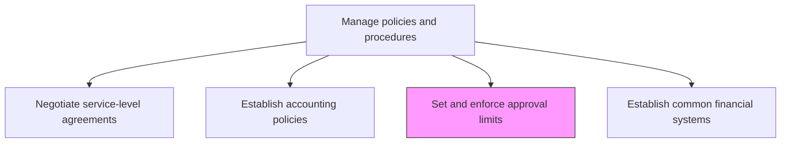
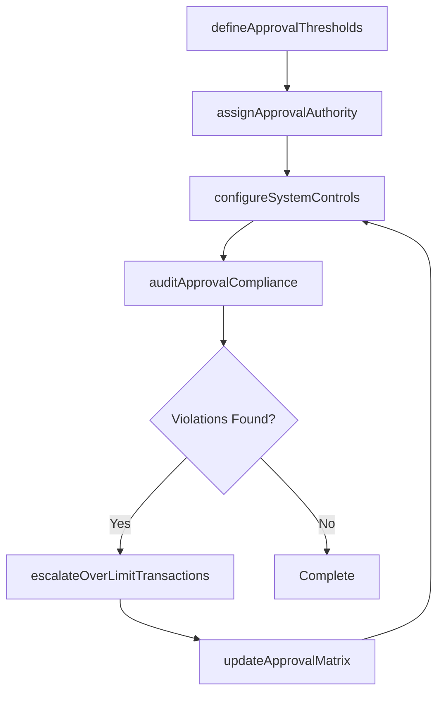

# Set and enforce approval limits

> Business-as-Code definition for setting and enforcing financial approval limits. Models the process of defining authorization thresholds, configuring system controls, and monitoring compliance with approval hierarchies.

## Overview

Implementing parameters for accounting. Apply set conditions for any approval process. Approval limits define the maximum monetary authority granted to each organizational role, ensuring that transactions above specified thresholds receive appropriate management oversight before commitment. Properly configured approval limits reduce fraud risk, enforce segregation of duties, and create an auditable authorization chain across the organization.

## Process Hierarchy



## GraphDL

```yaml
set:
  object: And Enforce Approval Limits
  actor: Controller
  result: ApprovalLimitConfiguration
```

## Actions

| Action | Description |
|--------|-------------|
| defineApprovalThresholds | Establish monetary thresholds for each level of the approval hierarchy |
| assignApprovalAuthority | Map specific individuals or roles to their authorized approval limits |
| configureSystemControls | Implement approval limits within financial systems to enforce automated routing |
| auditApprovalCompliance | Review transactions to verify that appropriate authorization was obtained |
| escalateOverLimitTransactions | Route transactions exceeding assigned limits to higher-level approvers |
| updateApprovalMatrix | Revise approval thresholds and authority assignments based on organizational changes |

## Events

| Event | Description |
|-------|-------------|
| thresholdsDefined | Monetary approval thresholds have been established for each level |
| authorityAssigned | Individuals or roles have been mapped to their approval limits |
| systemControlsConfigured | Approval limits have been implemented in the financial system |
| complianceAudited | A review of approval compliance has been completed |
| overLimitTransactionEscalated | A transaction exceeding the limit has been routed upward |
| approvalMatrixUpdated | The approval hierarchy and thresholds have been revised |

## Searches

| Search | Description |
|--------|-------------|
| getApprovalMatrix | Retrieve the current approval limit matrix by role and transaction type |
| findOverLimitTransactions | List transactions that exceeded assigned approval limits |
| getApprovalAuditLog | Return the authorization audit trail for a specific transaction |
| getApprovalLimitExceptions | Retrieve approved exceptions to standard approval limits |

## Process Flow



## RACI Matrix

| Activity | Responsible | Accountable | Consulted | Informed |
|----------|-------------|-------------|-----------|----------|
| defineApprovalThresholds | Controller | CFO | InternalAudit | BusinessUnitLeads |
| assignApprovalAuthority | Controller | CFO | HRCompensation | Legal |
| configureSystemControls | FinanceSystemsAdmin | Controller | IT | InternalAudit |
| auditApprovalCompliance | InternalAuditor | ChiefAuditExecutive | Controller | AuditCommittee |

## Related Processes

| Process | Relationship |
|---------|-------------|
| 9.3.1.2 Establish accounting policies | Upstream - accounting policies define the framework for approval limits |
| 9.6.1 Process accounts payable (AP) | Consumer - AP transactions are subject to approval limits |
| 9.8 Manage internal controls | Related - approval limits are a key internal control mechanism |

## Related Departments

| Department | Role |
|-----------|------|
| Finance | Primary owner of approval limit definition and enforcement |
| Internal Audit | Monitors compliance with approval limits |
| IT | Configures system-level approval controls |
| Human Resources | Manages role assignments that map to approval authorities |

## Related Occupations

| Occupation | Involvement |
|-----------|-------------|
| Controller | Defines and authorizes approval threshold levels |
| Internal Auditor | Reviews approval compliance and reports violations |
| Finance Systems Administrator | Implements limits in ERP and financial systems |

## KPIs

| KPI | Description | Unit |
|-----|-------------|------|
| Approval Compliance Rate | Percentage of transactions properly authorized within limits | % |
| Override Frequency | Number of approval limit overrides per period | Count |
| Unauthorized Transaction Rate | Percentage of transactions processed without required approval | % |
| Matrix Update Frequency | Number of times the approval matrix is revised per year | Per Year |

## Usage

```typescript
import { setAndEnforceApprovalLimits } from '@headlessly/set-and-enforce-approval-limits'

const client = setAndEnforceApprovalLimits()

// Define approval thresholds for purchase orders
const thresholds = await client.defineApprovalThresholds({
  transactionType: 'purchaseOrder',
  levels: [
    { role: 'DepartmentManager', limit: 10000 },
    { role: 'Director', limit: 50000 },
    { role: 'VP', limit: 250000 },
    { role: 'CFO', limit: 1000000 }
  ]
})

// Audit approval compliance for the quarter
const audit = await client.auditApprovalCompliance({
  period: '2024-Q4',
  transactionTypes: ['purchaseOrder', 'journalEntry', 'expenseReport']
})
```
