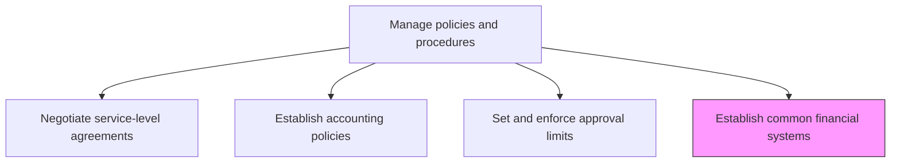
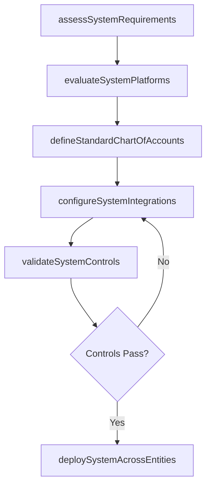

# Establish common financial systems

> Business-as-Code definition for establishing common financial systems. Models the process of selecting, configuring, and deploying standardized ERP and financial platforms across the organization.

## Overview

Establishing processes and procedures to exercise financial control and accountability. Record, verify, and report transactions that affect revenues, expenditures, assets, and liabilities. A common financial system standardizes the chart of accounts, transaction processing, and reporting across all business units, reducing data inconsistencies and enabling efficient consolidation. System standardization also lowers total cost of ownership by eliminating redundant platforms and simplifying integration maintenance.

## Process Hierarchy



## GraphDL

```yaml
establish:
  object: Common Financial Systems
  actor: FinanceSystemsDirector
  result: FinancialSystemLandscape
```

## Actions

| Action | Description |
|--------|-------------|
| assessSystemRequirements | Gather business and technical requirements for financial system capabilities |
| evaluateSystemPlatforms | Compare candidate ERP and financial platforms against requirements |
| defineStandardChartOfAccounts | Create a unified chart of accounts for use across all entities |
| configureSystemIntegrations | Set up data flows between financial systems, sub-ledgers, and reporting tools |
| deploySystemAcrossEntities | Roll out the standardized financial system to all business units |
| validateSystemControls | Test that automated controls, audit trails, and access restrictions function correctly |

## Events

| Event | Description |
|-------|-------------|
| requirementsAssessed | Business and technical requirements have been documented |
| platformsEvaluated | Candidate financial systems have been scored and ranked |
| chartOfAccountsDefined | A standardized chart of accounts has been established |
| integrationsConfigured | System integrations and data flows have been set up |
| systemDeployed | The financial system has been deployed to a business unit |
| controlsValidated | Automated controls and audit trails have been tested and confirmed |

## Searches

| Search | Description |
|--------|-------------|
| getSystemLandscape | Retrieve the current financial system inventory across all entities |
| findEntityDeployments | List business units and their financial system deployment status |
| getIntegrationMap | Return the data flow and integration topology for financial systems |
| getSystemControlStatus | Retrieve the validation status of automated controls by system |

## Process Flow



## RACI Matrix

| Activity | Responsible | Accountable | Consulted | Informed |
|----------|-------------|-------------|-----------|----------|
| assessSystemRequirements | FinanceSystemsDirector | CFO | BusinessUnitControllers | IT |
| evaluateSystemPlatforms | FinanceSystemsDirector | CFO | Procurement | InternalAudit |
| configureSystemIntegrations | FinanceSystemsAdmin | FinanceSystemsDirector | IT | Controller |
| deploySystemAcrossEntities | FinanceSystemsDirector | CFO | ChangeManagement | AllFinanceStaff |

## Related Processes

| Process | Relationship |
|---------|-------------|
| 9.3.1.2 Establish accounting policies | Upstream - policies drive system configuration requirements |
| 9.3.1.4 Set and enforce approval limits | Related - approval limits are configured within financial systems |
| 9.3.2.1 Maintain chart of accounts | Downstream - the chart of accounts is maintained within the system |
| 9.8 Manage internal controls | Related - system controls support the internal control framework |

## Related Departments

| Department | Role |
|-----------|------|
| Finance Systems | Primary owner of financial system strategy and deployment |
| IT | Provides infrastructure, hosting, and integration support |
| Internal Audit | Validates system controls and data integrity |
| Change Management | Manages organizational adoption and training |

## Related Occupations

| Occupation | Involvement |
|-----------|-------------|
| Finance Systems Director | Leads platform selection and standardization strategy |
| ERP Administrator | Configures and maintains the financial system |
| Business Analyst | Translates finance requirements into system specifications |

## KPIs

| KPI | Description | Unit |
|-----|-------------|------|
| System Standardization Rate | Percentage of business units on the common financial platform | % |
| Integration Uptime | Availability of data flows between financial systems | % |
| Control Validation Pass Rate | Percentage of automated controls passing validation tests | % |
| Deployment Cycle Time | Average time to deploy the system to a new entity | Weeks |

## Usage

```typescript
import { establishCommonFinancialSystems } from '@headlessly/establish-common-financial-systems'

const client = establishCommonFinancialSystems()

// Assess system requirements for a new business unit
const requirements = await client.assessSystemRequirements({
  entityId: 'BU-EMEA-004',
  capabilities: ['generalLedger', 'accountsPayable', 'fixedAssets'],
  userCount: 150,
  transactionVolume: 50000
})

// Get the current system landscape
const landscape = await client.getSystemLandscape({
  includeIntegrations: true,
  status: 'active'
})
```
