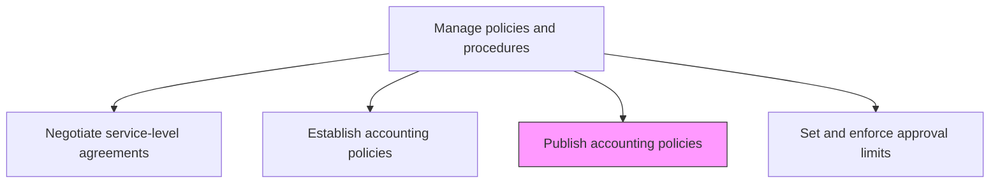
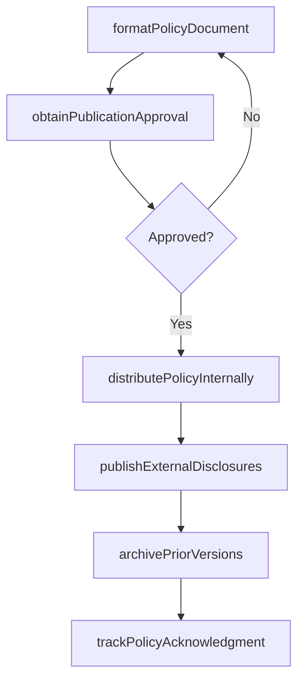

# Publish accounting policies

> Business-as-Code definition for publishing accounting policies. Models the process of formatting, distributing, and maintaining the accessibility of approved accounting policy documents for internal and external stakeholders.

## Overview

Creating a written copy of agreed-upon procedures for preparing financial statements, and making them available to the public. Publication ensures that all finance personnel have access to current policy versions, that external stakeholders can review accounting method disclosures, and that the organization maintains an auditable record of policy versions and employee acknowledgments. Timely publication is particularly critical when standards change, as delays can lead to inconsistent application across business units.

## Process Hierarchy



## GraphDL

```yaml
publish:
  object: Accounting Policies
  actor: TechnicalAccountingManager
  result: PublishedPolicyDocument
```

## Actions

| Action | Description |
|--------|-------------|
| formatPolicyDocument | Prepare the approved policy in the organization's standard document format |
| obtainPublicationApproval | Secure final sign-off from the controller before distribution |
| distributePolicyInternally | Publish the policy to the internal knowledge base and notify finance personnel |
| publishExternalDisclosures | Include policy summaries in public filings and annual reports as required |
| archivePriorVersions | Move superseded policy versions to the archive with retention metadata |
| trackPolicyAcknowledgment | Monitor and record employee acknowledgment of new or revised policies |

## Events

| Event | Description |
|-------|-------------|
| policyFormatted | The accounting policy document has been formatted for publication |
| publicationApproved | Final authorization for policy distribution has been granted |
| policyDistributedInternally | The policy has been published to the internal knowledge base |
| disclosuresPublished | Policy summaries have been included in external filings |
| priorVersionArchived | A superseded policy version has been archived |
| acknowledgmentRecorded | An employee's acknowledgment of the policy has been logged |

## Searches

| Search | Description |
|--------|-------------|
| findPublishedPolicies | List all currently published accounting policies filtered by topic or effective date |
| getPolicyVersionHistory | Retrieve the version history and change log for a specific policy |
| getAcknowledgmentStatus | Return the acknowledgment completion rate for a specific policy |
| getArchivedPolicies | List superseded policy versions available in the archive |

## Process Flow



## RACI Matrix

| Activity | Responsible | Accountable | Consulted | Informed |
|----------|-------------|-------------|-----------|----------|
| formatPolicyDocument | TechnicalAccountingManager | Controller | Legal | CorporateCommunications |
| obtainPublicationApproval | TechnicalAccountingManager | Controller | CFO | InternalAudit |
| distributePolicyInternally | FinanceOperationsManager | Controller | KnowledgeManagement | AllFinanceStaff |
| trackPolicyAcknowledgment | HRCompliance | Controller | FinanceOperationsManager | InternalAudit |

## Related Processes

| Process | Relationship |
|---------|-------------|
| 9.3.1.2 Establish accounting policies | Upstream - approved policies are published after establishment |
| 9.3.4 Perform financial reporting | Consumer - published policies inform financial statement disclosures |
| 9.3.1.4 Set and enforce approval limits | Related - approval limits are communicated alongside policy publications |
| 9.8.3 Manage and monitor compliance function | Related - policy publication supports compliance monitoring |

## Related Departments

| Department | Role |
|-----------|------|
| Technical Accounting | Primary owner of policy content and publication |
| Corporate Communications | Assists with external publication and disclosure formatting |
| Knowledge Management | Maintains the internal policy repository and search functionality |
| HR Compliance | Tracks employee acknowledgment and training completion |

## Related Occupations

| Occupation | Involvement |
|-----------|-------------|
| Technical Accounting Manager | Formats and coordinates policy publication |
| Corporate Secretary | Oversees external disclosure of accounting policies |
| Knowledge Management Specialist | Maintains the policy repository |

## KPIs

| KPI | Description | Unit |
|-----|-------------|------|
| Publication Timeliness | Average time from policy approval to internal publication | Days |
| Acknowledgment Completion Rate | Percentage of finance staff who have acknowledged current policies | % |
| Policy Accessibility Score | Employee satisfaction with policy findability and clarity | Score (1-5) |
| Archive Completeness | Percentage of superseded policies properly archived with metadata | % |

## Usage

```typescript
import { publishAccountingPolicies } from '@headlessly/publish-accounting-policies'

const client = publishAccountingPolicies()

// Publish an approved policy internally
const publication = await client.distributePolicyInternally({
  policyId: 'POL-ACC-2024-012',
  version: '3.0',
  channels: ['knowledgeBase', 'email', 'intranet'],
  acknowledgmentRequired: true
})

// Track acknowledgment status
const status = await client.getAcknowledgmentStatus({
  policyId: 'POL-ACC-2024-012',
  department: 'allFinance'
})
```
