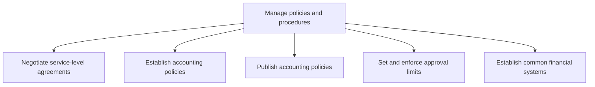
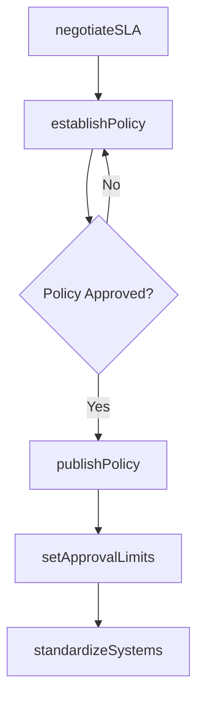

# Manage policies and procedures

> Business-as-Code definition for accounting policies and procedures management. Models SLA negotiation, policy establishment, policy publication, approval limit enforcement, and financial systems standardization as programmable APIs.

## Overview

Creating procedures to perform general accounting and reporting. Follow the rules and regulations made for a particular process in the business. Publish accounting policies.

## Process Hierarchy



## GraphDL

```yaml
manage:
  object: Policies And Procedures
  actor: Controller
  result: AccountingPolicyManual
```

## Actions

| Action | Description |
|--------|-------------|
| negotiateSLA | Define service-level agreements for shared accounting services |
| establishPolicy | Draft accounting policies aligned with GAAP or IFRS standards |
| publishPolicy | Distribute approved policies to all accounting stakeholders |
| setApprovalLimits | Configure authorization thresholds for financial transactions |
| standardizeSystems | Align financial systems and chart of accounts across entities |

## Events

| Event | Description |
|-------|-------------|
| slaNegotiated | Service-level agreement finalized with internal stakeholders |
| policyEstablished | Accounting policy drafted and approved |
| policyPublished | Approved policy distributed to the organization |
| approvalLimitsSet | Authorization thresholds configured in financial systems |
| systemsStandardized | Common financial systems deployed across business entities |

## Searches

| Search | Description |
|--------|-------------|
| getPolicies | List accounting policies by category, effective date, or status |
| getApprovalLimits | Retrieve authorization thresholds by role or transaction type |
| getSLACompliance | Query SLA performance metrics for shared services |

## Process Flow



## RACI Matrix

| Activity | Responsible | Accountable | Consulted | Informed |
|----------|-------------|-------------|-----------|----------|
| establishPolicy | Accounting Policy Manager | Controller | External Auditors | CFO |
| publishPolicy | Accounting Policy Manager | Controller | IT | All Finance Staff |
| setApprovalLimits | Controller | CFO | Internal Audit | Department Managers |

## Sub-Processes

| ID | Name | Description |
|----|------|-------------|
| 9.3.1.1 | Negotiate service-level agreements | Agreeing upon terms and conditions. Negotiate an agreement between two or more parties, the customer |
| 9.3.1.2 | Establish accounting policies | Establishing policies and procedures to prepare financial statements, including methods, measurement |
| 9.3.1.3 | Publish accounting policies | Creating a written copy of agreed-upon procedures for preparing financial statements, and making the |
| 9.3.1.4 | Set and enforce approval limits | Implementing parameters for accounting. Apply set conditions for any approval process. |
| 9.3.1.5 | Establish common financial systems | Establishing processes and procedures to exercise financial control and accountability. Record, veri |

## Related Processes

| Process | Relationship |
|---------|-------------|
| 9.3.2 Perform general accounting | Downstream - policies govern accounting operations |
| 9.3.4 Perform financial reporting | Downstream - reporting standards derive from policies |
| 9.8 Manage internal controls | Parallel - internal controls enforce accounting policies |

## Related Departments

| Department | Role |
|-----------|------|
| Accounting | Primary owner of policy development and enforcement |
| Internal Audit | Reviews policy compliance and recommends improvements |
| IT Finance | Implements policies in financial systems and workflows |
| Legal | Advises on regulatory requirements affecting accounting policies |

## Related Occupations

| Occupation | Involvement |
|-----------|-------------|
| Controller | Establishes and approves accounting policies |
| Accounting Policy Manager | Drafts, maintains, and publishes policy documentation |
| Internal Auditor | Validates policy adherence and recommends updates |

## KPIs

| KPI | Description | Unit |
|-----|-------------|------|
| Policy Compliance Rate | Percentage of transactions adhering to published policies | % |
| Policy Update Frequency | Number of policy revisions per fiscal year | Count |
| SLA Achievement Rate | Percentage of shared-service SLAs met on time | % |

## Usage

```typescript
import { managePoliciesAndProcedures } from '@headlessly/manage-policies-and-procedures'

const policies = managePoliciesAndProcedures()

// Establish a new accounting policy
const policy = await policies.establishPolicy({
  title: 'Revenue Recognition under ASC 606',
  effectiveDate: '2026-01-01',
  standard: 'US-GAAP'
})

// Set approval limits by role
await policies.setApprovalLimits({
  role: 'department-manager',
  journalEntryLimit: 50000,
  purchaseOrderLimit: 25000
})
```
