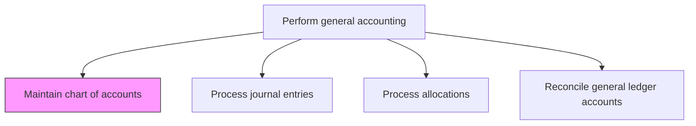
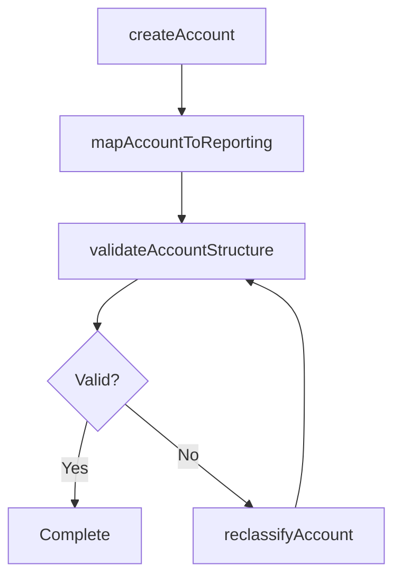

# Maintain chart of accounts

> Business-as-Code definition for chart of accounts maintenance. Models the process of creating, updating, and governing the hierarchical account structure used across the general ledger.

## Overview

Maintaining the hierarchical list of all accounts used in the general ledger. Alter accounts according to business requirements by adding new accounts, deactivating dormant ones, and updating account mappings. The chart of accounts is the structural backbone of the financial system, determining how transactions are classified, how financial statements are organized, and how management reports are segmented, making its governance essential for consistent and accurate financial reporting.

## Process Hierarchy



## GraphDL

```yaml
maintain:
  object: Chart Of Accounts
  actor: GeneralLedgerManager
  result: UpdatedChartOfAccounts
```

## Actions

| Action | Description |
|--------|-------------|
| createAccount | Add a new general ledger account with appropriate coding, type, and hierarchy placement |
| deactivateAccount | Mark an account as inactive to prevent future postings while preserving history |
| reclassifyAccount | Change the account type, parent, or reporting category of an existing account |
| mapAccountToReporting | Link general ledger accounts to financial statement line items and management reports |
| validateAccountStructure | Verify the chart of accounts for completeness, consistency, and compliance with standards |
| exportChartOfAccounts | Generate the full chart of accounts for audit or system migration purposes |

## Events

| Event | Description |
|-------|-------------|
| accountCreated | A new general ledger account has been added to the chart |
| accountDeactivated | An account has been marked inactive |
| accountReclassified | An account's type or hierarchy position has been changed |
| accountMappingUpdated | Account-to-reporting-line mappings have been updated |
| structureValidated | The chart of accounts structure has passed validation checks |
| chartExported | The chart of accounts has been exported for external use |

## Searches

| Search | Description |
|--------|-------------|
| findAccounts | List accounts filtered by type, status, department, or account range |
| getAccountDetails | Retrieve full details and history for a specific account |
| getInactiveAccounts | List deactivated accounts with their last transaction date |
| getAccountHierarchy | Return the hierarchical tree structure of the chart of accounts |

## Process Flow



## RACI Matrix

| Activity | Responsible | Accountable | Consulted | Informed |
|----------|-------------|-------------|-----------|----------|
| createAccount | GeneralLedgerManager | Controller | BusinessUnitControllers | InternalAudit |
| deactivateAccount | GeneralLedgerManager | Controller | TaxDepartment | ExternalAuditor |
| mapAccountToReporting | GeneralLedgerManager | Controller | FPAManager | CFO |
| validateAccountStructure | GeneralLedgerManager | Controller | InternalAudit | FinanceSystemsAdmin |

## Related Processes

| Process | Relationship |
|---------|-------------|
| 9.3.1.5 Establish common financial systems | Upstream - chart of accounts is maintained within the common financial system |
| 9.3.2.2 Process journal entries | Downstream - journal entries reference accounts from the chart |
| 9.3.4 Perform financial reporting | Consumer - financial statements are mapped from the chart of accounts |
| 9.3.2.7 Perform consolidations and process eliminations | Related - consolidated reporting requires aligned account structures |

## Related Departments

| Department | Role |
|-----------|------|
| General Accounting | Primary owner of chart of accounts maintenance |
| Financial Planning and Analysis | Defines management reporting requirements that drive account structure |
| Tax | Ensures tax-relevant accounts are properly categorized |
| Internal Audit | Reviews chart structure for control and compliance |

## Related Occupations

| Occupation | Involvement |
|-----------|-------------|
| General Ledger Manager | Maintains and governs the chart of accounts |
| Financial Reporting Analyst | Validates account-to-report mappings |
| ERP Administrator | Implements changes in the financial system |

## KPIs

| KPI | Description | Unit |
|-----|-------------|------|
| Account Utilization Rate | Percentage of active accounts with postings in the period | % |
| Dormant Account Ratio | Percentage of active accounts with no activity in 12 months | % |
| Mapping Completeness | Percentage of accounts mapped to financial statement lines | % |
| Change Request Cycle Time | Average time to process a chart of accounts change request | Days |

## Usage

```typescript
import { maintainChartOfAccounts } from '@headlessly/maintain-chart-of-accounts'

const client = maintainChartOfAccounts()

// Create a new revenue account
const account = await client.createAccount({
  accountNumber: '4150',
  name: 'Subscription Revenue - Enterprise',
  type: 'revenue',
  parentAccount: '4100',
  department: 'salesEnterprise',
  currency: 'USD'
})

// Retrieve the account hierarchy for reporting
const hierarchy = await client.getAccountHierarchy({
  rootAccount: '4000',
  includeInactive: false,
  depth: 3
})
```
