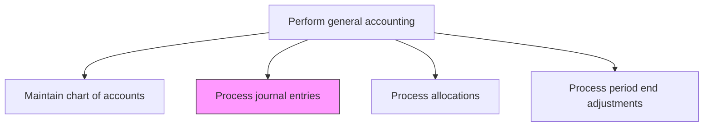
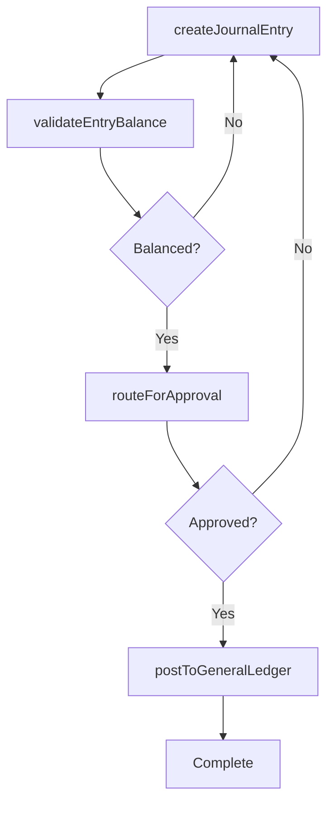

# Process journal entries

> Business-as-Code definition for journal entry processing. Models the complete lifecycle of creating, reviewing, approving, and posting journal entries to the general ledger.

## Overview

Making ledger and trial balance accounts from journal entries. This process requires the organization to record every transaction into accounts done by business. It is a base documents for preparing final accounts of company.

## Process Hierarchy



## GraphDL

```yaml
process:
  object: Journal Entries
  actor: StaffAccountant
  result: PostedJournalEntry
```

## Actions

| Action | Description |
|--------|-------------|
| createJournalEntry | Draft a new journal entry with debit and credit lines, descriptions, and supporting references |
| validateEntryBalance | Confirm that total debits equal total credits before submission |
| routeForApproval | Send the journal entry through the appropriate approval workflow based on amount and type |
| postToGeneralLedger | Record the approved journal entry in the general ledger |
| reverseJournalEntry | Create an offsetting entry to reverse a previously posted journal entry |
| processRecurringEntries | Automatically generate and post standard recurring journal entries |

## Events

| Event | Description |
|-------|-------------|
| journalEntryCreated | A new journal entry has been drafted for review |
| entryBalanceValidated | The journal entry has been confirmed as balanced |
| entryApproved | The journal entry has received required authorization |
| entryPosted | The journal entry has been recorded in the general ledger |
| entryReversed | A reversing journal entry has been posted |
| recurringEntriesProcessed | Scheduled recurring entries have been generated and posted |

## Searches

| Search | Description |
|--------|-------------|
| findJournalEntries | List journal entries filtered by period, status, preparer, or account |
| getEntryDetails | Retrieve the full line-item details and audit trail for a specific entry |
| getPendingApprovals | Return journal entries awaiting approval for the current user |
| getRecurringEntrySchedule | List all active recurring journal entry templates and their schedules |

## Process Flow



## RACI Matrix

| Activity | Responsible | Accountable | Consulted | Informed |
|----------|-------------|-------------|-----------|----------|
| createJournalEntry | StaffAccountant | GeneralLedgerManager | BusinessUnitFinance | Controller |
| routeForApproval | StaffAccountant | GeneralLedgerManager | Controller | InternalAudit |
| postToGeneralLedger | GeneralLedgerManager | Controller | FinanceSystemsAdmin | CFO |
| reverseJournalEntry | StaffAccountant | Controller | InternalAudit | GeneralLedgerManager |

## Related Processes

| Process | Relationship |
|---------|-------------|
| 9.3.2.1 Maintain chart of accounts | Upstream - journal entries reference the chart of accounts |
| 9.3.2.3 Process allocations | Related - allocations generate journal entries |
| 9.3.2.4 Process period end adjustments | Related - period-end adjustments are posted as journal entries |
| 9.3.2.6 Reconcile general ledger accounts | Downstream - posted entries are reconciled during account review |

## Related Departments

| Department | Role |
|-----------|------|
| General Accounting | Primary owner of journal entry processing |
| Business Unit Finance | Originates entries for local transactions and adjustments |
| Internal Audit | Reviews entries for compliance with controls |
| Finance Systems | Maintains the journal entry workflow and posting engine |

## Related Occupations

| Occupation | Involvement |
|-----------|-------------|
| Staff Accountant | Prepares and submits journal entries |
| General Ledger Manager | Reviews and approves entries for posting |
| Internal Auditor | Audits journal entry patterns and exceptions |

## KPIs

| KPI | Description | Unit |
|-----|-------------|------|
| Journal Entry Volume | Total number of journal entries processed per period | Count |
| Entry Error Rate | Percentage of entries requiring reversal or correction | % |
| Average Approval Cycle Time | Mean time from entry creation to posting | Hours |
| Automated Entry Rate | Percentage of entries generated automatically vs. manually | % |

## Usage

```typescript
import { processJournalEntries } from '@headlessly/process-journal-entries'

const client = processJournalEntries()

// Create a new journal entry
const entry = await client.createJournalEntry({
  description: 'Monthly rent expense accrual',
  period: '2024-11',
  lines: [
    { account: '6200', debit: 25000, credit: 0, description: 'Office rent expense' },
    { account: '2100', debit: 0, credit: 25000, description: 'Accrued liabilities' }
  ]
})

// Retrieve pending approvals
const pending = await client.getPendingApprovals({
  approverId: 'USR-GL-MGR-001',
  minAmount: 5000
})
```
