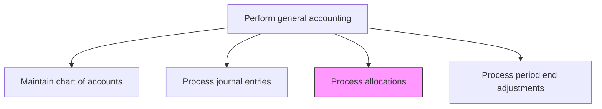
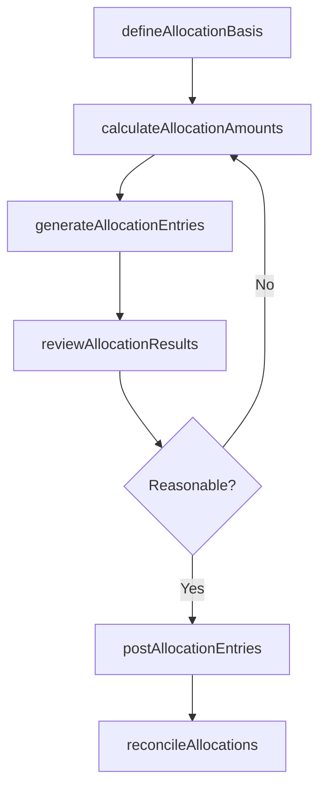

# Process allocations

> Business-as-Code definition for cost and revenue allocation processing. Models the process of defining allocation bases, calculating distributions, and posting allocation entries across cost centers and business units.

## Overview

Allocating funds across functions. Apportion funds in line with the budgets created. Formalize allocations in centralized internal records. Cost allocations distribute shared expenses such as corporate overhead, IT services, and facilities costs to receiving business units using defined drivers like headcount, square footage, or revenue, ensuring that each unit's financial results reflect the true cost of the resources it consumes.

## Process Hierarchy



## GraphDL

```yaml
process:
  object: Allocations
  actor: CostAccountant
  result: AllocationEntry
```

## Actions

| Action | Description |
|--------|-------------|
| defineAllocationBasis | Establish the driver or methodology for distributing costs such as headcount, square footage, or revenue |
| calculateAllocationAmounts | Compute the amounts to be distributed to each receiving cost center or entity |
| generateAllocationEntries | Create the journal entries reflecting the allocated amounts across accounts |
| reviewAllocationResults | Verify that allocated amounts are reasonable and consistent with the defined methodology |
| postAllocationEntries | Record the allocation journal entries in the general ledger |
| reconcileAllocations | Match allocated amounts to source pools and validate total distribution |

## Events

| Event | Description |
|-------|-------------|
| allocationBasisDefined | The allocation methodology and drivers have been documented |
| allocationAmountsCalculated | Distribution amounts have been computed for all receiving entities |
| allocationEntriesGenerated | Journal entries for the allocation have been created |
| allocationResultsReviewed | The allocation outputs have been validated for reasonableness |
| allocationEntriesPosted | Allocation journal entries have been posted to the general ledger |
| allocationsReconciled | Allocated amounts have been matched to source cost pools |

## Searches

| Search | Description |
|--------|-------------|
| findAllocationsByPool | List allocations from a specific cost pool filtered by period and receiving entity |
| getAllocationMethodology | Retrieve the defined basis and drivers for a specific allocation type |
| getAllocationHistory | Return historical allocation amounts for trend analysis |
| getUnreconciledAllocations | List allocations that have not yet been reconciled to source pools |

## Process Flow



## RACI Matrix

| Activity | Responsible | Accountable | Consulted | Informed |
|----------|-------------|-------------|-----------|----------|
| defineAllocationBasis | CostAccountant | Controller | FPAManager | BusinessUnitControllers |
| calculateAllocationAmounts | CostAccountant | Controller | FinanceSystemsAdmin | GeneralLedgerManager |
| reviewAllocationResults | GeneralLedgerManager | Controller | BusinessUnitControllers | CFO |
| postAllocationEntries | CostAccountant | Controller | InternalAudit | FPAManager |

## Related Processes

| Process | Relationship |
|---------|-------------|
| 9.3.2.2 Process journal entries | Downstream - allocations generate journal entries for posting |
| 9.3.2.4 Process period end adjustments | Related - allocations are often part of period-end close activities |
| 9.3.2.6 Reconcile general ledger accounts | Downstream - allocation entries are reconciled during GL review |
| 9.1 Perform planning and management accounting | Upstream - budget allocations drive accounting allocation bases |

## Related Departments

| Department | Role |
|-----------|------|
| Cost Accounting | Primary owner of allocation methodology and execution |
| Financial Planning and Analysis | Provides budget and forecast data driving allocation bases |
| General Accounting | Posts and reconciles allocation entries in the GL |
| Business Unit Finance | Receives and validates allocated costs |

## Related Occupations

| Occupation | Involvement |
|-----------|-------------|
| Cost Accountant | Defines methodologies and processes allocations |
| FPA Analyst | Provides allocation drivers and validates reasonableness |
| General Ledger Accountant | Posts allocation entries and performs reconciliation |

## KPIs

| KPI | Description | Unit |
|-----|-------------|------|
| Allocation Accuracy | Percentage of allocations posted without subsequent correction | % |
| Allocation Timeliness | Percentage of allocations completed by the close calendar deadline | % |
| Methodology Review Frequency | Number of times allocation bases are reviewed and validated | Per Year |
| Allocation Dispute Rate | Percentage of allocations challenged by receiving business units | % |

## Usage

```typescript
import { processAllocations } from '@headlessly/process-allocations'

const client = processAllocations()

// Define an allocation basis for shared services
const basis = await client.defineAllocationBasis({
  costPool: 'SharedITServices',
  driver: 'headcount',
  period: '2024-11',
  receivingEntities: ['BU-NAM', 'BU-EMEA', 'BU-APAC']
})

// Calculate and generate allocation entries
const entries = await client.calculateAllocationAmounts({
  costPoolId: basis.id,
  totalAmount: 450000.00,
  driverData: { 'BU-NAM': 200, 'BU-EMEA': 150, 'BU-APAC': 100 }
})
```
