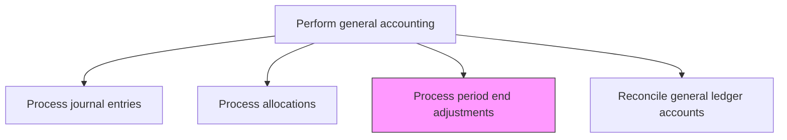
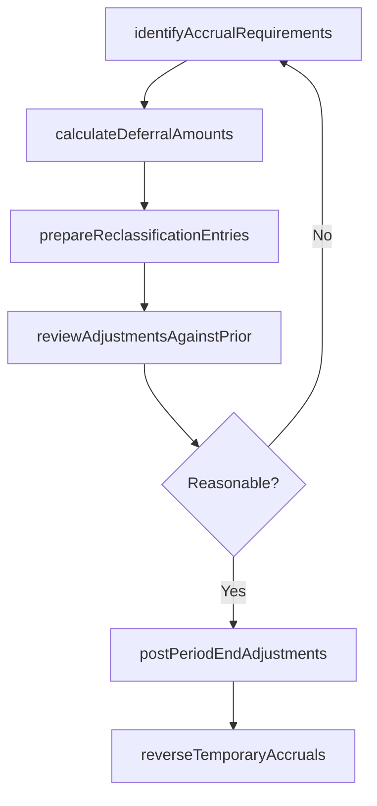

# Process period end adjustments

> Business-as-Code definition for period-end adjustment processing. Models the accrual, deferral, and reclassification entries required to accurately state financial results at month, quarter, and year-end close.

## Overview

Updating journal entries to adjust the balance of income and expenses at the end of an accounting period. This includes recording accruals for earned but unbilled revenue, incurred but unpaid expenses, amortization of prepaid items, and reclassifications needed to present financial results accurately. Timely and accurate period-end adjustments are critical to achieving a clean close, meeting reporting deadlines, and ensuring that financial statements reflect the true economic activity of the period.

## Process Hierarchy



## GraphDL

```yaml
process:
  object: Period End Adjustments
  actor: SeniorAccountant
  result: PeriodEndAdjustmentEntry
```

## Actions

| Action | Description |
|--------|-------------|
| identifyAccrualRequirements | Determine revenue and expense items that must be accrued for the closing period |
| calculateDeferralAmounts | Compute amounts for prepaid expenses and deferred revenue to be recognized |
| prepareReclassificationEntries | Draft entries to reclassify balances between accounts for proper reporting |
| reviewAdjustmentsAgainstPrior | Compare proposed adjustments to prior period amounts for reasonableness |
| postPeriodEndAdjustments | Record approved adjusting entries in the general ledger |
| reverseTemporaryAccruals | Automatically reverse temporary accruals at the start of the next period |

## Events

| Event | Description |
|-------|-------------|
| accrualRequirementsIdentified | Revenue and expense accrual needs have been determined for the period |
| deferralAmountsCalculated | Prepaid and deferred revenue recognition amounts have been computed |
| reclassificationsPrepared | Balance reclassification entries have been drafted |
| adjustmentsReviewed | Proposed adjustments have been compared to prior periods |
| adjustmentsPosted | Period-end adjusting entries have been recorded in the ledger |
| temporaryAccrualsReversed | Prior period temporary accruals have been reversed |

## Searches

| Search | Description |
|--------|-------------|
| findAdjustmentsByPeriod | List all period-end adjustments for a specific accounting period |
| getPendingAccruals | Retrieve accrual items identified but not yet posted |
| getDeferralSchedule | Return the amortization schedule for deferred revenue and prepaid expenses |
| getAdjustmentVarianceReport | Compare current period adjustments to prior period amounts |

## Process Flow



## RACI Matrix

| Activity | Responsible | Accountable | Consulted | Informed |
|----------|-------------|-------------|-----------|----------|
| identifyAccrualRequirements | SeniorAccountant | Controller | BusinessUnitControllers | CFO |
| calculateDeferralAmounts | SeniorAccountant | Controller | RevenueAccountant | FPAManager |
| reviewAdjustmentsAgainstPrior | GeneralLedgerManager | Controller | InternalAudit | ExternalAuditor |
| postPeriodEndAdjustments | SeniorAccountant | Controller | FinanceSystemsAdmin | CFO |

## Related Processes

| Process | Relationship |
|---------|-------------|
| 9.3.2.2 Process journal entries | Related - period-end adjustments are posted as journal entries |
| 9.3.2.6 Reconcile general ledger accounts | Downstream - adjustments feed into GL reconciliation |
| 9.3.2.8 Prepare trial balance | Downstream - adjusted trial balance reflects period-end entries |
| 9.3.4 Perform financial reporting | Consumer - financial statements require completed period-end adjustments |

## Related Departments

| Department | Role |
|-----------|------|
| General Accounting | Primary owner of period-end adjustment processing |
| Revenue Accounting | Provides revenue accrual and deferral details |
| Financial Planning and Analysis | Validates adjustment reasonableness against forecasts |
| Internal Audit | Reviews adjustments for control compliance |

## Related Occupations

| Occupation | Involvement |
|-----------|-------------|
| Senior Accountant | Identifies, prepares, and posts period-end adjustments |
| General Ledger Manager | Reviews and approves adjustments |
| Internal Auditor | Tests adjustment controls and materiality |

## KPIs

| KPI | Description | Unit |
|-----|-------------|------|
| Adjustment Processing Timeliness | Percentage of adjustments posted by the close calendar deadline | % |
| Adjustment Accuracy Rate | Percentage of adjustments posted without subsequent correction | % |
| Period-over-Period Variance | Average change in adjustment amounts compared to prior period | % |
| Manual Adjustment Volume | Number of manually prepared adjusting entries per close | Count |

## Usage

```typescript
import { processPeriodEndAdjustments } from '@headlessly/process-period-end-adjustments'

const client = processPeriodEndAdjustments()

// Identify accrual requirements for month-end
const accruals = await client.identifyAccrualRequirements({
  period: '2024-11',
  categories: ['expenseAccrual', 'revenueAccrual', 'prepaidAmortization']
})

// Review adjustments against prior period
const variance = await client.getAdjustmentVarianceReport({
  currentPeriod: '2024-11',
  priorPeriod: '2024-10',
  materialityThreshold: 5000
})
```
