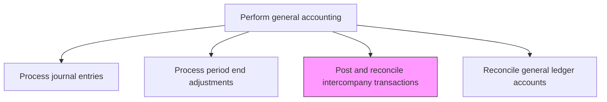
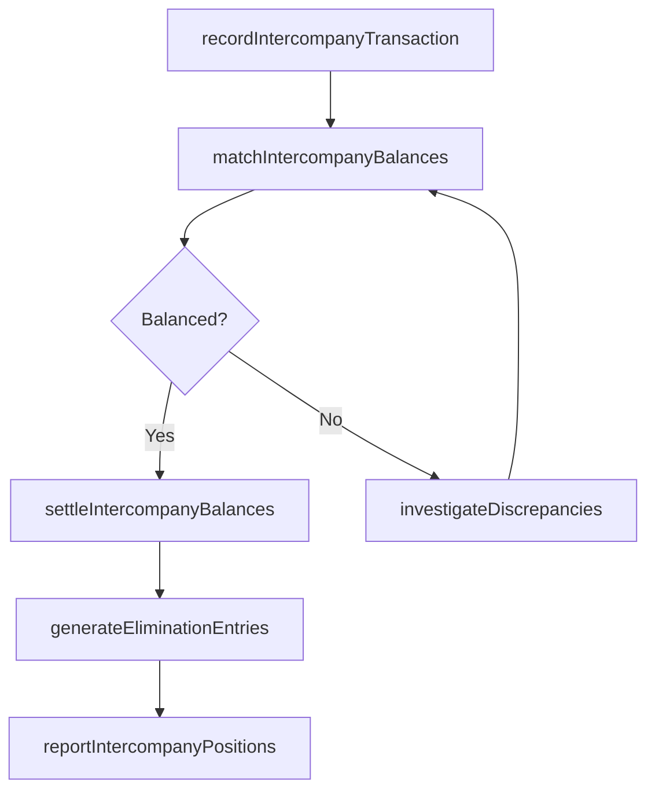

# Post and reconcile intercompany transactions

> Business-as-Code definition for intercompany transaction posting and reconciliation. Models the process of recording, matching, and settling transactions between legal entities within the same corporate group.

## Overview

Checking accounts separately for a parent and subsidiary company. Manage the financial relationship between a parent company and subsidiaries by recording, matching, and settling transactions between entities. Intercompany transactions include management fees, transfer pricing charges, intercompany loans, and goods transfers that must be reconciled and ultimately eliminated during consolidation to prevent double-counting of revenues and expenses in the group financial statements.

## Process Hierarchy



## GraphDL

```yaml
post:
  object: And Reconcile Intercompany Transactions
  actor: IntercompanyAccountant
  result: ReconciledIntercompanyBalance
```

## Actions

| Action | Description |
|--------|-------------|
| recordIntercompanyTransaction | Post the intercompany invoice, loan, or transfer in both the initiating and receiving entity ledgers |
| matchIntercompanyBalances | Compare the intercompany receivable and payable balances between paired entities |
| investigateDiscrepancies | Research and resolve mismatches in intercompany balances including timing differences and currency effects |
| settleIntercompanyBalances | Process cash transfers or netting agreements to settle outstanding intercompany balances |
| generateEliminationEntries | Create consolidation elimination entries to remove intercompany profit and balances |
| reportIntercompanyPositions | Produce a summary of all intercompany balances and unsettled transactions |

## Events

| Event | Description |
|-------|-------------|
| intercompanyTransactionRecorded | An intercompany transaction has been posted in both entity ledgers |
| balancesMatched | Intercompany receivable and payable balances have been confirmed as matching |
| discrepancyIdentified | A mismatch in intercompany balances has been detected |
| balancesSettled | Outstanding intercompany balances have been settled through cash or netting |
| eliminationEntriesGenerated | Consolidation elimination entries have been prepared |
| positionsReported | A summary of intercompany positions has been produced |

## Searches

| Search | Description |
|--------|-------------|
| findIntercompanyTransactions | List intercompany transactions filtered by entity pair, period, or type |
| getIntercompanyBalances | Retrieve current intercompany receivable and payable balances by entity |
| getUnmatchedTransactions | Return intercompany transactions not yet confirmed by the counterpart entity |
| getSettlementHistory | Retrieve the history of intercompany settlements by entity pair |

## Process Flow



## RACI Matrix

| Activity | Responsible | Accountable | Consulted | Informed |
|----------|-------------|-------------|-----------|----------|
| recordIntercompanyTransaction | IntercompanyAccountant | GeneralLedgerManager | EntityControllers | Controller |
| matchIntercompanyBalances | IntercompanyAccountant | Controller | EntityControllers | InternalAudit |
| settleIntercompanyBalances | TreasuryAnalyst | Treasurer | IntercompanyAccountant | CFO |
| generateEliminationEntries | ConsolidationAccountant | Controller | ExternalAuditor | CFO |

## Related Processes

| Process | Relationship |
|---------|-------------|
| 9.3.2.2 Process journal entries | Upstream - intercompany transactions are posted as journal entries |
| 9.3.2.7 Perform consolidations and process eliminations | Downstream - intercompany eliminations feed the consolidation process |
| 9.3.4.1 Prepare consolidated financial statements | Consumer - clean intercompany balances are required for consolidation |
| 9.7 Manage treasury operations | Related - intercompany settlement involves treasury cash management |

## Related Departments

| Department | Role |
|-----------|------|
| Intercompany Accounting | Primary owner of intercompany posting and reconciliation |
| Treasury | Manages intercompany cash settlements and netting |
| Entity Controllership | Validates intercompany transactions at the local entity level |
| Consolidation Accounting | Prepares elimination entries for group reporting |

## Related Occupations

| Occupation | Involvement |
|-----------|-------------|
| Intercompany Accountant | Records, matches, and reconciles intercompany transactions |
| Consolidation Accountant | Prepares elimination entries for consolidated statements |
| Treasury Analyst | Processes intercompany cash settlements |

## KPIs

| KPI | Description | Unit |
|-----|-------------|------|
| Intercompany Match Rate | Percentage of intercompany transactions matched within the close window | % |
| Unresolved Discrepancy Count | Number of unmatched intercompany items at period end | Count |
| Settlement Cycle Time | Average time to settle intercompany balances after matching | Days |
| Elimination Accuracy | Percentage of elimination entries posted without correction | % |

## Usage

```typescript
import { postAndReconcileIntercompanyTransactions } from '@headlessly/post-and-reconcile-intercompany-transactions'

const client = postAndReconcileIntercompanyTransactions()

// Record an intercompany service charge
const transaction = await client.recordIntercompanyTransaction({
  initiatingEntity: 'US-PARENT',
  receivingEntity: 'UK-SUB',
  type: 'managementFee',
  amount: 75000.00,
  currency: 'USD',
  period: '2024-11'
})

// Get unmatched transactions for reconciliation
const unmatched = await client.getUnmatchedTransactions({
  entityPair: ['US-PARENT', 'UK-SUB'],
  period: '2024-11'
})
```
