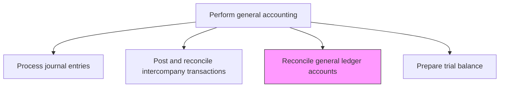
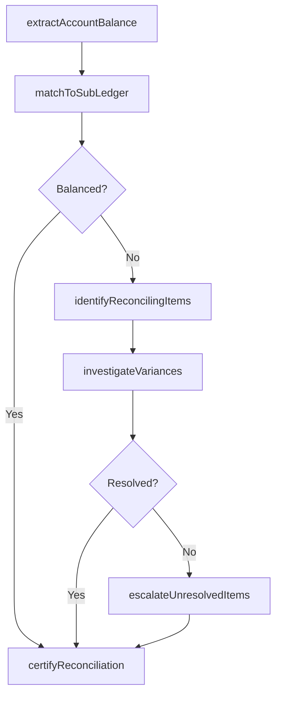

# Reconcile general ledger accounts

> Business-as-Code definition for general ledger account reconciliation. Models the process of verifying account balances against sub-ledgers, bank statements, and supporting documentation to ensure ledger integrity.

## Overview

Reviewing general ledger accounts for a parent and subsidiaries companies. Validate the integrity of account balances on the company's general ledger of accounts. Review and compare general ledger accounts balances with source documents to ensure that balances match.

## Process Hierarchy



## GraphDL

```yaml
reconcile:
  object: General Ledger Accounts
  actor: AccountReconciliationAnalyst
  result: ReconciliationWorkpaper
```

## Actions

| Action | Description |
|--------|-------------|
| extractAccountBalance | Pull the ending balance for a GL account from the ledger |
| matchToSubLedger | Compare the GL balance to the corresponding sub-ledger or supporting schedule |
| identifyReconcilingItems | Document differences between the GL balance and the supporting detail |
| investigateVariances | Research unexplained reconciling items to determine root cause |
| certifyReconciliation | Sign off that the account is fully reconciled and differences are explained |
| escalateUnresolvedItems | Route unresolved reconciling items to management for action |

## Events

| Event | Description |
|-------|-------------|
| accountBalanceExtracted | The GL account ending balance has been pulled for reconciliation |
| subLedgerMatched | The GL balance has been compared to the sub-ledger |
| reconcilingItemsIdentified | Differences between GL and support have been documented |
| variancesInvestigated | Unexplained items have been researched |
| reconciliationCertified | The account reconciliation has been signed off |
| unresolvedItemEscalated | An unresolved reconciling item has been routed to management |

## Searches

| Search | Description |
|--------|-------------|
| findAccountsToReconcile | List GL accounts requiring reconciliation for the current period |
| getReconciliationStatus | Retrieve the reconciliation completion status by account or entity |
| getReconcilingItems | Return open reconciling items for a specific account |
| getReconciliationHistory | Retrieve historical reconciliation workpapers for an account |

## Process Flow



## RACI Matrix

| Activity | Responsible | Accountable | Consulted | Informed |
|----------|-------------|-------------|-----------|----------|
| matchToSubLedger | AccountReconciliationAnalyst | GeneralLedgerManager | SubLedgerOwners | Controller |
| investigateVariances | AccountReconciliationAnalyst | GeneralLedgerManager | BusinessUnitFinance | InternalAudit |
| certifyReconciliation | GeneralLedgerManager | Controller | InternalAudit | CFO |
| escalateUnresolvedItems | GeneralLedgerManager | Controller | CFO | AuditCommittee |

## Related Processes

| Process | Relationship |
|---------|-------------|
| 9.3.2.2 Process journal entries | Upstream - posted entries are validated through reconciliation |
| 9.3.2.4 Process period end adjustments | Upstream - adjustments must be reconciled |
| 9.3.2.8 Prepare trial balance | Downstream - reconciled accounts feed the trial balance |
| 9.8 Manage internal controls | Related - reconciliation is a key financial control |

## Related Departments

| Department | Role |
|-----------|------|
| General Accounting | Primary owner of GL reconciliation |
| Accounts Receivable | Provides AR sub-ledger detail for balance sheet reconciliation |
| Accounts Payable | Provides AP sub-ledger detail for liability reconciliation |
| Internal Audit | Reviews reconciliation quality and timeliness |

## Related Occupations

| Occupation | Involvement |
|-----------|-------------|
| Account Reconciliation Analyst | Performs day-to-day reconciliation activities |
| General Ledger Manager | Reviews and certifies reconciliations |
| Internal Auditor | Tests reconciliation controls |

## KPIs

| KPI | Description | Unit |
|-----|-------------|------|
| Reconciliation Completion Rate | Percentage of required reconciliations completed by deadline | % |
| Unreconciled Item Aging | Average age of open reconciling items | Days |
| Reconciliation Accuracy | Percentage of reconciliations completed without subsequent adjustments | % |
| Certification Timeliness | Average days from period end to reconciliation sign-off | Days |

## Usage

```typescript
import { reconcileGeneralLedgerAccounts } from '@headlessly/reconcile-general-ledger-accounts'

const client = reconcileGeneralLedgerAccounts()

// Get accounts requiring reconciliation this period
const accounts = await client.findAccountsToReconcile({
  period: '2024-11',
  entity: 'US-PARENT',
  riskLevel: 'high'
})

// Reconcile a specific account
const reconciliation = await client.matchToSubLedger({
  account: '1200-AccountsReceivable',
  glBalance: 2450000.00,
  subLedgerBalance: 2448500.00,
  period: '2024-11'
})
```
