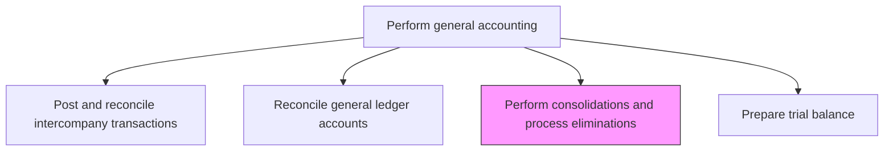
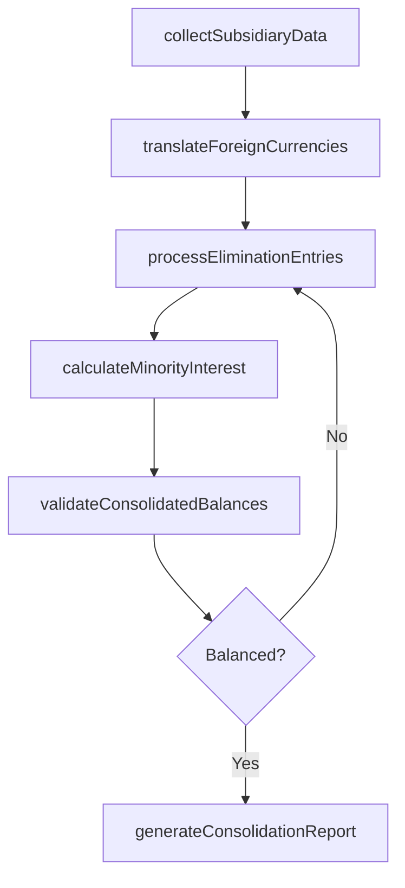

# Perform consolidations and process eliminations

> Business-as-Code definition for financial consolidation and elimination processing. Models the aggregation of subsidiary financial data, currency translation, minority interest calculation, and elimination of intercompany balances.

## Overview

Aggregating financial data from all subsidiary entities and eliminating intercompany transactions to present the corporate group as a single economic entity. This process involves collecting trial balances, translating foreign currencies, removing intercompany revenues, expenses, receivables, and payables, and calculating minority interest. Accurate consolidation is essential for producing reliable group financial statements that comply with GAAP or IFRS requirements and provide investors with a true view of the organization's financial position.

## Process Hierarchy



## GraphDL

```yaml
perform:
  object: Consolidations And Process Eliminations
  actor: ConsolidationAccountant
  result: ConsolidatedTrialBalance
```

## Actions

| Action | Description |
|--------|-------------|
| collectSubsidiaryData | Gather trial balance and supporting data from all reporting entities |
| translateForeignCurrencies | Convert subsidiary financials from local currencies to the reporting currency |
| processEliminationEntries | Remove intercompany balances, revenues, and expenses from the consolidated totals |
| calculateMinorityInterest | Compute the non-controlling interest share of subsidiary net income and equity |
| validateConsolidatedBalances | Verify that the consolidated trial balance is balanced and complete |
| generateConsolidationReport | Produce the consolidated financial data package for reporting |

## Events

| Event | Description |
|-------|-------------|
| subsidiaryDataCollected | Trial balance data from all entities has been received and loaded |
| currenciesTranslated | Foreign currency financials have been converted to reporting currency |
| eliminationsProcessed | Intercompany eliminations have been posted |
| minorityInterestCalculated | Non-controlling interest amounts have been computed |
| consolidatedBalancesValidated | The consolidated trial balance has been verified |
| consolidationReportGenerated | The consolidated data package has been produced |

## Searches

| Search | Description |
|--------|-------------|
| getSubsidiarySubmissionStatus | List all entities and their data submission status for the period |
| getEliminationEntries | Retrieve all elimination entries for a specific consolidation period |
| getCurrencyTranslationRates | Return the exchange rates used for the consolidation period |
| getConsolidatedTrialBalance | Retrieve the consolidated trial balance after eliminations |

## Process Flow



## RACI Matrix

| Activity | Responsible | Accountable | Consulted | Informed |
|----------|-------------|-------------|-----------|----------|
| collectSubsidiaryData | ConsolidationAccountant | Controller | EntityControllers | CFO |
| translateForeignCurrencies | ConsolidationAccountant | Controller | TreasuryAnalyst | ExternalAuditor |
| processEliminationEntries | ConsolidationAccountant | Controller | IntercompanyAccountant | InternalAudit |
| validateConsolidatedBalances | ConsolidationManager | Controller | ExternalAuditor | AuditCommittee |

## Related Processes

| Process | Relationship |
|---------|-------------|
| 9.3.2.5 Post and reconcile intercompany transactions | Upstream - clean intercompany balances are required for eliminations |
| 9.3.2.8 Prepare trial balance | Upstream - entity trial balances feed the consolidation |
| 9.3.4.1 Prepare consolidated financial statements | Downstream - consolidation output drives financial statement preparation |
| 9.3.4.5 Perform legal and management consolidation | Related - legal consolidation may differ from management consolidation |

## Related Departments

| Department | Role |
|-----------|------|
| Consolidation Accounting | Primary owner of the consolidation process |
| Entity Controllership | Provides subsidiary financial data and supports data quality |
| Treasury | Provides exchange rate data for currency translation |
| External Audit | Reviews consolidation entries and eliminations |

## Related Occupations

| Occupation | Involvement |
|-----------|-------------|
| Consolidation Accountant | Executes the consolidation and elimination process |
| Consolidation Manager | Reviews and approves consolidated results |
| External Auditor | Audits consolidation procedures and eliminations |

## KPIs

| KPI | Description | Unit |
|-----|-------------|------|
| Subsidiary Submission Timeliness | Percentage of entities submitting data by the close deadline | % |
| Elimination Accuracy | Percentage of elimination entries posted without correction | % |
| Consolidation Cycle Time | Days from period end to completed consolidation | Days |
| Translation Adjustment Materiality | Currency translation adjustments as a percentage of total equity | % |

## Usage

```typescript
import { performConsolidationsAndProcessEliminations } from '@headlessly/perform-consolidations-and-process-eliminations'

const client = performConsolidationsAndProcessEliminations()

// Check subsidiary data submission status
const status = await client.getSubsidiarySubmissionStatus({
  period: '2024-Q4',
  consolidationGroup: 'GLOBAL'
})

// Process elimination entries for intercompany balances
const eliminations = await client.processEliminationEntries({
  period: '2024-Q4',
  eliminationTypes: ['intercompanyRevenue', 'intercompanyAR', 'intercompanyAP'],
  consolidationGroup: 'GLOBAL'
})
```
