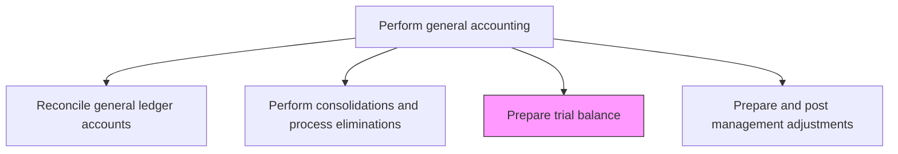
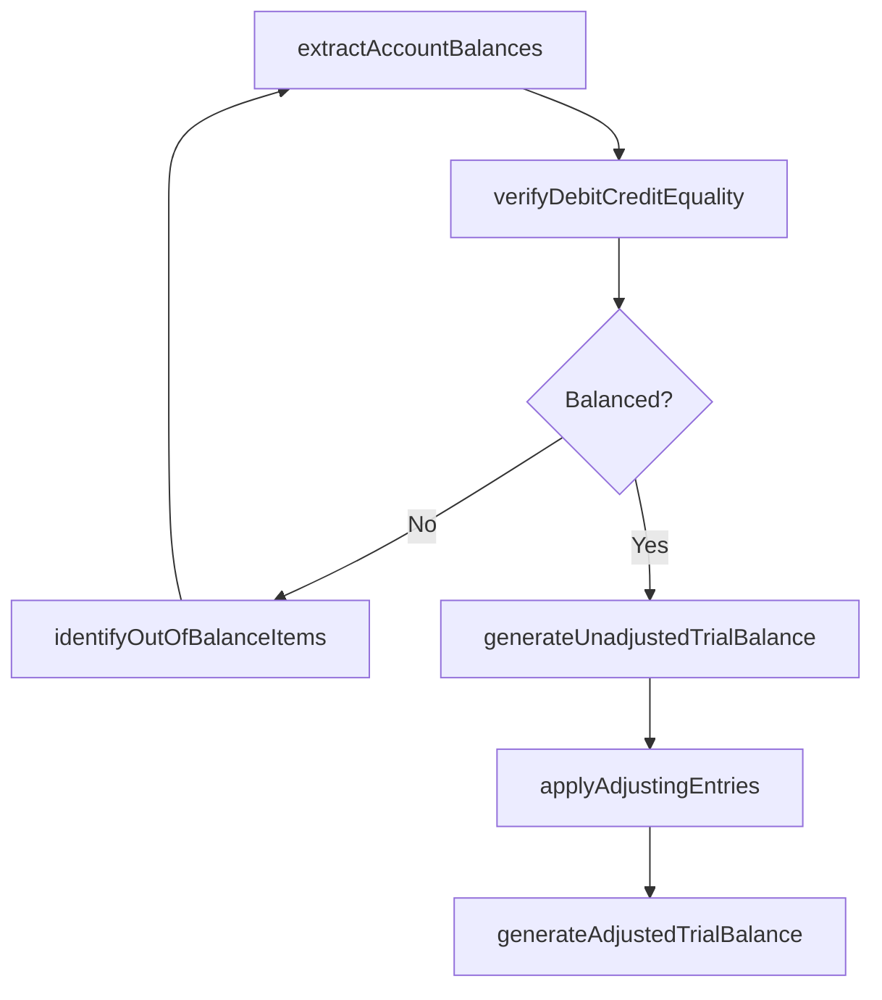

# Prepare trial balance

> Business-as-Code definition for trial balance preparation. Models the process of extracting, verifying, and balancing all general ledger account balances to ensure debits equal credits before financial statement generation.

## Overview

Balancing debit and credit balances of trial balance to preparing final accounts. Calculate the total debits and credits in company's accounts. Correspond the sum of all debits with the sum of all credits. Adjust entries as appropriate.

## Process Hierarchy



## GraphDL

```yaml
prepare:
  object: Trial Balance
  actor: GeneralLedgerAccountant
  result: TrialBalanceReport
```

## Actions

| Action | Description |
|--------|-------------|
| extractAccountBalances | Pull ending debit and credit balances for all active GL accounts |
| verifyDebitCreditEquality | Confirm that total debits equal total credits across the trial balance |
| identifyOutOfBalanceItems | Flag accounts or segments where debits and credits do not balance |
| generateUnadjustedTrialBalance | Produce the pre-adjustment trial balance for review |
| applyAdjustingEntries | Incorporate period-end adjustments into the trial balance |
| generateAdjustedTrialBalance | Produce the final adjusted trial balance for financial statement preparation |

## Events

| Event | Description |
|-------|-------------|
| accountBalancesExtracted | Ending balances for all GL accounts have been pulled |
| debitCreditVerified | Total debits and credits have been confirmed as equal |
| outOfBalanceItemFlagged | An account or segment with mismatched debits and credits has been identified |
| unadjustedTrialBalanceGenerated | The pre-adjustment trial balance has been produced |
| adjustingEntriesApplied | Period-end adjustments have been incorporated |
| adjustedTrialBalanceGenerated | The final adjusted trial balance has been produced |

## Searches

| Search | Description |
|--------|-------------|
| getTrialBalance | Retrieve the trial balance for a specific entity and period |
| getTrialBalanceBySegment | Return trial balance data filtered by department, cost center, or project |
| getOutOfBalanceAccounts | List accounts where debits and credits do not balance |
| compareTrialBalancePeriods | Show trial balance movement between two periods |

## Process Flow



## RACI Matrix

| Activity | Responsible | Accountable | Consulted | Informed |
|----------|-------------|-------------|-----------|----------|
| extractAccountBalances | GeneralLedgerAccountant | GeneralLedgerManager | FinanceSystemsAdmin | Controller |
| verifyDebitCreditEquality | GeneralLedgerAccountant | GeneralLedgerManager | InternalAudit | Controller |
| applyAdjustingEntries | SeniorAccountant | GeneralLedgerManager | Controller | FPAManager |
| generateAdjustedTrialBalance | GeneralLedgerManager | Controller | ExternalAuditor | CFO |

## Related Processes

| Process | Relationship |
|---------|-------------|
| 9.3.2.4 Process period end adjustments | Upstream - adjusting entries feed the adjusted trial balance |
| 9.3.2.6 Reconcile general ledger accounts | Upstream - reconciled accounts ensure trial balance accuracy |
| 9.3.2.9 Prepare and post management adjustments | Related - management adjustments may follow initial trial balance |
| 9.3.4 Perform financial reporting | Downstream - the adjusted trial balance drives financial statement preparation |

## Related Departments

| Department | Role |
|-----------|------|
| General Accounting | Primary owner of trial balance preparation |
| Financial Reporting | Consumes the trial balance for statement generation |
| Internal Audit | Reviews trial balance for completeness and accuracy |
| External Audit | Uses the trial balance as a primary audit workpaper |

## Related Occupations

| Occupation | Involvement |
|-----------|-------------|
| General Ledger Accountant | Extracts balances and prepares the trial balance |
| General Ledger Manager | Reviews and approves the trial balance |
| External Auditor | Uses the trial balance for audit testing |

## KPIs

| KPI | Description | Unit |
|-----|-------------|------|
| Trial Balance Preparation Time | Hours from period end to completed adjusted trial balance | Hours |
| Out-of-Balance Occurrence Rate | Number of out-of-balance conditions per close cycle | Count |
| Adjusting Entry Volume | Number of adjusting entries required to finalize the trial balance | Count |
| First-Pass Balance Rate | Percentage of trial balances that balance on first extraction | % |

## Usage

```typescript
import { prepareTrialBalance } from '@headlessly/prepare-trial-balance'

const client = prepareTrialBalance()

// Generate the unadjusted trial balance
const unadjusted = await client.generateUnadjustedTrialBalance({
  entity: 'US-PARENT',
  period: '2024-11',
  currency: 'USD'
})

// Compare trial balance between periods
const movement = await client.compareTrialBalancePeriods({
  entity: 'US-PARENT',
  currentPeriod: '2024-11',
  priorPeriod: '2024-10',
  materialityThreshold: 10000
})
```
