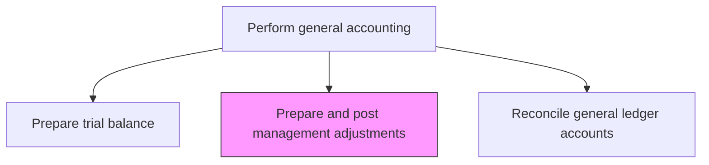
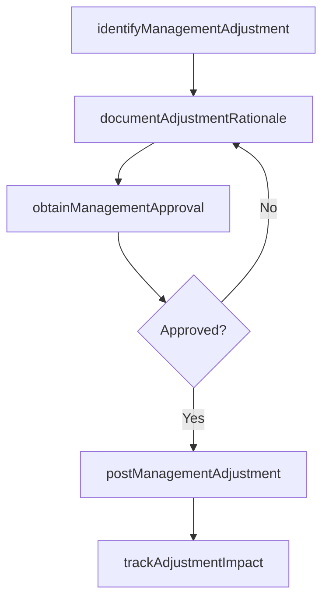

# Prepare and post management adjustments

> Business-as-Code definition for management adjustment processing. Models the process of identifying, documenting, and posting top-side adjustments directed by management for financial reporting purposes.

## Overview

Accounting for changes due to country-level policy changes. Record adjustments made by management in the accounts. Management adjustments are top-side entries directed by senior leadership to reflect reserves, reclassifications, or corrections that are not captured through normal accounting processes. Because these entries originate outside standard transaction flows, they require enhanced documentation, explicit authorization by the CFO, and heightened audit scrutiny to prevent earnings manipulation and ensure financial statement integrity.

## Process Hierarchy



## GraphDL

```yaml
prepare:
  object: And Post Management Adjustments
  actor: Controller
  result: ManagementAdjustmentEntry
```

## Actions

| Action | Description |
|--------|-------------|
| identifyManagementAdjustment | Determine adjustments required by management for reserves, reclassifications, or policy changes |
| documentAdjustmentRationale | Prepare written justification and supporting calculations for each adjustment |
| obtainManagementApproval | Secure sign-off from the CFO or designated management authority |
| postManagementAdjustment | Record the approved management adjustment in the general ledger |
| trackAdjustmentImpact | Monitor the effect of management adjustments on financial statement line items |

## Events

| Event | Description |
|-------|-------------|
| managementAdjustmentIdentified | A management-directed adjustment has been determined |
| rationaleDocumented | Written justification and calculations have been prepared |
| managementApprovalObtained | The CFO or designated authority has signed off on the adjustment |
| managementAdjustmentPosted | The adjustment has been recorded in the general ledger |
| adjustmentImpactTracked | The financial statement impact of the adjustment has been documented |

## Searches

| Search | Description |
|--------|-------------|
| findManagementAdjustments | List all management adjustments for a specific period and entity |
| getAdjustmentRationale | Retrieve the documented justification for a specific management adjustment |
| getAdjustmentImpactReport | Return the financial statement line-item impact of management adjustments |
| getAdjustmentApprovalStatus | Check the approval status of pending management adjustments |

## Process Flow



## RACI Matrix

| Activity | Responsible | Accountable | Consulted | Informed |
|----------|-------------|-------------|-----------|----------|
| identifyManagementAdjustment | Controller | CFO | FPAManager | InternalAudit |
| documentAdjustmentRationale | SeniorAccountant | Controller | TechnicalAccounting | ExternalAuditor |
| obtainManagementApproval | Controller | CFO | AuditCommittee | GeneralCounsel |
| postManagementAdjustment | GeneralLedgerManager | Controller | FinanceSystemsAdmin | InternalAudit |

## Related Processes

| Process | Relationship |
|---------|-------------|
| 9.3.2.8 Prepare trial balance | Upstream - management adjustments are applied after the trial balance |
| 9.3.2.4 Process period end adjustments | Related - management adjustments supplement standard period-end entries |
| 9.3.4 Perform financial reporting | Downstream - adjusted results feed financial statement preparation |
| 9.8 Manage internal controls | Related - management adjustments require enhanced controls and documentation |

## Related Departments

| Department | Role |
|-----------|------|
| Controllership | Primary owner of management adjustment identification and documentation |
| Executive Management | Approves adjustments and provides strategic direction |
| Internal Audit | Reviews management adjustments for appropriateness and control compliance |
| External Audit | Evaluates management adjustments as part of the audit process |

## Related Occupations

| Occupation | Involvement |
|-----------|-------------|
| Controller | Identifies and documents management adjustments |
| CFO | Approves significant management adjustments |
| External Auditor | Reviews management adjustment appropriateness |

## KPIs

| KPI | Description | Unit |
|-----|-------------|------|
| Management Adjustment Volume | Number of management adjustments per close cycle | Count |
| Adjustment Materiality | Total value of management adjustments as a percentage of net income | % |
| Documentation Completeness | Percentage of adjustments with full rationale and supporting calculations | % |
| Audit Challenge Rate | Percentage of management adjustments questioned by external auditors | % |

## Usage

```typescript
import { prepareAndPostManagementAdjustments } from '@headlessly/prepare-and-post-management-adjustments'

const client = prepareAndPostManagementAdjustments()

// Identify a management adjustment for a reserve
const adjustment = await client.identifyManagementAdjustment({
  type: 'reserveAdjustment',
  description: 'Increase warranty reserve based on updated claims analysis',
  amount: 350000.00,
  debitAccount: '6500-WarrantyExpense',
  creditAccount: '2300-WarrantyReserve',
  period: '2024-Q4'
})

// Get impact report for all management adjustments
const impact = await client.getAdjustmentImpactReport({
  period: '2024-Q4',
  entity: 'US-PARENT',
  groupByLineItem: true
})
```
