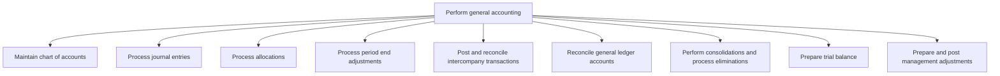
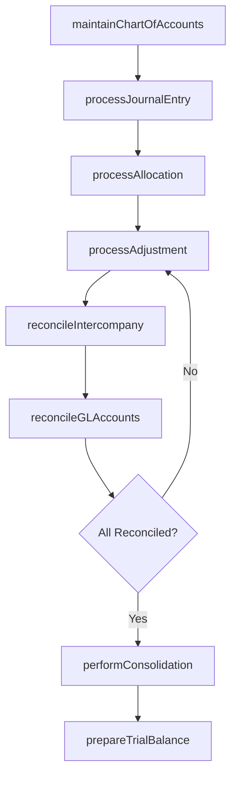

# Perform general accounting

> Business-as-Code definition for general ledger accounting operations. Models chart of accounts maintenance, journal entry processing, allocations, intercompany reconciliation, consolidation, and trial balance preparation as programmable APIs.

## Overview

Applying basic principles, concepts, and accounting practices in recording and preparing final accounts, and using accounting information in management.

## Process Hierarchy



## GraphDL

```yaml
perform:
  object: General Accounting
  actor: GeneralLedgerAccountant
  result: TrialBalance
```

## Actions

| Action | Description |
|--------|-------------|
| maintainChartOfAccounts | Add, modify, or deactivate GL account codes and hierarchies |
| processJournalEntry | Record and approve debit/credit entries in the general ledger |
| processAllocation | Distribute shared costs across cost centers or entities |
| processAdjustment | Record accruals, deferrals, and reclassifications at period end |
| reconcileIntercompany | Match and eliminate intercompany transactions across entities |
| reconcileGLAccounts | Verify subledger balances against general ledger control accounts |
| performConsolidation | Combine entity-level financials with intercompany eliminations |
| prepareTrialBalance | Generate debit/credit summary of all GL accounts |

## Events

| Event | Description |
|-------|-------------|
| chartOfAccountsMaintained | GL account structure updated |
| journalEntryProcessed | Journal entry posted and approved in the general ledger |
| allocationProcessed | Cost allocation completed for the period |
| adjustmentProcessed | Period-end adjustment recorded |
| intercompanyReconciled | Intercompany balances matched and eliminations posted |
| glAccountsReconciled | GL account reconciliation completed for all control accounts |
| consolidationPerformed | Multi-entity consolidation finalized |
| trialBalancePrepared | Period-end trial balance generated and balanced |

## Searches

| Search | Description |
|--------|-------------|
| getChartOfAccounts | Retrieve GL account structure filtered by type or entity |
| findJournalEntries | Search journal entries by account, date, amount, or source |
| getTrialBalance | Get trial balance for a specific entity and period |
| getReconciliationStatus | Query reconciliation completion status by account |
| getIntercompanyBalances | Retrieve intercompany balances by entity pair |

## Process Flow



## RACI Matrix

| Activity | Responsible | Accountable | Consulted | Informed |
|----------|-------------|-------------|-----------|----------|
| processJournalEntry | Staff Accountant | Controller | Tax Manager | Internal Audit |
| reconcileGLAccounts | Senior Accountant | Controller | Subledger Owners | CFO |
| performConsolidation | Consolidation Analyst | Controller | Subsidiary Controllers | CFO |
| prepareTrialBalance | GL Accountant | Controller | External Auditors | CFO |

## Sub-Processes

| ID | Name | Description |
|----|------|-------------|
| 9.3.2.1 | Maintain chart of accounts | Preparing trial balance account from general ledgers. List all accounts used in the general ledger.  |
| 9.3.2.2 | Process journal entries | Making ledger and trial balance accounts from journal entries. This process requires the organizatio |
| 9.3.2.3 | Process allocations | Allocating funds across functions. Apportion funds in line with the budgets created. Formalize alloc |
| 9.3.2.4 | Process period end adjustments | Updating journal entries to adjust the balance of income and expenses at the end of an accounting pe |
| 9.3.2.5 | Post and reconcile intercompany transactions | Checking accounts separately for a parent and subsidiary company. Manage relationship between a pare |
| 9.3.2.6 | Reconcile general ledger accounts | Reviewing general ledger accounts for a parent and subsidiaries companies. Validate the integrity of |
| 9.3.2.7 | Perform consolidations and process eliminations | Aggregating different processes in the business. Eliminate discontinued processes. |
| 9.3.2.8 | Prepare trial balance | Balancing debit and credit balances of trial balance to preparing final accounts. Calculate the tota |
| 9.3.2.9 | Prepare and post management adjustments | Accounting for changes due to country-level policy changes. Record adjustments made by management in |

## Related Processes

| Process | Relationship |
|---------|-------------|
| 9.3.1 Manage policies and procedures | Upstream - policies govern journal entry and reconciliation rules |
| 9.3.3 Perform fixed-asset accounting | Parallel - fixed-asset entries post to GL |
| 9.3.4 Perform financial reporting | Downstream - trial balance feeds financial statement preparation |
| 9.2 Perform revenue accounting | Upstream - AR subledger posts to the general ledger |

## Related Departments

| Department | Role |
|-----------|------|
| General Accounting | Primary owner of GL maintenance and period-end close |
| Accounts Receivable | Posts revenue-side subledger activity to GL |
| Accounts Payable | Posts expense-side subledger activity to GL |
| Tax | Provides tax-related adjustments and reclassifications |
| Internal Audit | Reviews GL entries and reconciliation quality |

## Related Occupations

| Occupation | Involvement |
|-----------|-------------|
| General Ledger Accountant | Processes journal entries and reconciles GL accounts |
| Senior Accountant | Reviews entries, performs consolidation, prepares trial balance |
| Consolidation Analyst | Manages multi-entity consolidation and intercompany eliminations |

## KPIs

| KPI | Description | Unit |
|-----|-------------|------|
| Journal Entry Error Rate | Percentage of journal entries requiring correction after posting | % |
| Reconciliation Completion Rate | Percentage of GL accounts reconciled by close deadline | % |
| Days to Close | Business days from period end to finalized close | Days |
| Intercompany Elimination Accuracy | Percentage of intercompany entries eliminated without exception | % |

## Usage

```typescript
import { performGeneralAccounting } from '@headlessly/perform-general-accounting'

const gl = performGeneralAccounting()

// Post a journal entry
await gl.processJournalEntry({
  date: '2025-12-31',
  entries: [
    { account: '6100', debit: 15000 },
    { account: '2200', credit: 15000 }
  ],
  description: 'Accrued year-end bonus',
  approver: 'controller@company.com'
})

// Prepare trial balance
const tb = await gl.prepareTrialBalance({
  entity: 'US-CORP',
  period: '2025-12',
  includeAdjustments: true
})
```
