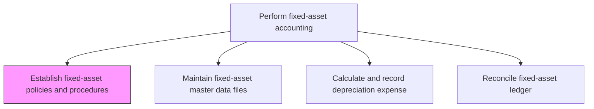
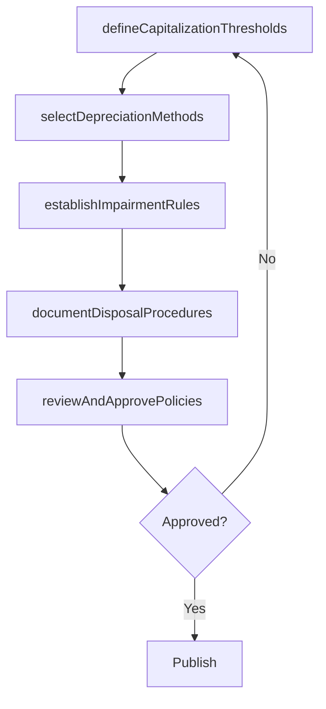

# Establish fixed-asset policies and procedures

> Business-as-Code definition for establishing fixed-asset policies and procedures. Models the process of defining capitalization thresholds, depreciation methods, impairment rules, and disposal procedures for property, plant, and equipment.

## Overview

Creating rules for fixed assets market valuation. Make rules and regulations for fixed assets regarding depreciation, provisions, resale, usage, and disposal. These policies define the minimum capitalization threshold, approved depreciation methods by asset class, impairment testing criteria, and procedures for asset retirement and disposal. Well-documented fixed-asset policies ensure consistent treatment across the organization, reduce audit risk, and provide clear guidance for determining whether expenditures should be capitalized or expensed.

## Process Hierarchy



## GraphDL

```yaml
establish:
  object: Fixed-asset Policies And Procedures
  actor: Controller
  result: FixedAssetPolicyDocument
```

## Actions

| Action | Description |
|--------|-------------|
| defineCapitalizationThresholds | Set the minimum cost and useful life criteria for capitalizing an asset |
| selectDepreciationMethods | Choose approved depreciation methods for each asset class |
| establishImpairmentRules | Define criteria and procedures for testing and recording asset impairment |
| documentDisposalProcedures | Outline the process for retiring, selling, or scrapping fixed assets |
| reviewAndApprovePolicies | Circulate draft policies for stakeholder review and obtain formal approval |

## Events

| Event | Description |
|-------|-------------|
| capitalizationThresholdsDefined | Minimum capitalization criteria have been established |
| depreciationMethodsSelected | Approved depreciation methods have been assigned to asset classes |
| impairmentRulesEstablished | Impairment testing procedures have been documented |
| disposalProceduresDocumented | Asset disposal and retirement procedures have been formalized |
| policiesApproved | Fixed-asset policies have been reviewed and formally approved |

## Searches

| Search | Description |
|--------|-------------|
| getFixedAssetPolicies | Retrieve current fixed-asset policies by asset class or topic |
| getCapitalizationThresholds | Return the capitalization thresholds in effect for each asset class |
| getPolicyChangeHistory | Retrieve the revision history for fixed-asset policies |

## Process Flow



## RACI Matrix

| Activity | Responsible | Accountable | Consulted | Informed |
|----------|-------------|-------------|-----------|----------|
| defineCapitalizationThresholds | FixedAssetManager | Controller | TaxManager | CFO |
| selectDepreciationMethods | FixedAssetManager | Controller | ExternalAuditor | InternalAudit |
| documentDisposalProcedures | FixedAssetManager | Controller | FacilitiesManager | Procurement |
| reviewAndApprovePolicies | Controller | CFO | AuditCommittee | AllFinanceStaff |

## Related Processes

| Process | Relationship |
|---------|-------------|
| 9.3.3.2 Establish (tax and book) depreciation policies | Downstream - depreciation policies build on the overall asset framework |
| 9.3.3.4 Process and record fixed-asset additions and retires | Consumer - policies govern capitalization and disposal decisions |
| 9.3.3.3 Maintain fixed-asset master data files | Downstream - policies define the required fields and standards for master data |
| 9.3.1.2 Establish accounting policies | Upstream - fixed-asset policies are a subset of overall accounting policies |

## Related Departments

| Department | Role |
|-----------|------|
| Fixed-Asset Accounting | Primary owner of policy development |
| Tax | Advises on tax depreciation and regulatory requirements |
| Internal Audit | Reviews policies for control adequacy |
| Facilities | Provides input on asset lifecycle and maintenance |

## Related Occupations

| Occupation | Involvement |
|-----------|-------------|
| Fixed-Asset Manager | Drafts and maintains fixed-asset policies |
| Controller | Approves policies and ensures alignment with standards |
| Tax Accountant | Advises on tax-relevant policy provisions |

## KPIs

| KPI | Description | Unit |
|-----|-------------|------|
| Policy Review Frequency | Number of times fixed-asset policies are reviewed per year | Per Year |
| Policy Compliance Rate | Percentage of asset transactions conforming to established policies | % |
| Threshold Update Cycle Time | Average time to update thresholds after standard changes | Days |
| Impairment Test Completion Rate | Percentage of applicable assets tested for impairment per the policy schedule | % |

## Usage

```typescript
import { establishFixedAssetPoliciesAndProcedures } from '@headlessly/establish-fixed-asset-policies-and-procedures'

const client = establishFixedAssetPoliciesAndProcedures()

// Define capitalization thresholds
const thresholds = await client.defineCapitalizationThresholds({
  assetClass: 'machinery',
  minimumCost: 5000,
  minimumUsefulLife: 12,
  effectiveDate: '2025-01-01'
})

// Retrieve current policies
const policies = await client.getFixedAssetPolicies({
  assetClass: 'allClasses',
  status: 'active'
})
```
