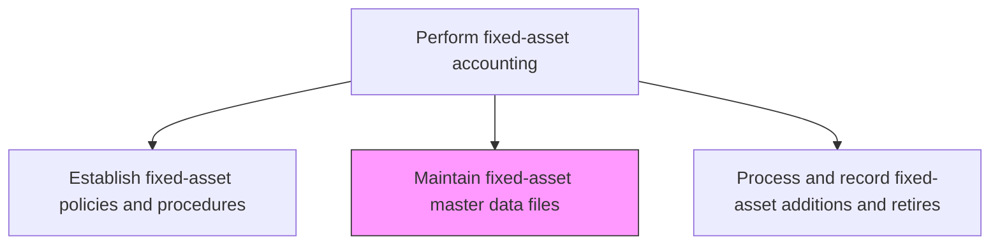
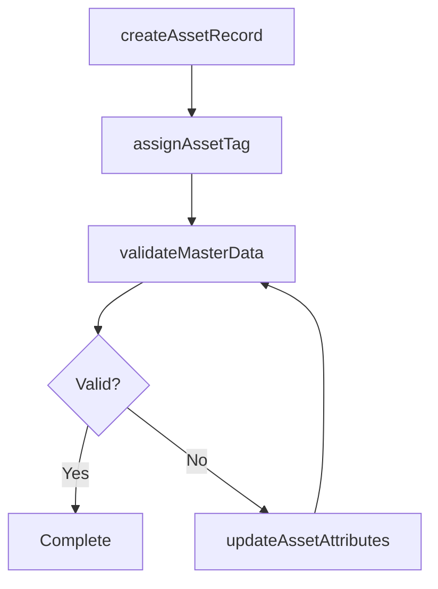

# Maintain fixed-asset master data files

> Business-as-Code definition for fixed-asset master data maintenance. Models the process of creating, updating, and governing asset records including acquisition cost, location, useful life, and depreciation parameters.

## Overview

Keeping reports up-to-date regarding fixed assets. Create a fixed assets database detailing price, life cycle, depreciation rate, resale value, installation information, usage information, and custodian assignments. Accurate master data is the foundation for reliable depreciation calculations, physical inventory tracking, and financial reporting, since errors in asset attributes propagate into every downstream process from monthly depreciation runs to year-end tax filings.

## Process Hierarchy



## GraphDL

```yaml
maintain:
  object: Fixed-asset Master Data Files
  actor: FixedAssetAccountant
  result: AssetMasterRecord
```

## Actions

| Action | Description |
|--------|-------------|
| createAssetRecord | Add a new asset to the master register with all required attributes |
| updateAssetAttributes | Modify asset details such as location, department, or custodian |
| assignAssetTag | Generate and assign a unique identification tag to the physical asset |
| validateMasterData | Run data quality checks to ensure completeness and accuracy of asset records |
| archiveRetiredAssetData | Move records for disposed assets to the archive while preserving audit trail |

## Events

| Event | Description |
|-------|-------------|
| assetRecordCreated | A new asset has been added to the master register |
| assetAttributesUpdated | Asset details have been modified in the master file |
| assetTagAssigned | A unique identification tag has been assigned to the asset |
| masterDataValidated | Data quality checks have been completed on asset records |
| retiredAssetArchived | A disposed asset record has been moved to the archive |

## Searches

| Search | Description |
|--------|-------------|
| findAssets | List assets filtered by class, location, department, or custodian |
| getAssetRecord | Retrieve the full master data record for a specific asset |
| getAssetsByLocation | Return all assets assigned to a specific physical location |
| getDataQualityExceptions | List asset records failing data quality validation checks |

## Process Flow



## RACI Matrix

| Activity | Responsible | Accountable | Consulted | Informed |
|----------|-------------|-------------|-----------|----------|
| createAssetRecord | FixedAssetAccountant | FixedAssetManager | Procurement | Controller |
| updateAssetAttributes | FixedAssetAccountant | FixedAssetManager | FacilitiesManager | InternalAudit |
| validateMasterData | FixedAssetAccountant | FixedAssetManager | FinanceSystemsAdmin | Controller |
| archiveRetiredAssetData | FixedAssetAccountant | FixedAssetManager | InternalAudit | ExternalAuditor |

## Related Processes

| Process | Relationship |
|---------|-------------|
| 9.3.3.1 Establish fixed-asset policies and procedures | Upstream - policies define required master data fields |
| 9.3.3.4 Process and record fixed-asset additions and retires | Downstream - additions create new master records |
| 9.3.3.7 Calculate and record depreciation expense | Consumer - depreciation uses useful life and method data from master records |
| 9.3.3.9 Track fixed-assets including physical inventory | Related - physical inventory validates master data accuracy |

## Related Departments

| Department | Role |
|-----------|------|
| Fixed-Asset Accounting | Primary owner of asset master data |
| Facilities | Provides physical location and condition data |
| IT | Maintains the asset management system |
| Procurement | Supplies acquisition details for new assets |

## Related Occupations

| Occupation | Involvement |
|-----------|-------------|
| Fixed-Asset Accountant | Creates and maintains asset master records |
| Asset Coordinator | Manages physical tagging and location tracking |
| ERP Administrator | Supports system configuration for asset data |

## KPIs

| KPI | Description | Unit |
|-----|-------------|------|
| Master Data Completeness | Percentage of asset records with all required fields populated | % |
| Data Quality Exception Rate | Percentage of records failing validation checks | % |
| Record Update Timeliness | Average days from change event to master data update | Days |
| Duplicate Record Rate | Percentage of asset records identified as duplicates | % |

## Usage

```typescript
import { maintainFixedAssetMasterDataFiles } from '@headlessly/maintain-fixed-asset-master-data-files'

const client = maintainFixedAssetMasterDataFiles()

// Create a new asset record
const asset = await client.createAssetRecord({
  description: 'Office Furniture - Executive Suite',
  assetClass: 'furnitureAndFixtures',
  acquisitionCost: 12000,
  acquisitionDate: '2024-11-15',
  location: 'HQ-Floor3',
  department: 'executive',
  usefulLife: 7,
  depreciationMethod: 'straightLine'
})

// Validate master data quality
const exceptions = await client.getDataQualityExceptions({
  assetClass: 'allClasses',
  checkTypes: ['missingFields', 'invalidCodes', 'duplicates']
})
```
