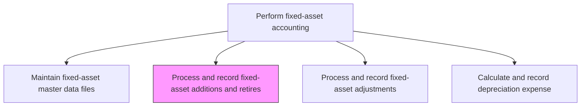
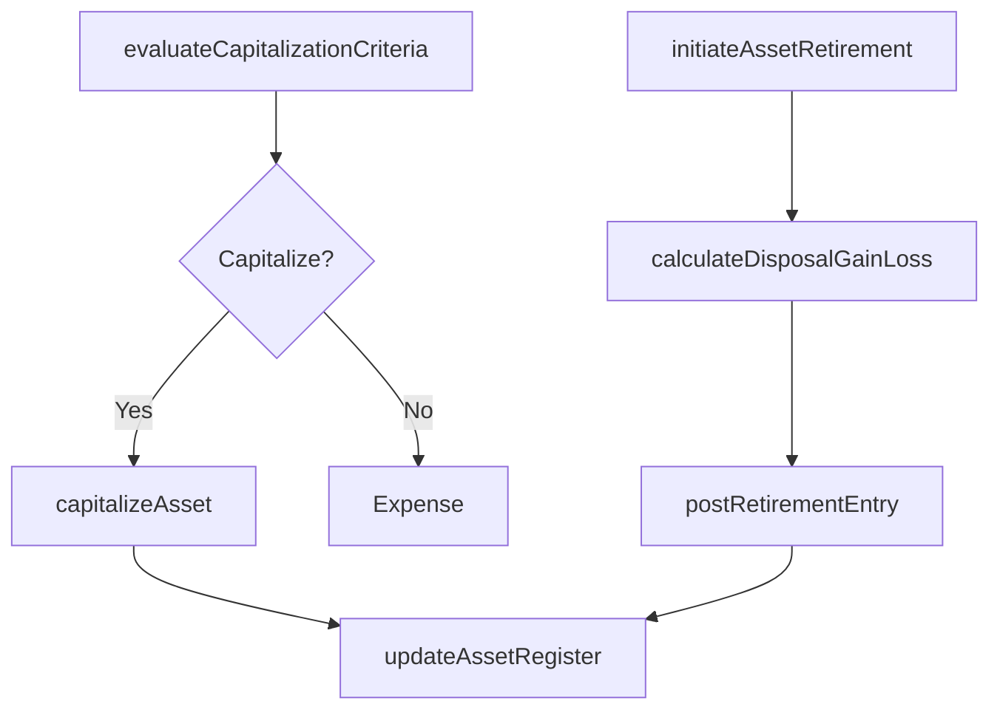

# Process and record fixed-asset additions and retires

> Business-as-Code definition for fixed-asset addition and retirement processing. Models the capitalization of new assets and the disposal, sale, or retirement of existing assets including gain/loss calculations.

## Overview

Keeping a summary of sales and purchases of assets. Record any expenses made for new assets purchased and sales of any old assets during the fiscal year. This process evaluates whether expenditures meet the capitalization threshold, records new assets in the fixed-asset register with appropriate cost basis, and handles the financial impact of asset disposals including gain or loss calculations based on net book value versus sale proceeds.

## Process Hierarchy



## GraphDL

```yaml
process:
  object: And Record Fixed-asset Additions And Retires
  actor: FixedAssetAccountant
  result: AssetCapitalizationOrDisposalEntry
```

## Actions

| Action | Description |
|--------|-------------|
| evaluateCapitalizationCriteria | Determine whether a purchase meets the threshold for capitalization as a fixed asset |
| capitalizeAsset | Record the new asset in the fixed-asset register and post the capitalization entry |
| initiateAssetRetirement | Begin the process of removing an asset from service including documentation |
| calculateDisposalGainLoss | Compute the gain or loss on disposal based on net book value and proceeds |
| postRetirementEntry | Record the asset removal and any gain or loss in the general ledger |
| updateAssetRegister | Remove retired assets and add new assets to the master register |

## Events

| Event | Description |
|-------|-------------|
| capitalizationEvaluated | A purchase has been assessed against capitalization criteria |
| assetCapitalized | A new asset has been recorded in the register and ledger |
| retirementInitiated | An asset retirement or disposal process has been started |
| disposalGainLossCalculated | The financial impact of the disposal has been computed |
| retirementEntryPosted | The asset removal and gain/loss have been recorded |
| assetRegisterUpdated | The master register has been updated for additions or removals |

## Searches

| Search | Description |
|--------|-------------|
| findRecentAdditions | List assets capitalized within a specified date range |
| findRetiredAssets | List assets retired or disposed within a specified period |
| getDisposalGainLoss | Retrieve gain or loss details for a specific asset disposal |
| getPendingRetirements | Return assets approved for retirement but not yet processed |

## Process Flow



## RACI Matrix

| Activity | Responsible | Accountable | Consulted | Informed |
|----------|-------------|-------------|-----------|----------|
| evaluateCapitalizationCriteria | FixedAssetAccountant | FixedAssetManager | Procurement | Controller |
| capitalizeAsset | FixedAssetAccountant | Controller | TaxAccountant | CFO |
| calculateDisposalGainLoss | FixedAssetAccountant | Controller | ExternalAuditor | InternalAudit |
| postRetirementEntry | FixedAssetAccountant | Controller | GeneralLedgerManager | CFO |

## Related Processes

| Process | Relationship |
|---------|-------------|
| 9.3.3.3 Maintain fixed-asset master data files | Downstream - additions and retirements update the master register |
| 9.3.3.7 Calculate and record depreciation expense | Related - new assets begin depreciation; retired assets cease |
| 9.4.2 Perform capital project accounting | Upstream - completed capital projects are capitalized as fixed assets |
| 9.3.2.2 Process journal entries | Downstream - capitalization and disposal entries post to the GL |

## Related Departments

| Department | Role |
|-----------|------|
| Fixed-Asset Accounting | Primary owner of asset capitalization and retirement |
| Procurement | Provides acquisition documentation for capitalization |
| Facilities | Manages physical asset deployment and removal |
| Tax | Advises on tax implications of asset additions and disposals |

## Related Occupations

| Occupation | Involvement |
|-----------|-------------|
| Fixed-Asset Accountant | Processes capitalizations and retirements |
| Procurement Specialist | Provides purchase documentation for new assets |
| Facilities Manager | Coordinates physical asset installation and removal |

## KPIs

| KPI | Description | Unit |
|-----|-------------|------|
| Capitalization Processing Time | Average days from purchase to asset capitalization | Days |
| Retirement Processing Time | Average days from retirement request to ledger removal | Days |
| Net Disposal Gain/Loss | Total gain or loss on asset disposals per period | Currency |
| Capitalization Accuracy | Percentage of capitalizations correctly classified on first entry | % |

## Usage

```typescript
import { processAndRecordFixedAssetAdditionsAndRetires } from '@headlessly/process-and-record-fixed-asset-additions-and-retires'

const client = processAndRecordFixedAssetAdditionsAndRetires()

// Capitalize a new asset
const asset = await client.capitalizeAsset({
  description: 'Industrial Conveyor System',
  acquisitionCost: 275000,
  assetClass: 'machinery',
  usefulLife: 15,
  depreciationMethod: 'straightLine',
  location: 'Plant-A',
  purchaseOrderId: 'PO-2024-0892'
})

// Process an asset retirement
const disposal = await client.initiateAssetRetirement({
  assetId: 'FA-2018-00341',
  retirementDate: '2024-12-01',
  disposalMethod: 'sale',
  saleProceeds: 15000
})
```
