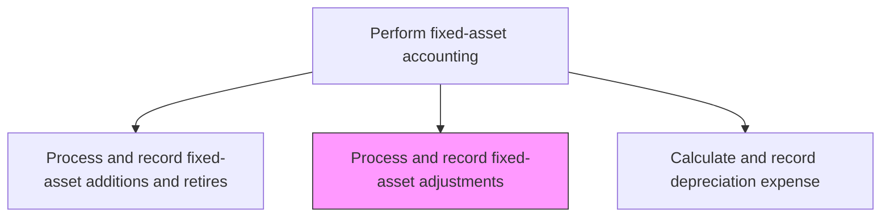
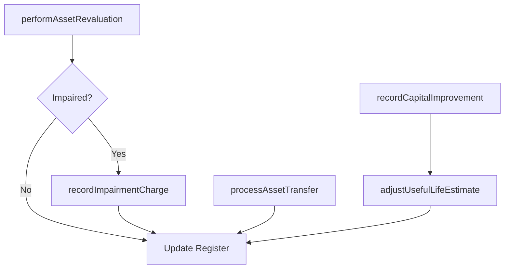

# Process and record fixed-asset adjustments, enhancements, revaluations, and transfers

> Business-as-Code definition for fixed-asset adjustments, enhancements, revaluations, and transfers. Models the process of recording modifications to existing assets including capital improvements, fair-value revaluations, impairment charges, and inter-entity transfers.

## Overview

Keeping a summary of expenses for installing and modifying assets. Record any expenses incurred on improvements, the valuation of assets to reach current market price, and any transfers of assets from one location or entity to another during the fiscal year. Proper classification of these events is essential because capital improvements extend useful life and increase book value, revaluations adjust carrying amounts to fair value, impairments reduce assets to recoverable amounts, and transfers reallocate ownership across the corporate structure.

## Process Hierarchy



## GraphDL

```yaml
process:
  object: And Record Fixed-asset Adjustments, Enhancements, Revaluations, And Transfers
  actor: FixedAssetAccountant
  result: AssetAdjustmentEntry
```

## Actions

| Action | Description |
|--------|-------------|
| recordCapitalImprovement | Post betterment costs that extend useful life or enhance asset capacity |
| performAssetRevaluation | Adjust the carrying value of an asset to fair market value |
| recordImpairmentCharge | Write down an asset's value when recoverable amount falls below book value |
| processAssetTransfer | Move an asset between locations, departments, or legal entities |
| adjustUsefulLifeEstimate | Revise the remaining useful life based on updated operating conditions |

## Events

| Event | Description |
|-------|-------------|
| capitalImprovementRecorded | A betterment cost has been capitalized to the asset |
| assetRevalued | An asset's carrying value has been adjusted to fair value |
| impairmentCharged | An asset impairment loss has been recorded |
| assetTransferred | An asset has been moved between entities or locations |
| usefulLifeAdjusted | The estimated remaining useful life has been revised |

## Searches

| Search | Description |
|--------|-------------|
| findAssetAdjustments | List adjustments by type, period, or asset class |
| getRevaluationHistory | Retrieve the revaluation history for a specific asset |
| getImpairmentReport | Return assets with recorded impairment charges |
| getTransferLog | List inter-entity or inter-location asset transfers |

## Process Flow



## RACI Matrix

| Activity | Responsible | Accountable | Consulted | Informed |
|----------|-------------|-------------|-----------|----------|
| recordCapitalImprovement | FixedAssetAccountant | FixedAssetManager | FacilitiesManager | Controller |
| performAssetRevaluation | FixedAssetAccountant | Controller | ExternalAppraiser | CFO |
| recordImpairmentCharge | FixedAssetAccountant | Controller | ExternalAuditor | AuditCommittee |
| processAssetTransfer | FixedAssetAccountant | FixedAssetManager | EntityControllers | InternalAudit |

## Related Processes

| Process | Relationship |
|---------|-------------|
| 9.3.3.4 Process and record fixed-asset additions and retires | Related - adjustments modify previously capitalized assets |
| 9.3.3.7 Calculate and record depreciation expense | Downstream - adjustments may change depreciation calculations |
| 9.3.3.3 Maintain fixed-asset master data files | Downstream - adjustments update asset attributes in the master register |
| 9.3.3.8 Reconcile fixed-asset ledger | Downstream - adjustments must be reconciled to the GL |

## Related Departments

| Department | Role |
|-----------|------|
| Fixed-Asset Accounting | Primary owner of asset adjustments and revaluations |
| Facilities | Provides data on capital improvements and asset condition |
| Tax | Advises on tax treatment of revaluations and impairments |
| Internal Audit | Reviews adjustment appropriateness and documentation |

## Related Occupations

| Occupation | Involvement |
|-----------|-------------|
| Fixed-Asset Accountant | Records adjustments, revaluations, and transfers |
| External Appraiser | Provides fair-value estimates for revaluations |
| Tax Accountant | Advises on tax implications of asset adjustments |

## KPIs

| KPI | Description | Unit |
|-----|-------------|------|
| Adjustment Volume | Number of asset adjustments processed per period | Count |
| Impairment Charge Total | Total value of impairment charges recognized | Currency |
| Transfer Processing Time | Average days to complete an asset transfer | Days |
| Revaluation Frequency | Number of assets revalued per year | Count |

## Usage

```typescript
import { processAndRecordFixedAssetAdjustments } from '@headlessly/process-and-record-fixed-asset-adjustments'

const client = processAndRecordFixedAssetAdjustments()

// Record a capital improvement
const improvement = await client.recordCapitalImprovement({
  assetId: 'FA-2020-00512',
  improvementCost: 45000,
  description: 'HVAC system upgrade',
  additionalUsefulLife: 5
})

// Process an inter-entity asset transfer
const transfer = await client.processAssetTransfer({
  assetId: 'FA-2019-00234',
  fromEntity: 'US-PARENT',
  toEntity: 'CA-SUB',
  transferDate: '2024-12-01'
})
```
