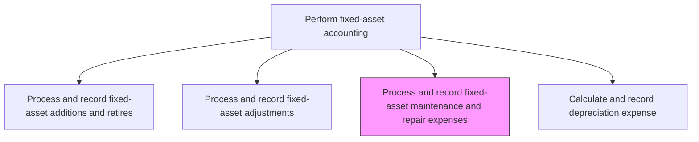
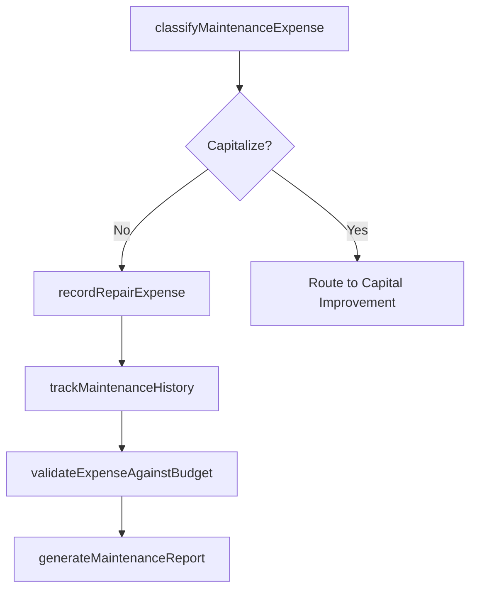

# Process and record fixed-asset maintenance and repair expenses

> Business-as-Code definition for fixed-asset maintenance and repair expense processing. Models the classification, recording, and tracking of maintenance costs to distinguish between expensed repairs and capitalizable improvements.

## Overview

Maintaining a record of expenses necessitated for repairs and the preservation of assets. Administer and oversee the maintenance and repair of any fixed assets. Record all related transactions. The critical accounting judgment in this process is determining whether a cost is a routine repair (expensed immediately) or a capital improvement (added to the asset's book value), since misclassification can materially affect both the income statement and balance sheet.

## Process Hierarchy



## GraphDL

```yaml
process:
  object: And Record Fixed-asset Maintenance And Repair Expenses
  actor: FixedAssetAccountant
  result: MaintenanceExpenseEntry
```

## Actions

| Action | Description |
|--------|-------------|
| classifyMaintenanceExpense | Determine whether the cost is a repair (expense) or betterment (capitalize) |
| recordRepairExpense | Post the maintenance or repair cost to the appropriate expense account |
| trackMaintenanceHistory | Log the maintenance event against the asset record for lifecycle tracking |
| validateExpenseAgainstBudget | Compare maintenance costs to the approved maintenance budget |
| generateMaintenanceReport | Produce a summary of maintenance expenses by asset class and period |

## Events

| Event | Description |
|-------|-------------|
| maintenanceExpenseClassified | The maintenance cost has been categorized as repair or capital improvement |
| repairExpenseRecorded | A repair expense has been posted to the ledger |
| maintenanceHistoryUpdated | The asset maintenance log has been updated |
| budgetVarianceFlagged | Maintenance spending has exceeded the approved budget threshold |
| maintenanceReportGenerated | A maintenance expense summary has been produced |

## Searches

| Search | Description |
|--------|-------------|
| findMaintenanceByAsset | List all maintenance expenses for a specific asset |
| getMaintenanceBudgetVariance | Compare actual maintenance spend to budget by asset class |
| getMaintenanceHistory | Retrieve the full maintenance history for an asset |

## Process Flow



## RACI Matrix

| Activity | Responsible | Accountable | Consulted | Informed |
|----------|-------------|-------------|-----------|----------|
| classifyMaintenanceExpense | FixedAssetAccountant | FixedAssetManager | FacilitiesManager | Controller |
| recordRepairExpense | FixedAssetAccountant | Controller | GeneralLedgerManager | InternalAudit |
| trackMaintenanceHistory | FixedAssetAccountant | FixedAssetManager | FacilitiesManager | AssetCoordinator |
| validateExpenseAgainstBudget | FixedAssetAccountant | Controller | FPAManager | CFO |

## Related Processes

| Process | Relationship |
|---------|-------------|
| 9.3.3.5 Process and record fixed-asset adjustments | Related - capital improvements are routed from maintenance classification |
| 9.3.3.7 Calculate and record depreciation expense | Related - capitalized improvements affect depreciation schedules |
| 9.3.3.3 Maintain fixed-asset master data files | Downstream - maintenance history is logged against asset master records |
| 9.3.2.2 Process journal entries | Downstream - repair expenses are posted as journal entries |

## Related Departments

| Department | Role |
|-----------|------|
| Fixed-Asset Accounting | Primary owner of maintenance expense classification and recording |
| Facilities | Manages physical maintenance activities and work orders |
| Procurement | Sources maintenance services and parts |

## Related Occupations

| Occupation | Involvement |
|-----------|-------------|
| Fixed-Asset Accountant | Classifies and records maintenance expenses |
| Facilities Manager | Manages maintenance work orders and vendor relationships |
| Budget Analyst | Monitors maintenance budget variance |

## KPIs

| KPI | Description | Unit |
|-----|-------------|------|
| Maintenance Cost Ratio | Maintenance expense as a percentage of total asset value | % |
| Capitalize vs. Expense Ratio | Ratio of capitalized improvements to expensed repairs | Ratio |
| Budget Variance | Difference between actual and budgeted maintenance spend | Currency |
| Classification Accuracy | Percentage of maintenance expenses correctly classified on first review | % |

## Usage

```typescript
import { processAndRecordFixedAssetMaintenanceAndRepairExpenses } from '@headlessly/process-and-record-fixed-asset-maintenance-and-repair-expenses'

const client = processAndRecordFixedAssetMaintenanceAndRepairExpenses()

// Classify a maintenance expense
const classification = await client.classifyMaintenanceExpense({
  assetId: 'FA-2020-00341',
  description: 'Conveyor belt replacement',
  amount: 8500,
  workOrderId: 'WO-2024-1122'
})

// Get maintenance budget variance
const variance = await client.getMaintenanceBudgetVariance({
  assetClass: 'machinery',
  period: '2024-Q4'
})
```
