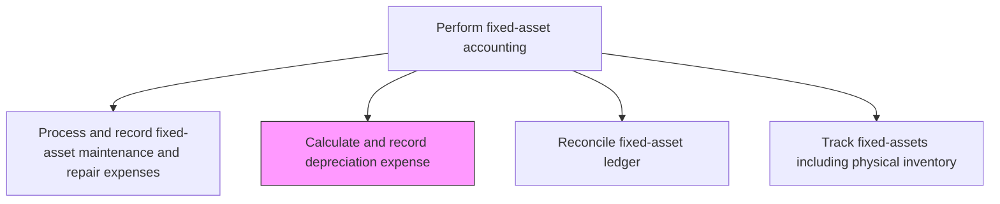
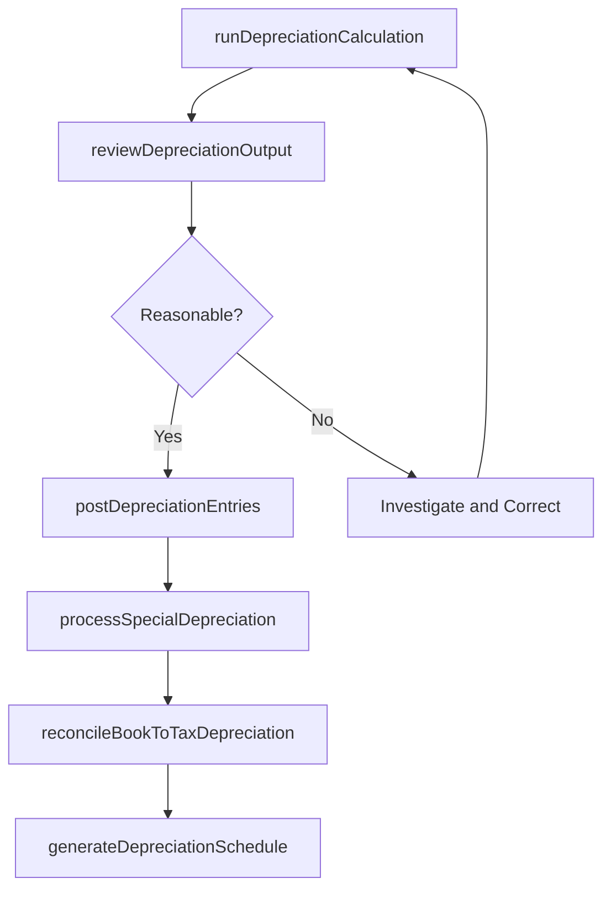

# Calculate and record depreciation expense

> Business-as-Code definition for record depreciation expense. Models the end-to-end process of calculate and record depreciation expense as a programmable workflow.

## Overview

Carrying out accounting for depreciation over fixed assets. Compute the sums necessitated. Maintain a record of the cost value of fixed assets over their useful life in the book of accounts. Accurate depreciation calculation ensures that asset values on the balance sheet reflect economic consumption, that income statements properly match expense to revenue, and that tax depreciation deductions are correctly claimed.

## Process Hierarchy



## GraphDL

```yaml
calculate:
  object: And Record Depreciation Expense
  actor: FixedAssetAccountant
  result: RecordDepreciationExpenseCalculation
```

## Actions

| Action | Description |
|--------|-------------|
| runDepreciationCalculation | Execute the periodic depreciation engine for all active assets using approved methods and useful lives |
| reviewDepreciationOutput | Examine calculated amounts for reasonableness and compare to prior period charges |
| postDepreciationEntries | Record the depreciation expense and accumulated depreciation entries in the general ledger |
| processSpecialDepreciation | Handle bonus depreciation, Section 179 deductions, or accelerated methods for qualifying assets |
| reconcileBookToTaxDepreciation | Compare book depreciation to tax depreciation and document temporary differences |
| generateDepreciationSchedule | Produce a detailed schedule of depreciation by asset showing cost, method, accumulated, and net book value |

## Events

| Event | Description |
|-------|-------------|
| depreciationCalculationCompleted | Periodic depreciation has been computed for all active assets |
| depreciationOutputReviewed | Calculated depreciation amounts have been validated for reasonableness |
| depreciationEntriesPosted | Depreciation expense entries have been recorded in the general ledger |
| specialDepreciationProcessed | Bonus or accelerated depreciation deductions have been applied |
| bookTaxDifferencesReconciled | Differences between book and tax depreciation have been documented |
| depreciationScheduleGenerated | A detailed depreciation schedule has been produced for review |

## Searches

| Search | Description |
|--------|-------------|
| getDepreciationByAssetClass | Retrieve depreciation expense totals grouped by asset class and period |
| findFullyDepreciatedAssets | List assets that have reached zero net book value but remain in service |
| getDepreciationSchedule | Return the detailed depreciation schedule for a specific asset or class |
| getBookTaxDifferenceReport | Retrieve the book-to-tax depreciation variance report for the period |

## Process Flow



## RACI Matrix

| Activity | Responsible | Accountable | Consulted | Informed |
|----------|-------------|-------------|-----------|----------|
| runDepreciationCalculation | FixedAssetAccountant | FixedAssetManager | FinanceSystemsAdmin | Controller |
| reviewDepreciationOutput | FixedAssetManager | Controller | InternalAudit | CFO |
| postDepreciationEntries | FixedAssetAccountant | Controller | GeneralLedgerManager | ExternalAuditor |
| reconcileBookToTaxDepreciation | TaxAccountant | TaxManager | FixedAssetManager | Controller |

## Related Processes

| Process | Relationship |
|---------|-------------|
| 9.3.3.2 Establish (tax and book) depreciation policies | Upstream - depreciation policies govern calculation methods and useful lives |
| 9.3.3.5 Process and record fixed-asset adjustments | Upstream - asset revaluations and improvements change depreciation inputs |
| 9.3.3.8 Reconcile fixed-asset ledger | Downstream - depreciation entries must reconcile to the general ledger |
| 9.9 Manage taxes | Related - tax depreciation feeds income tax provision calculations |

## Related Departments

| Department | Role |
|-----------|------|
| Fixed-Asset Accounting | Primary owner of depreciation calculation and posting |
| Tax | Manages tax depreciation methods and book-tax difference tracking |
| General Accounting | Receives depreciation entries and maintains the general ledger |
| Internal Audit | Reviews depreciation accuracy and method compliance |

## Related Occupations

| Occupation | Involvement |
|-----------|-------------|
| Fixed-Asset Accountant | Runs depreciation calculations and posts entries |
| Tax Accountant | Calculates tax depreciation and reconciles book-tax differences |
| ERP Administrator | Maintains depreciation parameters in the financial system |

## KPIs

| KPI | Description | Unit |
|-----|-------------|------|
| Depreciation Posting Timeliness | Days from period end to depreciation entries posted | Days |
| Depreciation Accuracy Rate | Percentage of depreciation runs completed without manual correction | % |
| Fully Depreciated Asset Ratio | Percentage of assets fully depreciated but still in service | % |
| Book-Tax Difference Reconciliation Rate | Percentage of assets with documented book-tax depreciation variances | % |

## Usage

```typescript
import { calculateAndRecordDepreciationExpense } from '@headlessly/calculate-and-record-depreciation-expense'

const client = calculateAndRecordDepreciationExpense()

// Run monthly depreciation calculation
const depRun = await client.runDepreciationCalculation({
  period: '2024-11',
  assetClasses: ['machinery', 'vehicles', 'furnitureAndFixtures'],
  method: 'perPolicy'
})

// Retrieve fully depreciated assets still in service
const fullyDepreciated = await client.findFullyDepreciatedAssets({
  assetClass: 'allClasses',
  inServiceOnly: true
})
```
