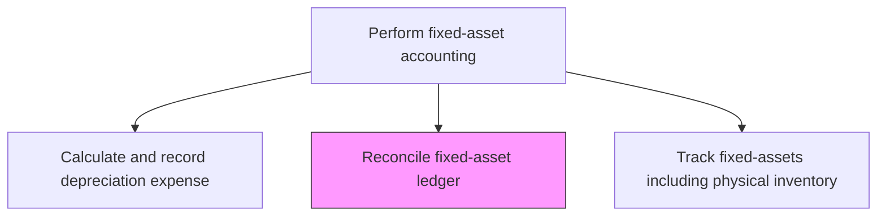
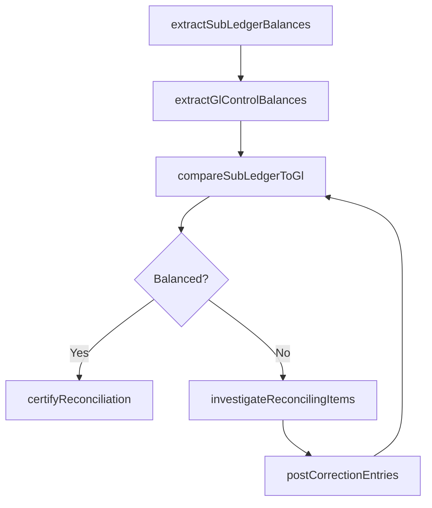

# Reconcile fixed-asset ledger

> Business-as-Code definition for fixed-asset ledger. Models the end-to-end process of reconcile fixed-asset ledger as a programmable workflow.

## Overview

Balancing the ledger account balance for fixed assets. Correct errors in the books of fixed assets. Provide correct information in relevant accounts. This reconciliation ensures that the fixed-asset sub-ledger agrees with the general ledger control accounts for gross asset cost, accumulated depreciation, and net book value, catching data entry errors, missed transactions, and system integration failures before financial statements are produced.

## Process Hierarchy



## GraphDL

```yaml
reconcile:
  object: Fixed-asset Ledger
  actor: FixedAssetAccountant
  result: FixedassetLedgerReconciliationReport
```

## Actions

| Action | Description |
|--------|-------------|
| extractSubLedgerBalances | Pull gross cost, accumulated depreciation, and net book value totals from the asset sub-ledger |
| extractGlControlBalances | Pull corresponding fixed-asset control account balances from the general ledger |
| compareSubLedgerToGl | Match sub-ledger totals to GL control accounts and identify variances |
| investigateReconcilingItems | Research the root cause of differences such as unposted entries or timing mismatches |
| postCorrectionEntries | Record adjusting entries to resolve identified discrepancies |
| certifyReconciliation | Sign off that the fixed-asset ledger is fully reconciled for the period |

## Events

| Event | Description |
|-------|-------------|
| subLedgerBalancesExtracted | Fixed-asset sub-ledger totals have been pulled for reconciliation |
| glControlBalancesExtracted | General ledger fixed-asset control account balances have been retrieved |
| variancesIdentified | Differences between the sub-ledger and GL have been documented |
| reconcilingItemsResolved | Root causes of discrepancies have been identified and corrected |
| correctionEntriesPosted | Adjusting entries have been recorded to resolve variances |
| reconciliationCertified | The fixed-asset ledger reconciliation has been signed off for the period |

## Searches

| Search | Description |
|--------|-------------|
| getReconciliationStatus | Retrieve the reconciliation completion status for each fixed-asset GL account |
| findReconcilingItems | List open reconciling items between the sub-ledger and GL by category |
| getReconciliationHistory | Return historical reconciliation results and trend data by period |
| getVarianceSummary | Retrieve a summary of sub-ledger-to-GL variances by asset class |

## Process Flow



## RACI Matrix

| Activity | Responsible | Accountable | Consulted | Informed |
|----------|-------------|-------------|-----------|----------|
| compareSubLedgerToGl | FixedAssetAccountant | FixedAssetManager | GeneralLedgerManager | Controller |
| investigateReconcilingItems | FixedAssetAccountant | FixedAssetManager | FinanceSystemsAdmin | InternalAudit |
| postCorrectionEntries | FixedAssetAccountant | Controller | GeneralLedgerManager | ExternalAuditor |
| certifyReconciliation | FixedAssetManager | Controller | InternalAudit | CFO |

## Related Processes

| Process | Relationship |
|---------|-------------|
| 9.3.3.7 Calculate and record depreciation expense | Upstream - depreciation entries must be posted before reconciliation |
| 9.3.3.4 Process and record fixed-asset additions and retires | Upstream - capitalization and disposal entries feed the sub-ledger |
| 9.3.2.6 Reconcile general ledger accounts | Related - fixed-asset reconciliation is a component of overall GL reconciliation |
| 9.3.3.9 Track fixed-assets including physical inventory | Downstream - reconciled ledger supports physical inventory validation |

## Related Departments

| Department | Role |
|-----------|------|
| Fixed-Asset Accounting | Primary owner of sub-ledger-to-GL reconciliation |
| General Accounting | Maintains GL control accounts and validates postings |
| Internal Audit | Reviews reconciliation quality and timeliness |
| Finance Systems | Supports data extraction and system integration troubleshooting |

## Related Occupations

| Occupation | Involvement |
|-----------|-------------|
| Fixed-Asset Accountant | Performs reconciliation and investigates variances |
| Fixed-Asset Manager | Reviews and certifies the reconciliation |
| Internal Auditor | Tests reconciliation controls and reviews open items |

## KPIs

| KPI | Description | Unit |
|-----|-------------|------|
| Reconciliation Completion Rate | Percentage of fixed-asset accounts reconciled by the close deadline | % |
| Unreconciled Variance Amount | Total dollar value of unresolved sub-ledger-to-GL differences | Currency |
| Correction Entry Volume | Number of adjusting entries required to reconcile per period | Count |
| Reconciliation Cycle Time | Days from period end to certified fixed-asset reconciliation | Days |

## Usage

```typescript
import { reconcileFixedassetLedger } from '@headlessly/reconcile-fixed-asset-ledger'

const client = reconcileFixedassetLedger()

// Compare sub-ledger to GL for the period
const reconciliation = await client.compareSubLedgerToGl({
  period: '2024-11',
  assetClasses: ['machinery', 'vehicles', 'buildings'],
  entity: 'US-PARENT'
})

// Retrieve open reconciling items
const openItems = await client.findReconcilingItems({
  period: '2024-11',
  status: 'unresolved',
  minVariance: 500
})
```
