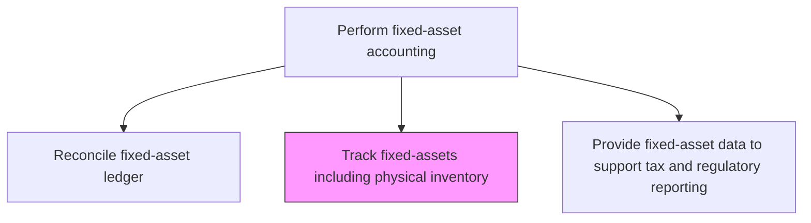
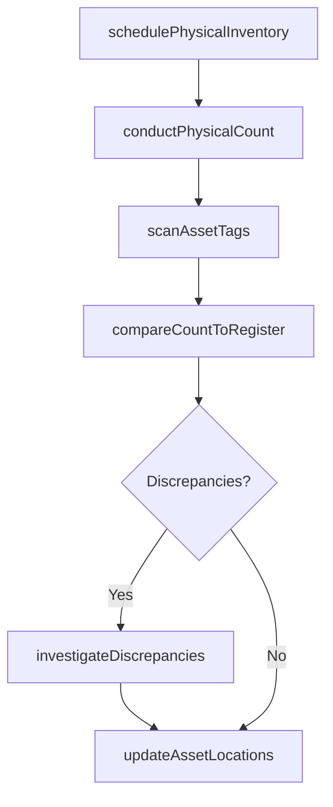

# Track fixed-assets including physical inventory

> Business-as-Code definition for fixed-assets including physical inventory. Models the end-to-end process of track fixed-assets including physical inventory as a programmable workflow.

## Overview

Checking and updating the record of all fixed assets through ongoing location tracking and periodic physical verification. This process ensures that every asset recorded in the financial system physically exists, is in its documented location, and is in serviceable condition. Physical inventory counts detect ghost assets, unreported disposals, and location changes that would otherwise distort balance sheet values and depreciation expense.

## Process Hierarchy



## GraphDL

```yaml
track:
  object: Fixed-assets Including Physical Inventory
  actor: FixedAssetAccountant
  result: FixedassetsIncludingPhysicalInventoryTrackingLog
```

## Actions

| Action | Description |
|--------|-------------|
| schedulePhysicalInventory | Plan the timing, scope, and staffing for the physical asset count cycle |
| conductPhysicalCount | Perform on-site verification of each asset's existence, location, and condition |
| scanAssetTags | Use barcode or RFID technology to capture asset tag data during the physical count |
| compareCountToRegister | Match physical count results against the asset master register to identify discrepancies |
| investigateDiscrepancies | Research missing, untagged, or relocated assets to determine root cause |
| updateAssetLocations | Correct location, custodian, and condition data in the master register based on findings |

## Events

| Event | Description |
|-------|-------------|
| physicalInventoryScheduled | The physical count cycle has been planned and communicated to stakeholders |
| physicalCountCompleted | On-site asset verification has been completed for the assigned scope |
| assetTagsScanned | Asset tag data has been captured and uploaded from the physical count |
| countComparedToRegister | Physical count results have been matched against the master register |
| discrepancyInvestigated | A mismatch between physical count and register has been researched and resolved |
| assetLocationsUpdated | Asset location and condition records have been corrected in the system |

## Searches

| Search | Description |
|--------|-------------|
| getPhysicalCountSchedule | Retrieve the planned physical inventory schedule by location and date range |
| findAssetDiscrepancies | List assets with mismatches between physical count and register data |
| getAssetLocationHistory | Return the location change history for a specific asset |
| getCountCompletionStatus | Retrieve the percentage of assets verified by location or department |

## Process Flow



## RACI Matrix

| Activity | Responsible | Accountable | Consulted | Informed |
|----------|-------------|-------------|-----------|----------|
| schedulePhysicalInventory | FixedAssetManager | Controller | FacilitiesManager | InternalAudit |
| conductPhysicalCount | AssetCoordinator | FixedAssetManager | DepartmentManagers | Controller |
| compareCountToRegister | FixedAssetAccountant | FixedAssetManager | FinanceSystemsAdmin | InternalAudit |
| investigateDiscrepancies | FixedAssetAccountant | Controller | FacilitiesManager | CFO |

## Related Processes

| Process | Relationship |
|---------|-------------|
| 9.3.3.3 Maintain fixed-asset master data files | Related - physical inventory validates master data accuracy |
| 9.3.3.8 Reconcile fixed-asset ledger | Upstream - ledger reconciliation identifies discrepancies for count verification |
| 9.3.3.10 Provide fixed-asset data to support tax and regulatory reporting | Downstream - verified asset data supports accurate regulatory filings |
| 9.8 Manage internal controls | Related - physical inventory is a key internal control over asset existence |

## Related Departments

| Department | Role |
|-----------|------|
| Fixed-Asset Accounting | Primary owner of asset tracking and physical count coordination |
| Facilities | Provides physical access and assists with on-site verification |
| IT | Supports barcode and RFID scanning infrastructure |
| Internal Audit | Observes physical counts and tests tracking controls |

## Related Occupations

| Occupation | Involvement |
|-----------|-------------|
| Fixed-Asset Accountant | Coordinates counts and investigates discrepancies |
| Asset Coordinator | Conducts on-site physical verification and tag scanning |
| Internal Auditor | Observes and validates the physical count process |

## KPIs

| KPI | Description | Unit |
|-----|-------------|------|
| Physical Count Accuracy | Percentage of assets verified matching the register on first count | % |
| Ghost Asset Rate | Percentage of registered assets not found during physical count | % |
| Count Cycle Completion | Percentage of assets physically verified within the annual cycle | % |
| Discrepancy Resolution Time | Average days to resolve a physical count discrepancy | Days |

## Usage

```typescript
import { trackFixedassetsIncludingPhysicalInventory } from '@headlessly/track-fixed-assets-including-physical-inventory'

const client = trackFixedassetsIncludingPhysicalInventory()

// Compare physical count results to the asset register
const comparison = await client.compareCountToRegister({
  location: 'HQ-Floor3',
  countDate: '2024-12-01',
  scannedAssetIds: ['FA-2020-00341', 'FA-2021-00112', 'FA-2022-00045']
})

// Retrieve unresolved discrepancies from the latest count
const discrepancies = await client.findAssetDiscrepancies({
  countCycle: '2024-Annual',
  status: 'unresolved',
  location: 'allLocations'
})
```
