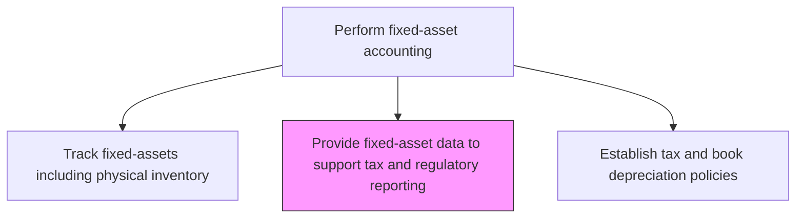
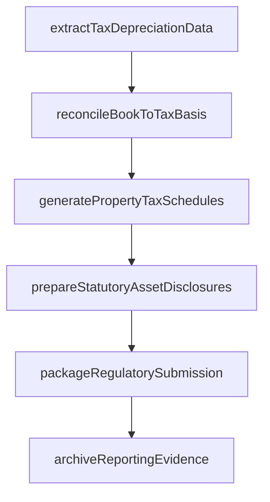

# Provide fixed-asset data to support tax, statutory, and regulatory reporting

> Business-as-Code definition for fixed-asset data to support tax, statutory, and regulatory reporting. Models the end-to-end process of provide fixed-asset data to support tax, statutory, and regulatory reporting as a programmable workflow.

## Overview

Showing market value and related expenses on fixed assets data for taxation. Provide complete information recorded in the books of fixed assets about purchase price, depreciation, installation charges, resale market value, and other attributes for tax and regulatory purposes. This process extracts and formats asset data to meet the specific requirements of tax returns, statutory financial statements, property tax filings, and industry-specific regulatory reports across all jurisdictions in which the organization operates.

## Process Hierarchy



## GraphDL

```yaml
provide:
  object: Fixed-asset Data To Support Tax, Statutory, And Regulatory Reporting
  actor: FixedAssetAccountant
  result: FixedassetDataToSupportTaxStatutoryAndRegulatoryReportingRecord
```

## Actions

| Action | Description |
|--------|-------------|
| extractTaxDepreciationData | Pull tax-basis depreciation, cost recovery, and net book value data for all assets |
| generatePropertyTaxSchedules | Compile asset cost and location data for property tax assessment filings |
| prepareStatutoryAssetDisclosures | Format fixed-asset disclosures required by local statutory reporting frameworks |
| reconcileBookToTaxBasis | Compare book and tax asset values and document timing differences for deferred tax calculations |
| packageRegulatorySubmission | Assemble the required data extracts in the format specified by each regulatory authority |
| archiveReportingEvidence | Store supporting schedules and data extracts with retention metadata for audit trail |

## Events

| Event | Description |
|-------|-------------|
| taxDepreciationDataExtracted | Tax-basis depreciation data has been pulled for the reporting period |
| propertyTaxSchedulesGenerated | Asset data has been compiled for property tax filings |
| statutoryDisclosuresPrepared | Fixed-asset disclosures have been formatted for statutory reports |
| bookTaxBasisReconciled | Book and tax asset values have been compared and differences documented |
| regulatorySubmissionPackaged | Data extracts have been assembled in the required regulatory format |
| reportingEvidenceArchived | Supporting schedules have been stored with retention metadata |

## Searches

| Search | Description |
|--------|-------------|
| getTaxDepreciationReport | Retrieve tax depreciation schedules by asset class, entity, or jurisdiction |
| getPropertyTaxAssessment | Return property tax filing data by location and assessment period |
| getBookTaxDifferenceReport | Retrieve book-to-tax basis differences for deferred tax calculations |
| getRegulatoryFilingStatus | List the status of regulatory asset data submissions by jurisdiction and deadline |

## Process Flow



## RACI Matrix

| Activity | Responsible | Accountable | Consulted | Informed |
|----------|-------------|-------------|-----------|----------|
| extractTaxDepreciationData | FixedAssetAccountant | FixedAssetManager | TaxManager | Controller |
| reconcileBookToTaxBasis | TaxAccountant | TaxManager | FixedAssetManager | ExternalAuditor |
| generatePropertyTaxSchedules | TaxAccountant | TaxManager | FacilitiesManager | Controller |
| packageRegulatorySubmission | FixedAssetAccountant | Controller | TaxManager | CFO |

## Related Processes

| Process | Relationship |
|---------|-------------|
| 9.3.3.7 Calculate and record depreciation expense | Upstream - depreciation data is the primary input for tax reporting |
| 9.3.3.2 Establish (tax and book) depreciation policies | Upstream - policies determine tax depreciation methods and lives |
| 9.9 Manage taxes | Downstream - asset data feeds income tax provision and return preparation |
| 9.3.4 Perform financial reporting | Related - statutory asset disclosures appear in published financial statements |

## Related Departments

| Department | Role |
|-----------|------|
| Fixed-Asset Accounting | Primary owner of asset data extraction and formatting |
| Tax | Consumes asset data for tax returns and property tax filings |
| Financial Reporting | Incorporates statutory asset disclosures into published statements |
| External Audit | Reviews asset data accuracy for regulatory filings |

## Related Occupations

| Occupation | Involvement |
|-----------|-------------|
| Fixed-Asset Accountant | Extracts and packages asset data for regulatory submissions |
| Tax Accountant | Prepares tax depreciation schedules and property tax filings |
| Financial Reporting Analyst | Incorporates asset disclosures into statutory reports |

## KPIs

| KPI | Description | Unit |
|-----|-------------|------|
| Regulatory Filing Timeliness | Percentage of asset-related filings submitted by deadline | % |
| Book-Tax Reconciliation Accuracy | Percentage of assets with correctly documented book-tax differences | % |
| Property Tax Assessment Variance | Difference between assessed and expected property tax values | Currency |
| Data Extract Completeness | Percentage of required data fields populated in regulatory submissions | % |

## Usage

```typescript
import { provideFixedassetDataToSupportTaxStatutoryAndRegulatoryReporting } from '@headlessly/provide-fixed-asset-data-to-support-tax-statutory-and-regulatory-reporting'

const client = provideFixedassetDataToSupportTaxStatutoryAndRegulatoryReporting()

// Extract tax depreciation data for year-end filing
const taxData = await client.extractTaxDepreciationData({
  fiscalYear: 2024,
  entity: 'US-PARENT',
  taxJurisdiction: 'federal',
  includeSection179: true
})

// Get property tax schedules by location
const propertyTax = await client.getPropertyTaxAssessment({
  assessmentYear: 2025,
  locations: ['HQ-Building', 'Plant-A', 'Warehouse-West']
})
```
