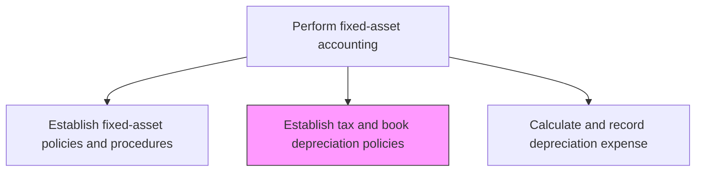
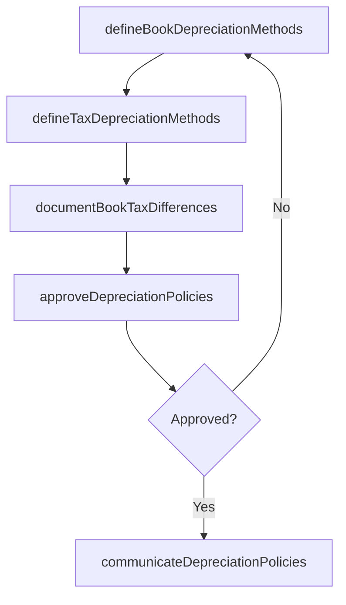

# Establish (tax and book) depreciation policies

> Business-as-Code definition for establishing tax and book depreciation policies. Models the process of defining GAAP/IFRS book depreciation methods alongside tax code methods (MACRS, ACA), documenting book-tax differences, and ensuring consistent application.

## Overview

Establishing separate depreciation policies for financial reporting (book) and tax compliance purposes. Define approved methods, useful lives, and salvage values for each asset class under both book and tax frameworks to ensure accurate financial statements and tax returns.

## Process Hierarchy



## GraphDL

```yaml
establish:
  object: (tax And Book) Depreciation Policies
  actor: TaxManager
  result: DepreciationPolicyDocument
```

## Actions

| Action | Description |
|--------|-------------|
| defineBookDepreciationMethods | Select GAAP/IFRS-compliant depreciation methods for each asset class |
| defineTaxDepreciationMethods | Establish tax depreciation methods per applicable tax code such as MACRS or ACA |
| documentBookTaxDifferences | Catalog expected timing and permanent differences between book and tax depreciation |
| approveDepreciationPolicies | Obtain formal sign-off from the controller and tax director |
| communicateDepreciationPolicies | Distribute approved policies to asset accounting and tax teams |

## Events

| Event | Description |
|-------|-------------|
| bookMethodsDefined | GAAP/IFRS depreciation methods have been selected for each asset class |
| taxMethodsDefined | Tax depreciation methods have been established per applicable code |
| bookTaxDifferencesDocumented | Expected book-tax depreciation differences have been cataloged |
| depreciationPoliciesApproved | Depreciation policies have been formally authorized |
| depreciationPoliciesCommunicated | Approved policies have been distributed to relevant teams |

## Searches

| Search | Description |
|--------|-------------|
| getDepreciationPolicies | Retrieve current depreciation policies by asset class and method type |
| getBookTaxMethodComparison | Compare book and tax depreciation methods for a specific asset class |
| getPolicyChangeHistory | Return the revision history for depreciation policies |

## Process Flow



## RACI Matrix

| Activity | Responsible | Accountable | Consulted | Informed |
|----------|-------------|-------------|-----------|----------|
| defineBookDepreciationMethods | FixedAssetManager | Controller | ExternalAuditor | CFO |
| defineTaxDepreciationMethods | TaxManager | TaxDirector | FixedAssetManager | Controller |
| documentBookTaxDifferences | TaxAccountant | TaxManager | FixedAssetManager | InternalAudit |
| approveDepreciationPolicies | Controller | CFO | TaxDirector | AuditCommittee |

## Related Processes

| Process | Relationship |
|---------|-------------|
| 9.3.3.1 Establish fixed-asset policies and procedures | Upstream - overall asset policies define the framework for depreciation |
| 9.3.3.7 Calculate and record depreciation expense | Consumer - depreciation policies govern calculation methods |
| 9.3.3.10 Provide fixed-asset data to support tax and regulatory reporting | Downstream - tax depreciation data feeds regulatory filing schedules |
| 9.9 Manage taxes | Related - tax depreciation policies support tax compliance |

## Related Departments

| Department | Role |
|-----------|------|
| Fixed-Asset Accounting | Co-owner defining book depreciation methods |
| Tax | Co-owner defining tax depreciation methods and managing compliance |
| External Audit | Reviews policy compliance with accounting standards |

## Related Occupations

| Occupation | Involvement |
|-----------|-------------|
| Tax Manager | Defines tax depreciation methods and advises on regulatory requirements |
| Fixed-Asset Manager | Defines book depreciation methods and useful life estimates |
| External Auditor | Reviews depreciation policy compliance |

## KPIs

| KPI | Description | Unit |
|-----|-------------|------|
| Policy Compliance Rate | Percentage of assets depreciated per approved policy methods | % |
| Book-Tax Difference Accuracy | Percentage of book-tax differences correctly forecasted | % |
| Policy Review Cadence | Frequency of depreciation policy reviews per year | Per Year |

## Usage

```typescript
import { establishTaxAndBookDepreciationPolicies } from '@headlessly/establish-tax-and-book-depreciation-policies'

const client = establishTaxAndBookDepreciationPolicies()

// Define book depreciation methods for an asset class
const bookPolicy = await client.defineBookDepreciationMethods({
  assetClass: 'machinery',
  method: 'straightLine',
  usefulLife: 10,
  residualValue: 0.05,
  effectiveDate: '2025-01-01'
})

// Compare book and tax methods
const comparison = await client.getBookTaxMethodComparison({
  assetClass: 'machinery',
  fiscalYear: 2025
})
```
