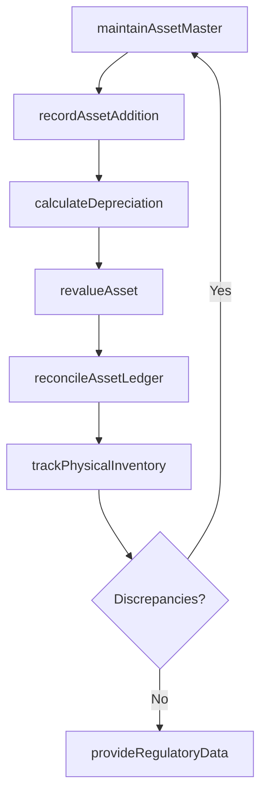

# Perform fixed-asset accounting

> Business-as-Code definition for fixed-asset accounting. Models asset register maintenance, depreciation calculation, asset additions and disposals, revaluations, physical inventory tracking, and tax/regulatory data provision as programmable APIs.

## Overview

Accounting for long-term and fixed assets. Record purchased, fixed assets that are not easily convertible into cash. Account for costs, useful life, resale value, depreciation, and amortization.

## Process Hierarchy

```mermaid
graph TD
    A[Perform fixed-asset accounting]
    A --> B[Establish fixed-asset policies and procedures]
    A --> C[Establish (tax and book) depreciation policies]
    A --> D[Maintain fixed-asset master data files]
    A --> E[Process and record fixed-asset additions and retires]
    A --> F[Process and record fixed-asset adjustments, enhancements, revaluations, and transfers]
    A --> G[Process and record fixed-asset maintenance and repair expenses]
    A --> H[Calculate and record depreciation expense]
    A --> I[Reconcile fixed-asset ledger]
    A --> J[Track fixed-assets including physical inventory]
    A --> K[Provide fixed-asset data to support tax, statutory, and regulatory reporting]
```

## GraphDL

```yaml
perform:
  object: Fixed-asset Accounting
  actor: FixedAssetAccountant
  result: FixedAssetRegister
```

## Actions

| Action | Description |
|--------|-------------|
| maintainAssetMaster | Create and update fixed-asset records in the asset register |
| recordAssetAddition | Capitalize new asset acquisitions and record in the ledger |
| retireAsset | Remove disposed or fully depreciated assets from the register |
| calculateDepreciation | Compute periodic depreciation expense using approved methods |
| revalueAsset | Adjust asset carrying value based on appraisal or impairment |
| reconcileAssetLedger | Match fixed-asset subledger to general ledger control accounts |
| trackPhysicalInventory | Conduct physical counts and reconcile with asset register |
| provideRegulatoryData | Extract fixed-asset data for tax, statutory, and audit reporting |

## Events

| Event | Description |
|-------|-------------|
| assetMasterMaintained | Fixed-asset record created or updated |
| assetAdditionRecorded | New asset capitalized and posted to the fixed-asset ledger |
| assetRetired | Disposed asset removed from the register with gain/loss recorded |
| depreciationCalculated | Periodic depreciation expense computed and posted |
| assetRevalued | Asset carrying value adjusted for impairment or revaluation |
| assetLedgerReconciled | Fixed-asset subledger balanced with the general ledger |
| physicalInventoryTracked | Physical asset count completed and exceptions resolved |
| regulatoryDataProvided | Fixed-asset data extracted for regulatory or tax reporting |

## Searches

| Search | Description |
|--------|-------------|
| getAssetRegister | List fixed assets by class, location, department, or status |
| getDepreciationSchedule | Retrieve depreciation schedules for specific assets or classes |
| getAssetDisposals | Query disposed assets by date, gain/loss, or method |
| getAssetReconciliation | Check reconciliation status between asset and GL ledgers |

## Process Flow



## RACI Matrix

| Activity | Responsible | Accountable | Consulted | Informed |
|----------|-------------|-------------|-----------|----------|
| recordAssetAddition | Fixed-Asset Accountant | Controller | Procurement | CFO |
| calculateDepreciation | Fixed-Asset Accountant | Controller | Tax Manager | Internal Audit |
| reconcileAssetLedger | Senior Accountant | Controller | GL Accountant | CFO |
| trackPhysicalInventory | Asset Coordinator | Controller | Facilities Manager | Internal Audit |

## Sub-Processes

| ID | Name | Description |
|----|------|-------------|
| 9.3.3.1 | Establish fixed-asset policies and procedures | Creating rules for fixed assets market valuation. Make rules and regulations for fixed assets regard |
| 9.3.3.2 | Establish (tax and book) depreciation policies | Setting depreciation methods and useful life estimates for both tax and financial reporting purposes. |
| 9.3.3.3 | Maintain fixed-asset master data files | Keeping reports up-to-date regarding fixed assets. Create a fixed assets database detailing price, l |
| 9.3.3.4 | Process and record fixed-asset additions and retires | Keeping a summary of sales and purchases of assets. Record any expenses made for new assets purchase |
| 9.3.3.5 | Process and record fixed-asset adjustments, enhancements, revaluations, and transfers | Keeping a summary of expenses for installing and modifying assets. Record any expenses made for new  |
| 9.3.3.6 | Process and record fixed-asset maintenance and repair expenses | Maintaining a record of expenses necessitated for repairs and the preservation of assets. Administer |
| 9.3.3.7 | Calculate and record depreciation expense | Carrying out accounting for depreciation over fixed assets. Compute the sums necessitated. Maintain  |
| 9.3.3.8 | Reconcile fixed-asset ledger | Balancing the ledger account balance for fixed assets. Correct errors in the books of fixed assets.  |
| 9.3.3.9 | Track fixed-assets including physical inventory | Checking and updating the record of all raw materials and fixed assets. Track all fixes asset. Maint |
| 9.3.3.10 | Provide fixed-asset data to support tax, statutory, and regulatory reporting | Showing market value and related expenses on fixed assets data for taxation. Provide complete inform |

## Related Processes

| Process | Relationship |
|---------|-------------|
| 9.4 Manage fixed-asset project accounting | Upstream - capitalized projects create new fixed assets |
| 9.3.2 Perform general accounting | Downstream - depreciation and disposal entries post to GL |
| 9.9 Manage taxes | Downstream - asset data supports tax depreciation schedules |

## Related Departments

| Department | Role |
|-----------|------|
| Fixed-Asset Accounting | Primary owner of asset register and depreciation |
| Facilities | Manages physical asset locations and maintenance |
| Tax | Uses asset data for tax depreciation and compliance |
| Internal Audit | Validates physical inventory counts and asset controls |
| Procurement | Provides acquisition data for capitalization |

## Related Occupations

| Occupation | Involvement |
|-----------|-------------|
| Fixed-Asset Accountant | Maintains asset register, calculates depreciation, reconciles ledger |
| Asset Coordinator | Tracks physical asset locations and conducts inventory counts |
| Tax Accountant | Manages tax vs. book depreciation schedules |

## KPIs

| KPI | Description | Unit |
|-----|-------------|------|
| Asset Register Accuracy | Percentage of assets verified during physical inventory | % |
| Depreciation Posting Timeliness | Days from period end to depreciation entries posted | Days |
| Asset Utilization Rate | Percentage of fixed assets actively in use | % |
| Disposal Processing Time | Days from asset disposal request to ledger removal | Days |

## Usage

```typescript
import { performFixedAssetAccounting } from '@headlessly/perform-fixed-asset-accounting'

const assets = performFixedAssetAccounting()

// Record a new asset acquisition
await assets.recordAssetAddition({
  assetClass: 'Machinery',
  description: 'CNC Milling Machine',
  acquisitionCost: 180000,
  usefulLife: 10,
  depreciationMethod: 'straight-line',
  location: 'Plant-B'
})

// Get depreciation schedule for an asset class
const schedule = await assets.getDepreciationSchedule({
  assetClass: 'Machinery',
  fiscalYear: 2025
})
```
