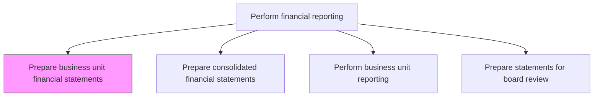
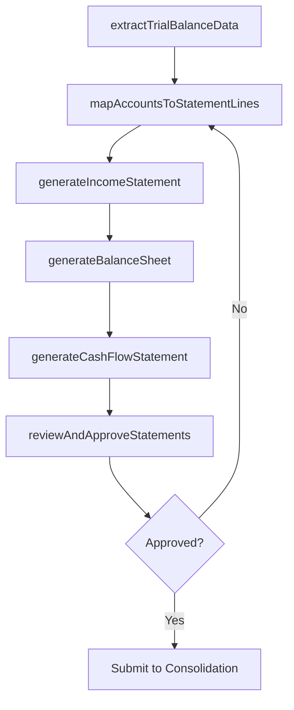

# Prepare business unit financial statements

> Business-as-Code definition for business unit financial statements. Models the end-to-end process of prepare business unit financial statements as a programmable workflow.

## Overview

Making reports of subsidiary units to show profits generated from them. Prepare financial statements (balance sheets, income statements, cash flow statements, and statements of shareholders' equity) for a single unit of a business. Business unit financial statements provide local management and corporate leadership with visibility into individual entity performance, serving as the building blocks for consolidated group reporting and enabling local statutory compliance in each jurisdiction.

## Process Hierarchy



## GraphDL

```yaml
prepare:
  object: Business Unit Financial Statements
  actor: FinancialReportingManager
  result: BusinessUnitFinancialStatementsDocument
```

## Actions

| Action | Description |
|--------|-------------|
| extractTrialBalanceData | Pull the adjusted trial balance for the specific business unit from the general ledger |
| mapAccountsToStatementLines | Apply the reporting taxonomy to map GL accounts to financial statement line items |
| generateIncomeStatement | Produce the business unit income statement showing revenue, expenses, and net income |
| generateBalanceSheet | Produce the business unit balance sheet showing assets, liabilities, and equity |
| generateCashFlowStatement | Prepare the statement of cash flows using the indirect or direct method |
| reviewAndApproveStatements | Circulate draft statements for entity controller review and sign-off |

## Events

| Event | Description |
|-------|-------------|
| trialBalanceDataExtracted | The adjusted trial balance has been pulled for the business unit |
| accountsMappedToStatements | GL accounts have been mapped to financial statement line items |
| incomeStatementGenerated | The business unit income statement has been produced |
| balanceSheetGenerated | The business unit balance sheet has been produced |
| cashFlowStatementGenerated | The statement of cash flows has been prepared |
| statementsApproved | Business unit financial statements have been reviewed and signed off |

## Searches

| Search | Description |
|--------|-------------|
| getBusinessUnitStatements | Retrieve financial statements for a specific business unit and period |
| findStatementsByStatus | List business unit statements filtered by preparation or approval status |
| getStatementLineItemDetail | Drill into a specific line item to view the underlying GL account balances |
| compareStatementPeriods | Show business unit financial statement variances between two periods |

## Process Flow



## RACI Matrix

| Activity | Responsible | Accountable | Consulted | Informed |
|----------|-------------|-------------|-----------|----------|
| extractTrialBalanceData | FinancialReportingAnalyst | EntityController | GeneralLedgerManager | FinancialReportingManager |
| mapAccountsToStatementLines | FinancialReportingAnalyst | EntityController | TechnicalAccounting | InternalAudit |
| generateCashFlowStatement | FinancialReportingAnalyst | EntityController | TreasuryAnalyst | CFO |
| reviewAndApproveStatements | EntityController | Controller | ExternalAuditor | CFO |

## Related Processes

| Process | Relationship |
|---------|-------------|
| 9.3.2.8 Prepare trial balance | Upstream - the adjusted trial balance is the primary input |
| 9.3.4.2 Prepare consolidated financial statements | Downstream - business unit statements feed the consolidation |
| 9.3.4.3 Perform business unit reporting/review management reports | Related - management reports complement financial statements |
| 9.3.2.7 Perform consolidations and process eliminations | Consumer - business unit data drives the consolidation process |

## Related Departments

| Department | Role |
|-----------|------|
| Financial Reporting | Primary owner of business unit statement preparation |
| Entity Controllership | Reviews and approves individual business unit statements |
| General Accounting | Provides the trial balance and supporting detail |
| External Audit | Reviews statements for accuracy and standard compliance |

## Related Occupations

| Occupation | Involvement |
|-----------|-------------|
| Financial Reporting Analyst | Prepares financial statements and maps accounts to line items |
| Entity Controller | Reviews and approves business unit statements |
| External Auditor | Audits business unit financial statements |

## KPIs

| KPI | Description | Unit |
|-----|-------------|------|
| Statement Preparation Cycle Time | Days from period end to completed business unit statements | Days |
| Statement Accuracy Rate | Percentage of statements issued without subsequent correction | % |
| Line Item Mapping Completeness | Percentage of GL accounts mapped to financial statement lines | % |
| Entity Submission Timeliness | Percentage of business units submitting statements by the close deadline | % |

## Usage

```typescript
import { prepareBusinessUnitFinancialStatements } from '@headlessly/prepare-business-unit-financial-statements'

const client = prepareBusinessUnitFinancialStatements()

// Generate income statement for a business unit
const incomeStatement = await client.generateIncomeStatement({
  entity: 'BU-EMEA-004',
  period: '2024-Q4',
  currency: 'EUR',
  comparativePeriod: '2023-Q4'
})

// Compare statement line items between periods
const variance = await client.compareStatementPeriods({
  entity: 'BU-EMEA-004',
  currentPeriod: '2024-Q4',
  priorPeriod: '2024-Q3',
  statementType: 'incomeStatement'
})
```
