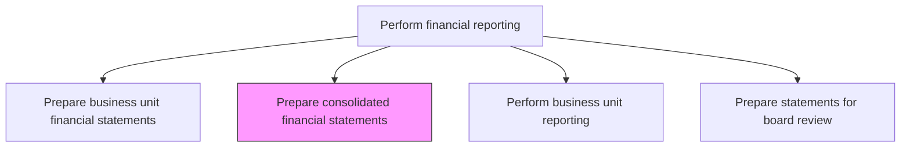
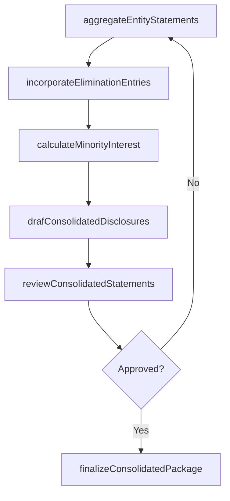

# Prepare consolidated financial statements

> Business-as-Code definition for consolidated financial statements. Models the end-to-end process of prepare consolidated financial statements as a programmable workflow.

## Overview

Making final accounts for all units of a company together. Prepare combined financial statements of a parent company and its subsidiaries (separate legal entities controlled by a parent company) showing assets, liabilities, equity, income, expenses, and cash flows. Consolidated statements present the financial position and results of the entire corporate group as if it were a single economic entity, eliminating intercompany transactions and incorporating currency translations, minority interests, and equity method investments.

## Process Hierarchy



## GraphDL

```yaml
prepare:
  object: Consolidated Financial Statements
  actor: FinancialReportingManager
  result: ConsolidatedFinancialStatementsDocument
```

## Actions

| Action | Description |
|--------|-------------|
| aggregateEntityStatements | Combine financial statement data from all subsidiaries and reporting entities |
| incorporateEliminationEntries | Apply intercompany elimination entries from the consolidation process |
| calculateMinorityInterest | Compute and present non-controlling interest in subsidiary equity and income |
| drafConsolidatedDisclosures | Prepare footnote disclosures covering consolidation scope, policies, and segment information |
| reviewConsolidatedStatements | Circulate draft consolidated statements for controller and CFO review |
| finalizeConsolidatedPackage | Produce the final consolidated financial statement package for external publication |

## Events

| Event | Description |
|-------|-------------|
| entityStatementsAggregated | Financial data from all reporting entities has been combined |
| eliminationsIncorporated | Intercompany elimination entries have been applied to the consolidated data |
| minorityInterestCalculated | Non-controlling interest amounts have been computed and presented |
| consolidatedDisclosuresDrafted | Footnote disclosures for the consolidated statements have been prepared |
| consolidatedStatementsReviewed | Draft consolidated statements have been reviewed by the controller |
| consolidatedPackageFinalized | The final consolidated financial statement package has been approved |

## Searches

| Search | Description |
|--------|-------------|
| getConsolidatedStatements | Retrieve consolidated financial statements for a specific period and reporting group |
| getConsolidationScope | Return the list of entities included in the consolidation with ownership percentages |
| getSegmentBreakdown | Retrieve financial data broken down by reportable segment |
| compareConsolidatedPeriods | Show consolidated financial statement variances between two periods |

## Process Flow



## RACI Matrix

| Activity | Responsible | Accountable | Consulted | Informed |
|----------|-------------|-------------|-----------|----------|
| aggregateEntityStatements | ConsolidationAccountant | FinancialReportingManager | EntityControllers | Controller |
| incorporateEliminationEntries | ConsolidationAccountant | Controller | IntercompanyAccountant | ExternalAuditor |
| drafConsolidatedDisclosures | FinancialReportingManager | Controller | TechnicalAccounting | Legal |
| reviewConsolidatedStatements | Controller | CFO | ExternalAuditor | AuditCommittee |

## Related Processes

| Process | Relationship |
|---------|-------------|
| 9.3.4.1 Prepare business unit financial statements | Upstream - business unit statements are the input for consolidation |
| 9.3.2.7 Perform consolidations and process eliminations | Upstream - consolidation entries must be complete before statement preparation |
| 9.3.4.5 Prepare statements for board review | Downstream - consolidated statements are presented to the board |
| 9.3.4.6 Produce quarterly/annual filings and shareholder reports | Downstream - consolidated statements are included in public filings |

## Related Departments

| Department | Role |
|-----------|------|
| Financial Reporting | Primary owner of consolidated statement preparation |
| Consolidation Accounting | Provides elimination entries and consolidation data |
| Technical Accounting | Advises on consolidation standards and disclosure requirements |
| External Audit | Audits the consolidated financial statements |

## Related Occupations

| Occupation | Involvement |
|-----------|-------------|
| Financial Reporting Manager | Oversees consolidated statement preparation and review |
| Consolidation Accountant | Provides consolidation data and elimination entries |
| External Auditor | Audits the consolidated financial statements |

## KPIs

| KPI | Description | Unit |
|-----|-------------|------|
| Consolidated Close Cycle Time | Days from period end to finalized consolidated statements | Days |
| Restatement Frequency | Number of consolidated financial restatements per year | Count |
| Disclosure Completeness Rate | Percentage of required consolidated disclosures included | % |
| Segment Reporting Accuracy | Percentage of segment allocations validated without correction | % |

## Usage

```typescript
import { prepareConsolidatedFinancialStatements } from '@headlessly/prepare-consolidated-financial-statements'

const client = prepareConsolidatedFinancialStatements()

// Aggregate entity statements for the consolidation group
const consolidated = await client.aggregateEntityStatements({
  period: '2024-Q4',
  consolidationGroup: 'GLOBAL',
  currency: 'USD'
})

// Get segment breakdown for reporting
const segments = await client.getSegmentBreakdown({
  period: '2024-Q4',
  segments: ['northAmerica', 'europe', 'asiaPacific'],
  statementType: 'incomeStatement'
})
```
