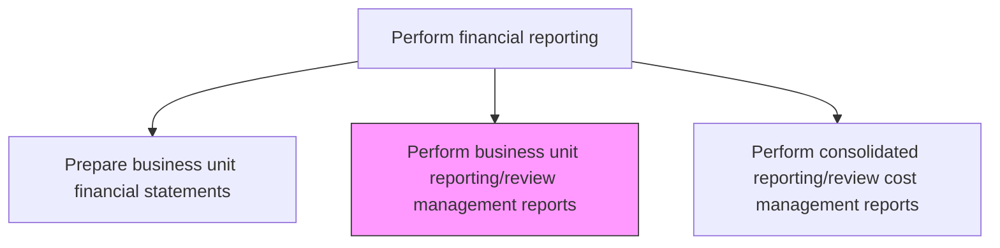
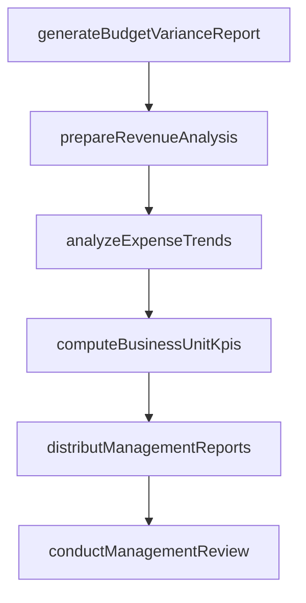

# Perform business unit reporting/review management reports

> Business-as-Code definition for business unit reporting and review management reports. Models the end-to-end process of perform business unit reporting/review management reports as a programmable workflow.

## Overview

Making reports for units and subsidiaries to help management in decision making. Break down profits and losses by function, business unit, clients, products, and region. These management reports provide business unit leaders with actionable financial insights beyond statutory statements, including budget-to-actual variance analysis, key performance indicators, and trend comparisons that drive operational decisions and strategic resource allocation.

## Process Hierarchy



## GraphDL

```yaml
perform:
  object: Business Unit Reporting/review Management Reports
  actor: FinancialReportingManager
  result: BusinessUnitReportingreviewManagementReportsReport
```

## Actions

| Action | Description |
|--------|-------------|
| generateBudgetVarianceReport | Produce actual-to-budget and actual-to-forecast variance reports for the business unit |
| prepareRevenueAnalysis | Break down revenue by product line, customer segment, and geography |
| analyzeExpenseTrends | Compare expense categories across periods to identify trends and anomalies |
| computeBusinessUnitKpis | Calculate key performance indicators such as gross margin, operating margin, and ROA |
| distributManagementReports | Deliver completed reports to business unit leaders and corporate management |
| conductManagementReview | Facilitate the review meeting where management discusses financial results and actions |

## Events

| Event | Description |
|-------|-------------|
| budgetVarianceReportGenerated | Actual-to-budget variance reports have been produced for the business unit |
| revenueAnalysisPrepared | Revenue has been analyzed by product, customer segment, and geography |
| expenseTrendsAnalyzed | Expense categories have been compared across periods |
| businessUnitKpisComputed | Key performance indicators have been calculated for the business unit |
| managementReportsDistributed | Completed management reports have been delivered to stakeholders |
| managementReviewConducted | Management has reviewed the financial results and agreed on action items |

## Searches

| Search | Description |
|--------|-------------|
| getManagementReport | Retrieve a specific management report by business unit, type, and period |
| getBudgetVariance | Return actual-to-budget variances for specified accounts and business units |
| getKpiDashboard | Retrieve calculated KPIs for a business unit across multiple periods |
| getRevenueBreakdown | Return revenue data segmented by product, customer, or geography |

## Process Flow



## RACI Matrix

| Activity | Responsible | Accountable | Consulted | Informed |
|----------|-------------|-------------|-----------|----------|
| generateBudgetVarianceReport | FPAAnalyst | FPAManager | EntityController | BusinessUnitLeader |
| prepareRevenueAnalysis | FPAAnalyst | FPAManager | SalesOperations | CFO |
| computeBusinessUnitKpis | FPAAnalyst | EntityController | FinancialReportingManager | CFO |
| conductManagementReview | EntityController | BusinessUnitLeader | CFO | AuditCommittee |

## Related Processes

| Process | Relationship |
|---------|-------------|
| 9.3.4.1 Prepare business unit financial statements | Upstream - financial statements provide the underlying data |
| 9.3.4.4 Perform consolidated reporting/review of cost management reports | Related - consolidated cost reports aggregate business unit data |
| 9.1 Perform planning and management accounting | Upstream - budgets and forecasts are the benchmark for variance analysis |
| 9.3.4.5 Prepare statements for board review | Downstream - key management insights feed board-level reporting |

## Related Departments

| Department | Role |
|-----------|------|
| Financial Planning and Analysis | Primary owner of management report preparation and analysis |
| Business Unit Finance | Provides local context and validates report accuracy |
| Financial Reporting | Supplies statutory data that underlies management reports |
| Sales Operations | Provides revenue detail by customer and product |

## Related Occupations

| Occupation | Involvement |
|-----------|-------------|
| FPA Analyst | Prepares variance reports and computes KPIs |
| Entity Controller | Reviews reports and presents findings to management |
| Business Unit Leader | Consumes reports and directs corrective actions |

## KPIs

| KPI | Description | Unit |
|-----|-------------|------|
| Management Report Timeliness | Days from period end to management report distribution | Days |
| Budget Variance Explanation Rate | Percentage of material variances with documented explanations | % |
| Report Consumption Rate | Percentage of distributed reports accessed by recipients | % |
| Action Item Closure Rate | Percentage of management review action items completed by deadline | % |

## Usage

```typescript
import { performBusinessUnitReportingreviewManagementReports } from '@headlessly/perform-business-unit-reporting-review-management-reports'

const client = performBusinessUnitReportingreviewManagementReports()

// Generate budget variance report for a business unit
const variance = await client.generateBudgetVarianceReport({
  entity: 'BU-NAM',
  period: '2024-11',
  budgetVersion: 'annual-2024',
  materialityThreshold: 10000
})

// Retrieve KPI dashboard across periods
const kpis = await client.getKpiDashboard({
  entity: 'BU-NAM',
  periods: ['2024-09', '2024-10', '2024-11'],
  metrics: ['grossMargin', 'operatingMargin', 'revenueGrowth']
})
```
