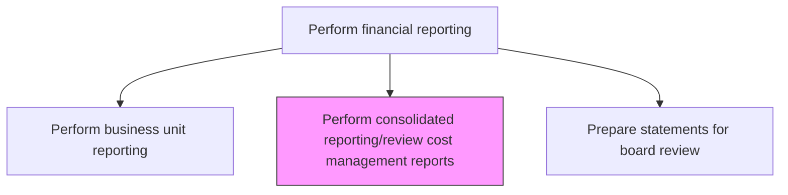
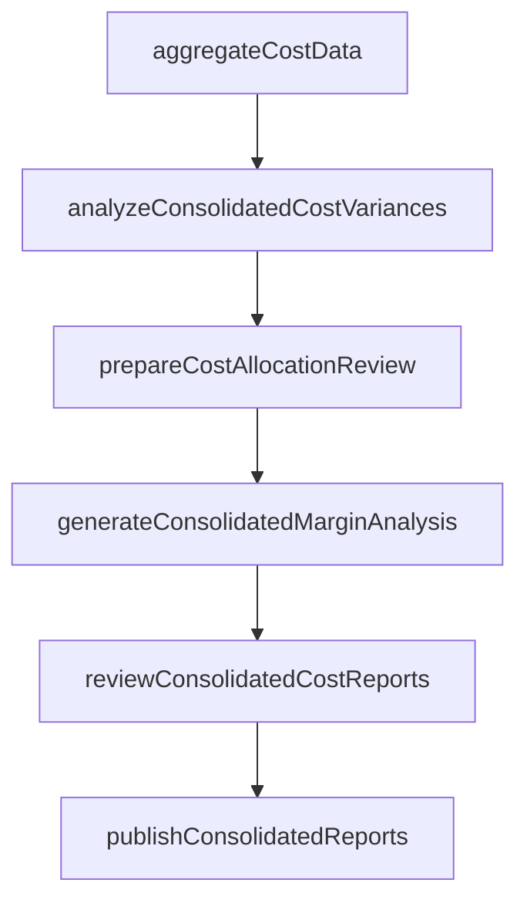

# Perform consolidated reporting/review of cost management reports

> Business-as-Code definition for consolidated reporting and review of cost management reports. Models the end-to-end process of perform consolidated reporting/review of cost management reports as a programmable workflow.

## Overview

Making reports for all units to help higher management in decision making. Prepare combined financial statements of a parent company and all its subsidiaries showing assets, liabilities, equity, income, expenses, and cash flows, alongside periodic reports showing actual and estimated costs and their variances. This process gives executive leadership a group-wide view of cost performance, enabling identification of cost reduction opportunities, allocation inefficiencies, and margin trends across the consolidated enterprise.

## Process Hierarchy



## GraphDL

```yaml
perform:
  object: Consolidated Reporting/review Of Cost Management Reports
  actor: FinancialReportingManager
  result: ConsolidatedReportingreviewOfCostManagementReportsReport
```

## Actions

| Action | Description |
|--------|-------------|
| aggregateCostData | Combine cost data from all business units into a consolidated cost management view |
| analyzeConsolidatedCostVariances | Compare consolidated actual costs to budget and forecast across cost categories |
| prepareCostAllocationReview | Review how shared costs have been allocated across business units and validate methodology |
| generateConsolidatedMarginAnalysis | Produce gross and operating margin analysis by product line and geography at the group level |
| reviewConsolidatedCostReports | Present cost management findings to executive leadership for review and action |
| publishConsolidatedReports | Distribute finalized consolidated cost and financial reports to stakeholders |

## Events

| Event | Description |
|-------|-------------|
| costDataAggregated | Cost data from all business units has been consolidated |
| costVariancesAnalyzed | Consolidated actual-to-budget cost variances have been computed and documented |
| costAllocationReviewed | Shared cost allocation methodologies and outputs have been validated |
| consolidatedMarginAnalysisGenerated | Group-level margin analysis by product and geography has been produced |
| consolidatedCostReportsReviewed | Executive leadership has reviewed consolidated cost management findings |
| consolidatedReportsPublished | Finalized consolidated reports have been distributed to stakeholders |

## Searches

| Search | Description |
|--------|-------------|
| getConsolidatedCostReport | Retrieve consolidated cost management report by period and cost category |
| getCostVarianceByEntity | Return cost variances broken down by business unit within the consolidated view |
| getConsolidatedMarginTrend | Retrieve margin trends at the consolidated level across multiple periods |
| getCostAllocationSummary | Return the summary of shared cost allocations across business units |

## Process Flow



## RACI Matrix

| Activity | Responsible | Accountable | Consulted | Informed |
|----------|-------------|-------------|-----------|----------|
| aggregateCostData | ConsolidationAccountant | FinancialReportingManager | EntityControllers | Controller |
| analyzeConsolidatedCostVariances | FPAManager | CFO | BusinessUnitControllers | AuditCommittee |
| prepareCostAllocationReview | CostAccountant | Controller | FPAManager | BusinessUnitLeaders |
| reviewConsolidatedCostReports | CFO | CEO | Controller | Board |

## Related Processes

| Process | Relationship |
|---------|-------------|
| 9.3.4.3 Perform business unit reporting/review management reports | Upstream - business unit reports are aggregated into consolidated view |
| 9.3.4.2 Prepare consolidated financial statements | Related - consolidated statements provide the financial foundation |
| 9.3.2.3 Process allocations | Upstream - cost allocations drive the shared cost distribution reviewed here |
| 9.1 Perform planning and management accounting | Upstream - budget and forecast data serve as the comparison benchmark |

## Related Departments

| Department | Role |
|-----------|------|
| Financial Planning and Analysis | Primary owner of cost variance analysis and margin reporting |
| Consolidation Accounting | Aggregates cost data across all entities |
| Cost Accounting | Provides allocation methodology and cost pool details |
| Executive Management | Consumes reports and directs cost optimization actions |

## Related Occupations

| Occupation | Involvement |
|-----------|-------------|
| FPA Manager | Leads consolidated cost analysis and variance reporting |
| Consolidation Accountant | Aggregates cost data from all reporting entities |
| CFO | Reviews consolidated cost reports and approves action plans |

## KPIs

| KPI | Description | Unit |
|-----|-------------|------|
| Consolidated Report Timeliness | Days from period end to consolidated cost report distribution | Days |
| Cost Variance Explanation Coverage | Percentage of material cost variances with documented root causes | % |
| Consolidated Operating Margin | Group-wide operating income as a percentage of revenue | % |
| Cost Reduction Target Achievement | Percentage of planned cost savings realized in the period | % |

## Usage

```typescript
import { performConsolidatedReportingreviewOfCostManagementReports } from '@headlessly/perform-consolidated-reporting-review-of-cost-management-reports'

const client = performConsolidatedReportingreviewOfCostManagementReports()

// Analyze consolidated cost variances for the quarter
const variances = await client.analyzeConsolidatedCostVariances({
  period: '2024-Q4',
  consolidationGroup: 'GLOBAL',
  costCategories: ['cogs', 'sgAndA', 'rAndD'],
  budgetVersion: 'annual-2024'
})

// Get consolidated margin trend
const margins = await client.getConsolidatedMarginTrend({
  periods: ['2024-Q1', '2024-Q2', '2024-Q3', '2024-Q4'],
  metrics: ['grossMargin', 'operatingMargin'],
  bySegment: true
})
```
