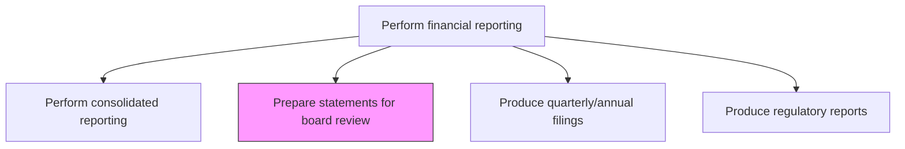
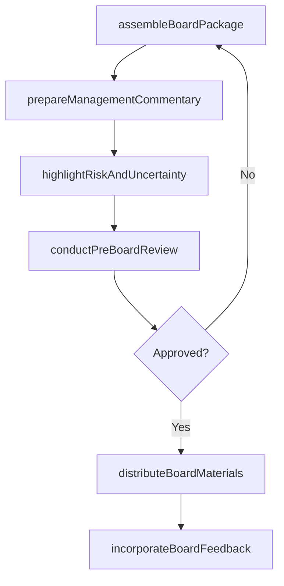

# Prepare statements for board review

> Business-as-Code definition for statements for board review. Models the end-to-end process of prepare statements for board review as a programmable workflow.

## Overview

Preparing a draft of financial statements for the board to review before they are sent to the auditor. This process assembles the consolidated financial data, key management commentary, risk highlights, and supplementary analyses into a board-ready package. The board review ensures governance oversight of financial results, enables directors to fulfill their fiduciary responsibilities, and provides an opportunity to identify concerns before external publication.

## Process Hierarchy



## GraphDL

```yaml
prepare:
  object: Statements For Board Review
  actor: FinancialReportingManager
  result: StatementsForBoardReviewDocument
```

## Actions

| Action | Description |
|--------|-------------|
| assembleBoardPackage | Compile consolidated financial statements, management discussion, and supplementary analyses into the board package |
| prepareManagementCommentary | Draft the narrative explaining financial performance, key drivers, and significant events |
| highlightRiskAndUncertainty | Identify and document risk factors, contingencies, and going-concern considerations for board attention |
| conductPreBoardReview | Review the draft board package with the CFO and controller prior to board distribution |
| distributeBoardMaterials | Deliver the finalized board package to directors within the required lead time |
| incorporateBoardFeedback | Record board questions, concerns, and directed changes for follow-up |

## Events

| Event | Description |
|-------|-------------|
| boardPackageAssembled | The consolidated financial package for board review has been compiled |
| managementCommentaryPrepared | The narrative explanation of financial performance has been drafted |
| risksHighlighted | Risk factors and contingencies for board attention have been documented |
| preBoardReviewCompleted | The CFO and controller have reviewed and approved the draft board package |
| boardMaterialsDistributed | The finalized board package has been delivered to directors |
| boardFeedbackIncorporated | Board questions and directed changes have been recorded for action |

## Searches

| Search | Description |
|--------|-------------|
| getBoardPackage | Retrieve the board financial package for a specific meeting date and period |
| getBoardMeetingSchedule | Return upcoming board meeting dates and material submission deadlines |
| getBoardFeedbackLog | Retrieve questions and action items from prior board financial reviews |
| getPreBoardReviewStatus | Check the approval status of the board package through the pre-review workflow |

## Process Flow



## RACI Matrix

| Activity | Responsible | Accountable | Consulted | Informed |
|----------|-------------|-------------|-----------|----------|
| assembleBoardPackage | FinancialReportingManager | Controller | ConsolidationAccountant | CFO |
| prepareManagementCommentary | Controller | CFO | FPAManager | GeneralCounsel |
| conductPreBoardReview | CFO | CEO | Controller | CorporateSecretary |
| distributeBoardMaterials | CorporateSecretary | CFO | GeneralCounsel | BoardMembers |

## Related Processes

| Process | Relationship |
|---------|-------------|
| 9.3.4.2 Prepare consolidated financial statements | Upstream - consolidated statements are the core of the board package |
| 9.3.4.4 Perform consolidated reporting/review of cost management reports | Upstream - cost management insights supplement the board package |
| 9.3.4.6 Produce quarterly/annual filings and shareholder reports | Downstream - board-approved statements are included in public filings |
| 9.8 Manage internal controls | Related - board review is a governance control over financial reporting |

## Related Departments

| Department | Role |
|-----------|------|
| Financial Reporting | Primary owner of board financial package preparation |
| Office of the CFO | Reviews package and presents to the board |
| Corporate Secretary | Manages board material distribution and meeting logistics |
| Legal | Reviews risk disclosures and contingency language |

## Related Occupations

| Occupation | Involvement |
|-----------|-------------|
| Financial Reporting Manager | Assembles the board financial package |
| CFO | Presents financial results and commentary to the board |
| Corporate Secretary | Coordinates board material distribution and deadlines |

## KPIs

| KPI | Description | Unit |
|-----|-------------|------|
| Board Package Delivery Timeliness | Days before the board meeting that materials are distributed | Days |
| Pre-Board Review Cycle Time | Days from package assembly to CFO sign-off | Days |
| Board Question Resolution Rate | Percentage of board-raised questions resolved before the next meeting | % |
| Material Accuracy Rate | Percentage of board packages issued without subsequent corrections | % |

## Usage

```typescript
import { prepareStatementsForBoardReview } from '@headlessly/prepare-statements-for-board-review'

const client = prepareStatementsForBoardReview()

// Assemble the board financial package
const boardPackage = await client.assembleBoardPackage({
  period: '2024-Q4',
  boardMeetingDate: '2025-02-15',
  includeSections: ['consolidatedStatements', 'managementCommentary', 'riskHighlights', 'segmentAnalysis']
})

// Check pre-board review approval status
const reviewStatus = await client.getPreBoardReviewStatus({
  boardMeetingDate: '2025-02-15',
  packageId: boardPackage.id
})
```
