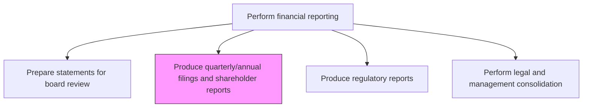
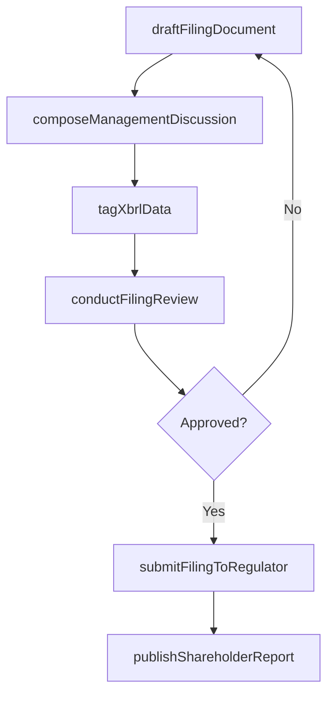

# Produce quarterly/annual filings and shareholder reports

> Business-as-Code definition for quarterly and annual filings and shareholder reports. Models the end-to-end process of produce quarterly/annual filings and shareholder reports as a programmable workflow.

## Overview

Making and presenting financial reports to stakeholders. Create annual and quarterly financial statements for reporting purposes. Prepare shareholder reports with details of the profit-and-loss account, balance sheet, and past year's business activities. This process produces SEC filings (10-Q, 10-K), annual reports, and proxy materials that fulfill the organization's public disclosure obligations, maintain investor confidence, and ensure compliance with securities regulations and stock exchange listing requirements.

## Process Hierarchy



## GraphDL

```yaml
produce:
  object: Quarterly/annual Filings And Shareholder Reports
  actor: FinancialReportingManager
  result: QuarterlyannualFilingsAndShareholderReportsRecord
```

## Actions

| Action | Description |
|--------|-------------|
| draftFilingDocument | Prepare the 10-Q, 10-K, or annual report document including financial statements and disclosures |
| composeManagementDiscussion | Write the MD&A section covering financial condition, results, and forward-looking commentary |
| tagXbrlData | Apply XBRL taxonomy tags to financial data elements for electronic filing compliance |
| conductFilingReview | Route the draft filing through legal, external audit, and management review |
| submitFilingToRegulator | File the completed document with the SEC or relevant securities authority |
| publishShareholderReport | Distribute the annual report and earnings materials to shareholders and investors |

## Events

| Event | Description |
|-------|-------------|
| filingDocumentDrafted | The quarterly or annual filing document has been prepared |
| managementDiscussionComposed | The MD&A section has been written and reviewed |
| xbrlDataTagged | Financial data has been tagged with XBRL taxonomy for electronic filing |
| filingReviewCompleted | Legal, audit, and management have reviewed and approved the filing |
| filingSubmitted | The completed filing has been submitted to the regulatory authority |
| shareholderReportPublished | The annual report and earnings materials have been distributed to shareholders |

## Searches

| Search | Description |
|--------|-------------|
| getFilingStatus | Retrieve the preparation and submission status of filings by type and period |
| getFilingDeadlines | Return upcoming SEC filing deadlines with days remaining |
| getFilingHistory | Retrieve historical filings with submission dates and amendment history |
| getXbrlValidationStatus | Check the XBRL tagging validation status for a specific filing |

## Process Flow



## RACI Matrix

| Activity | Responsible | Accountable | Consulted | Informed |
|----------|-------------|-------------|-----------|----------|
| draftFilingDocument | SECReportingManager | Controller | TechnicalAccounting | CFO |
| composeManagementDiscussion | Controller | CFO | FPAManager | GeneralCounsel |
| conductFilingReview | SECReportingManager | CFO | ExternalAuditor | AuditCommittee |
| submitFilingToRegulator | SECReportingManager | CFO | GeneralCounsel | InvestorRelations |

## Related Processes

| Process | Relationship |
|---------|-------------|
| 9.3.4.2 Prepare consolidated financial statements | Upstream - consolidated statements are the core content of filings |
| 9.3.4.5 Prepare statements for board review | Upstream - board-approved statements feed public filings |
| 9.3.4.7 Produce regulatory reports | Related - regulatory reports may accompany or reference public filings |
| 9.8 Manage internal controls | Related - SOX internal control assessments are included in annual filings |

## Related Departments

| Department | Role |
|-----------|------|
| SEC Reporting | Primary owner of filing preparation and submission |
| Legal | Reviews disclosure language and liability considerations |
| Investor Relations | Coordinates shareholder communication and earnings releases |
| External Audit | Provides audit opinion included in annual filings |

## Related Occupations

| Occupation | Involvement |
|-----------|-------------|
| SEC Reporting Manager | Leads filing preparation, XBRL tagging, and submission |
| General Counsel | Reviews filing for legal compliance and risk disclosures |
| Investor Relations Officer | Manages shareholder distribution and earnings communications |

## KPIs

| KPI | Description | Unit |
|-----|-------------|------|
| Filing Timeliness | Days from period end to SEC filing submission | Days |
| XBRL Error Rate | Number of XBRL validation errors per filing | Count |
| Filing Amendment Frequency | Number of amended filings per year | Count |
| Shareholder Report Distribution Time | Days from filing to shareholder report delivery | Days |

## Usage

```typescript
import { produceQuarterlyannualFilingsAndShareholderReports } from '@headlessly/produce-quarterly-annual-filings-and-shareholder-reports'

const client = produceQuarterlyannualFilingsAndShareholderReports()

// Draft a 10-Q filing
const filing = await client.draftFilingDocument({
  filingType: '10-Q',
  period: '2024-Q3',
  entity: 'PARENT-CO',
  sections: ['financialStatements', 'mdAndA', 'riskFactors', 'controls']
})

// Check upcoming filing deadlines
const deadlines = await client.getFilingDeadlines({
  filingTypes: ['10-Q', '10-K'],
  year: 2025
})
```
