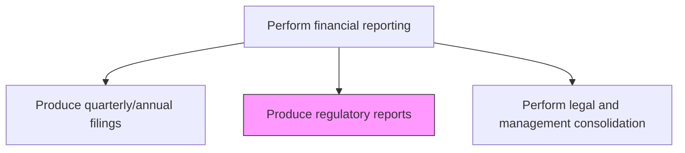
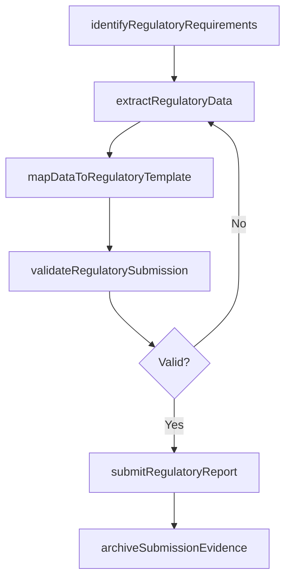

# Produce regulatory reports

> Business-as-Code definition for regulatory reports. Models the end-to-end process of produce regulatory reports as a programmable workflow.

## Overview

Reporting raw or summary data for final accounts following rules and regulations. This process encompasses the preparation and submission of financial reports required by government agencies, central banks, industry-specific regulators, and statistical authorities beyond standard SEC filings. Examples include bank call reports, insurance statutory filings, pension fund disclosures, and country-specific statistical returns, each with unique formats, deadlines, and data requirements that vary by jurisdiction and industry.

## Process Hierarchy



## GraphDL

```yaml
produce:
  object: Regulatory Reports
  actor: FinancialReportingManager
  result: RegulatoryReportsRecord
```

## Actions

| Action | Description |
|--------|-------------|
| identifyRegulatoryRequirements | Determine the reporting obligations for each jurisdiction, agency, and reporting period |
| extractRegulatoryData | Pull the required financial data from the general ledger and sub-systems in the prescribed format |
| mapDataToRegulatoryTemplate | Transform financial data into the specific fields and formats required by each regulatory authority |
| validateRegulatorySubmission | Run validation checks to ensure data completeness, accuracy, and compliance with filing rules |
| submitRegulatoryReport | File the completed report with the appropriate regulatory authority by the deadline |
| archiveSubmissionEvidence | Store the filed report and confirmation of receipt for audit trail and retention purposes |

## Events

| Event | Description |
|-------|-------------|
| regulatoryRequirementsIdentified | Reporting obligations for the period have been determined by jurisdiction and agency |
| regulatoryDataExtracted | Required financial data has been pulled from source systems |
| dataMapppedToTemplate | Financial data has been transformed into the regulatory filing format |
| submissionValidated | Validation checks have confirmed data completeness and compliance |
| regulatoryReportSubmitted | The completed report has been filed with the regulatory authority |
| submissionEvidenceArchived | Filing confirmation and supporting documentation have been stored |

## Searches

| Search | Description |
|--------|-------------|
| getRegulatoryCalendar | Retrieve all regulatory reporting deadlines by jurisdiction and agency |
| getSubmissionStatus | Return the preparation and filing status of regulatory reports by type |
| getRegulatoryHistory | Retrieve historical submissions for a specific regulatory report type |
| getValidationErrors | List data validation errors for a specific regulatory report in preparation |

## Process Flow



## RACI Matrix

| Activity | Responsible | Accountable | Consulted | Informed |
|----------|-------------|-------------|-----------|----------|
| identifyRegulatoryRequirements | RegulatoryReportingAnalyst | FinancialReportingManager | Legal | Controller |
| extractRegulatoryData | RegulatoryReportingAnalyst | FinancialReportingManager | FinanceSystemsAdmin | GeneralLedgerManager |
| validateRegulatorySubmission | RegulatoryReportingAnalyst | Controller | InternalAudit | CFO |
| submitRegulatoryReport | FinancialReportingManager | Controller | Legal | CFO |

## Related Processes

| Process | Relationship |
|---------|-------------|
| 9.3.4.6 Produce quarterly/annual filings and shareholder reports | Related - regulatory reports complement public SEC filings |
| 9.3.4.2 Prepare consolidated financial statements | Upstream - consolidated data is a primary source for regulatory reports |
| 9.9 Manage taxes | Related - certain regulatory reports include tax-related financial data |
| 9.8.3 Manage and monitor compliance function | Downstream - regulatory filing status feeds compliance monitoring |

## Related Departments

| Department | Role |
|-----------|------|
| Financial Reporting | Primary owner of regulatory report preparation and submission |
| Legal | Advises on regulatory obligations and filing requirements |
| Compliance | Monitors filing completeness and deadline adherence |
| Finance Systems | Supports data extraction and template integration |

## Related Occupations

| Occupation | Involvement |
|-----------|-------------|
| Regulatory Reporting Analyst | Prepares and validates regulatory filings |
| Financial Reporting Manager | Oversees regulatory reporting and ensures deadline compliance |
| Compliance Officer | Monitors regulatory filing obligations and tracks adherence |

## KPIs

| KPI | Description | Unit |
|-----|-------------|------|
| Regulatory Filing Timeliness | Percentage of regulatory reports filed by their deadlines | % |
| Validation Error Rate | Number of data validation errors per regulatory filing | Count |
| Filing Rejection Rate | Percentage of submitted reports rejected by regulators | % |
| Regulatory Report Volume | Total number of regulatory reports filed per period across jurisdictions | Count |

## Usage

```typescript
import { produceRegulatoryReports } from '@headlessly/produce-regulatory-reports'

const client = produceRegulatoryReports()

// Extract regulatory data for a bank call report
const callReportData = await client.extractRegulatoryData({
  reportType: 'bankCallReport',
  regulatoryAuthority: 'FDIC',
  period: '2024-Q4',
  entity: 'US-BANK-SUB'
})

// Get upcoming regulatory filing deadlines
const calendar = await client.getRegulatoryCalendar({
  jurisdictions: ['US', 'UK', 'DE'],
  dateRange: { from: '2025-01-01', to: '2025-06-30' }
})
```
