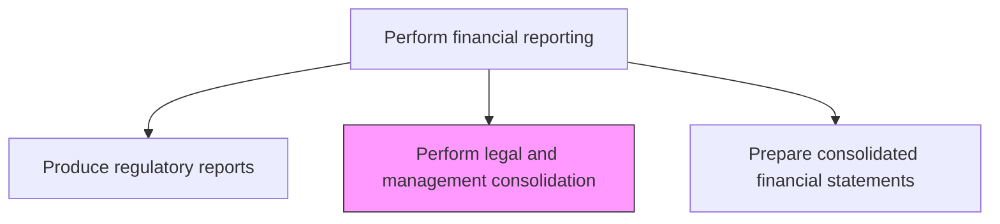
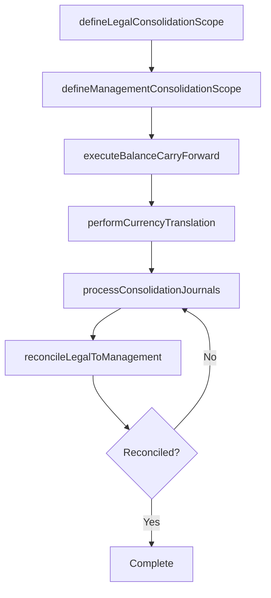

# Perform legal and management consolidation

> Business-as-Code definition for legal and management consolidation. Models the end-to-end process of perform legal and management consolidation as a programmable workflow.

## Overview

Carrying out activities associated with legal and management consolidation. Legal consolidation includes currency conversion, balance carry forward, and consolidation of journal entries required to produce statutory financial statements for each legal entity. Management consolidation includes reporting on financials along organizational hierarchies such as business lines, product groups, or geographies that may differ from the legal entity structure, providing leadership with performance views aligned to how the business is actually managed.

## Process Hierarchy



## GraphDL

```yaml
perform:
  object: Legal And Management Consolidation
  actor: FinancialReportingManager
  result: LegalAndManagementConsolidationReport
```

## Actions

| Action | Description |
|--------|-------------|
| defineLegalConsolidationScope | Identify the legal entities and ownership structure for statutory consolidation |
| defineManagementConsolidationScope | Map the management reporting hierarchy including business lines, regions, and product groups |
| performCurrencyTranslation | Convert subsidiary financials from local currencies using appropriate rates for each consolidation view |
| executeBalanceCarryForward | Carry forward opening balances from the prior period into the new consolidation cycle |
| processConsolidationJournals | Post consolidation adjustments including eliminations, minority interest, and equity pickups |
| reconcileLegalToManagement | Compare legal consolidation totals to management consolidation totals and explain differences |

## Events

| Event | Description |
|-------|-------------|
| legalConsolidationScopeDefined | The legal entity structure and ownership percentages have been confirmed |
| managementConsolidationScopeDefined | The management reporting hierarchy has been mapped and validated |
| currencyTranslationCompleted | Foreign currency translation has been performed for all consolidation views |
| balancesCarriedForward | Opening balances have been carried forward into the new consolidation period |
| consolidationJournalsProcessed | Consolidation adjustments and eliminations have been posted |
| legalManagementReconciled | Differences between legal and management consolidation have been explained |

## Searches

| Search | Description |
|--------|-------------|
| getLegalConsolidationScope | Retrieve the legal entity hierarchy and ownership structure |
| getManagementHierarchy | Return the management reporting structure by business line, region, or product |
| getConsolidationJournals | List consolidation adjustment entries by type and period |
| getLegalManagementBridge | Retrieve the reconciliation between legal and management consolidation totals |

## Process Flow



## RACI Matrix

| Activity | Responsible | Accountable | Consulted | Informed |
|----------|-------------|-------------|-----------|----------|
| defineLegalConsolidationScope | ConsolidationManager | Controller | Legal | CFO |
| defineManagementConsolidationScope | FPAManager | CFO | BusinessUnitLeaders | Controller |
| performCurrencyTranslation | ConsolidationAccountant | ConsolidationManager | TreasuryAnalyst | ExternalAuditor |
| reconcileLegalToManagement | ConsolidationAccountant | Controller | FPAManager | InternalAudit |

## Related Processes

| Process | Relationship |
|---------|-------------|
| 9.3.2.7 Perform consolidations and process eliminations | Upstream - consolidation entries and eliminations feed both legal and management views |
| 9.3.4.2 Prepare consolidated financial statements | Downstream - legal consolidation outputs drive statutory financial statements |
| 9.3.4.3 Perform business unit reporting/review management reports | Related - management consolidation provides the data for management reports |
| 9.7 Manage treasury operations | Related - treasury provides exchange rates for currency translation |

## Related Departments

| Department | Role |
|-----------|------|
| Consolidation Accounting | Primary owner of both legal and management consolidation processes |
| Financial Planning and Analysis | Defines and maintains the management reporting hierarchy |
| Legal | Advises on entity structure and statutory consolidation requirements |
| Treasury | Provides exchange rates for currency translation |

## Related Occupations

| Occupation | Involvement |
|-----------|-------------|
| Consolidation Manager | Oversees both legal and management consolidation cycles |
| Consolidation Accountant | Executes consolidation journals and reconciliations |
| FPA Manager | Defines management hierarchy and validates management consolidation outputs |

## KPIs

| KPI | Description | Unit |
|-----|-------------|------|
| Consolidation Cycle Time | Days from period end to completed legal and management consolidation | Days |
| Legal-Management Reconciliation Variance | Dollar value of unexplained differences between legal and management views | Currency |
| Currency Translation Accuracy | Percentage of translations using the correct period-end or average rates | % |
| Consolidation Journal Error Rate | Percentage of consolidation journals requiring correction after posting | % |

## Usage

```typescript
import { performLegalAndManagementConsolidation } from '@headlessly/perform-legal-and-management-consolidation'

const client = performLegalAndManagementConsolidation()

// Process consolidation journals for the legal view
const legalJournals = await client.processConsolidationJournals({
  consolidationType: 'legal',
  period: '2024-Q4',
  scope: 'GLOBAL',
  journalTypes: ['intercompanyElimination', 'minorityInterest', 'equityPickup']
})

// Reconcile legal to management consolidation
const bridge = await client.getLegalManagementBridge({
  period: '2024-Q4',
  materialityThreshold: 50000
})
```
